# `:androidApp`

## Overview
The `:androidApp` module is the entry point for the Meshtastic Android application. It orchestrates the various feature modules, manages global state, and provides the main UI shell.

## Key Components

### 1. `MainActivity` & `Main.kt`
The single Activity of the application. It hosts the shared `MeshtasticNavDisplay` navigation shell and manages the root UI structure (Navigation Bar, Rail, etc.).

### 2. `MeshService`
The core background service that manages long-running communication with the mesh radio. While it is declared in the `:androidApp` manifest for system visibility, its implementation resides in the `:core:service` module. It runs as a **Foreground Service** to ensure reliable communication even when the app is in the background.

### 3. Koin Application
`MeshUtilApplication` is the Koin entry point, providing the global dependency injection container.

## Architecture
The module primarily serves as a "glue" layer, connecting:
- `core:*` modules for shared logic.
- `feature:*` modules for specific user-facing screens.

## Module dependency graph

```mermaid
graph TB
  :androidApp[androidApp]:::android-application
  :androidApp -.-> :core:ble
  :androidApp -.-> :core:common
  :androidApp -.-> :core:data
  :androidApp -.-> :core:database
  :androidApp -.-> :core:datastore
  :androidApp -.-> :core:di
  :androidApp -.-> :core:domain
  :androidApp -.-> :core:model
  :androidApp -.-> :core:navigation
  :androidApp -.-> :core:network
  :androidApp -.-> :core:nfc
  :androidApp -.-> :core:prefs
  :androidApp -.-> :core:proto
  :androidApp -.-> :core:service
  :androidApp -.-> :core:resources
  :androidApp -.-> :core:ui
  :androidApp -.-> :core:barcode
  :androidApp -.-> :core:takserver
  :androidApp -.-> :feature:intro
  :androidApp -.-> :feature:messaging
  :androidApp -.-> :feature:connections
  :androidApp -.-> :feature:map
  :androidApp -.-> :feature:node
  :androidApp -.-> :feature:settings
  :androidApp -.-> :feature:docs
  :androidApp -.-> :feature:firmware
  :androidApp -.-> :feature:wifi-provision
  :androidApp -.-> :feature:widget

classDef android-application fill:#CAFFBF,stroke:#000,stroke-width:2px,color:#000;
classDef android-application-compose fill:#CAFFBF,stroke:#000,stroke-width:2px,color:#000;
classDef compose-desktop-application fill:#CAFFBF,stroke:#000,stroke-width:2px,color:#000;
classDef android-feature fill:#FFD6A5,stroke:#000,stroke-width:2px,color:#000;
classDef android-library fill:#9BF6FF,stroke:#000,stroke-width:2px,color:#000;
classDef android-library-compose fill:#9BF6FF,stroke:#000,stroke-width:2px,color:#000;
classDef android-test fill:#A0C4FF,stroke:#000,stroke-width:2px,color:#000;
classDef jvm-library fill:#BDB2FF,stroke:#000,stroke-width:2px,color:#000;
classDef kmp-feature fill:#FFD6A5,stroke:#000,stroke-width:2px,color:#000;
classDef kmp-library-compose fill:#FFC1CC,stroke:#000,stroke-width:2px,color:#000;
classDef kmp-library fill:#FFC1CC,stroke:#000,stroke-width:2px,color:#000;
classDef unknown fill:#FFADAD,stroke:#000,stroke-width:2px,color:#000;

```

<!--region graph-->

<!--endregion-->
