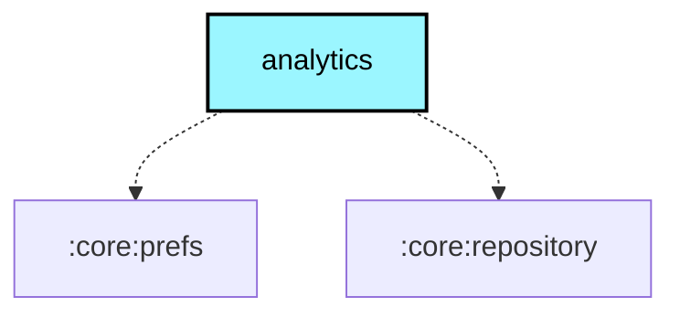

# `:core:analytics`

## Overview
The `:core:analytics` module provides a unified interface for event tracking and crash reporting. It is designed to strictly separate analytics providers based on the build flavor.

## Key Components

### 1. `PlatformAnalytics`
An interface defining the standard operations for tracking events and reporting errors.

## Flavor Specifics

-   **`google` flavor**: Implements `PlatformAnalytics` using **Firebase Analytics** and **Firebase Crashlytics**.
-   **`fdroid` flavor**: Provides a "no-op" implementation that does not collect any user data or report crashes, ensuring FOSS compliance.

## Module dependency graph

<!--region graph-->

<!--endregion-->
