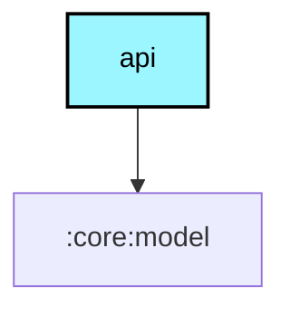

# `:core:api` (Meshtastic Android API)

## Overview
The `:core:api` module contains the stable AIDL interface and dependencies required for third-party applications to integrate with the Meshtastic Android app.

## Integration

To communicate with the Meshtastic Android service from your own application, we recommend using **JitPack**.

### Dependencies
Add the following to your `build.gradle.kts`:

```kotlin
dependencies {
    // The core AIDL interface and Intent constants
    implementation("com.github.meshtastic.Meshtastic-Android:meshtastic-android-api:v2.x.x")
    
    // Data models (DataPacket, MeshUser, NodeInfo, etc.) - Kotlin Multiplatform
    implementation("com.github.meshtastic.Meshtastic-Android:meshtastic-android-model:v2.x.x")
    
    // Protobuf definitions (PortNum, Telemetry, etc.) - Kotlin Multiplatform
    implementation("com.github.meshtastic.Meshtastic-Android:meshtastic-android-proto:v2.x.x")
}
```
*(Replace `v2.x.x` with the latest stable version).*

## Usage

### 1. Bind to the Service
Use the `IMeshService` interface to bind to the Meshtastic service.

```kotlin
val intent = Intent("com.geeksville.mesh.Service")
// ... query package manager and bind
```

### 2. Interact with the API
Once bound, cast the `IBinder` to `IMeshService`.

### 3. Register a BroadcastReceiver
Use `MeshtasticIntent` constants for actions. Remember to use `RECEIVER_EXPORTED` on Android 13+.

## Key Components
- **`IMeshService.aidl`**: The primary AIDL interface.
- **`MeshtasticIntent.kt`**: Defines Intent actions for received messages and status changes.

## Module dependency graph

<!--region graph-->

<!--endregion-->
