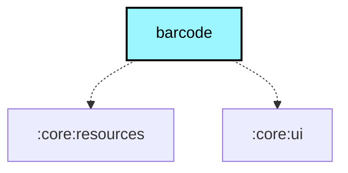

# `:core:barcode`

## Overview
The `:core:barcode` module provides barcode and QR code scanning capabilities using CameraX and flavor-specific decoding engines. It is used for scanning node configuration, pairing, and contact sharing.

The shared contract (`BarcodeScanner` interface + `LocalBarcodeScannerProvider`) lives in `core:ui/commonMain`, keeping this module Android-only.

## Key Components

### 1. `rememberBarcodeScanner`
A Composable function (in `main/`) that provides camera permission handling, a full-screen scanner dialog with live preview and reticule overlay, and returns a `BarcodeScanner` instance.

- **Technology:** Uses **CameraX** for camera lifecycle management.
- **Flavors:** Barcode decoding is the only flavor-specific code:
  - `google/` — **ML Kit** (`BarcodeScanning` + `InputImage`) via `createBarcodeAnalyzer()`
  - `fdroid/` — **ZXing** (`MultiFormatReader` + `PlanarYUVLuminanceSource`) via `createBarcodeAnalyzer()`
- All shared UI (dialog, reticule, permissions, camera lifecycle) lives in `main/`.

## Source Layout

```
src/
├── main/     BarcodeScannerProvider.kt (shared UI)
├── google/   BarcodeAnalyzerFactory.kt (ML Kit decoder)
├── fdroid/   BarcodeAnalyzerFactory.kt (ZXing decoder)
├── test/     Unit tests
└── androidTest/ Instrumented tests
```

## Usage

```kotlin
// In a Composable (typically wired via LocalBarcodeScannerProvider in app/)
val scanner = rememberBarcodeScanner { result ->
    // Handle scanned QR code string (or null on dismiss)
}
scanner.startScan()
```

## Module dependency graph

<!--region graph-->

<!--endregion-->
