# `:core:ble`

## Module dependency graph

```mermaid
graph TB
  :core:ble[ble]:::kmp-library

classDef android-application fill:#CAFFBF,stroke:#000,stroke-width:2px,color:#000;
classDef android-application-compose fill:#CAFFBF,stroke:#000,stroke-width:2px,color:#000;
classDef android-feature fill:#FFD6A5,stroke:#000,stroke-width:2px,color:#000;
classDef android-library fill:#9BF6FF,stroke:#000,stroke-width:2px,color:#000;
classDef android-library-compose fill:#9BF6FF,stroke:#000,stroke-width:2px,color:#000;
classDef android-test fill:#A0C4FF,stroke:#000,stroke-width:2px,color:#000;
classDef jvm-library fill:#BDB2FF,stroke:#000,stroke-width:2px,color:#000;
classDef kmp-library fill:#FFC1CC,stroke:#000,stroke-width:2px,color:#000;
classDef unknown fill:#FFADAD,stroke:#000,stroke-width:2px,color:#000;

```

<!--region graph-->

<!--endregion-->

## Overview

The `:core:ble` module contains the foundation for Bluetooth Low Energy (BLE) communication in the Meshtastic Android app. It uses the **Kable** multiplatform BLE library to provide a unified, Coroutine-based architecture across all supported targets (Android, Desktop, and future iOS).

This module abstracts platform-specific BLE operations behind common Kotlin interfaces (`BleDevice`, `BleScanner`, `BleConnection`, `BleConnectionFactory`), ensuring that business logic in `commonMain` remains platform-agnostic and testable.

## Key Components

### 1. `BleConnection`
A robust wrapper around Kable's `Peripheral` that simplifies the connection lifecycle and service discovery using modern Coroutine APIs.

- **Features:**
    - **Connection & Await:** Provides suspend functions to connect and wait for a terminal state (Connected or Disconnected).
    - **Unified Profile Helper:** A `profile` function that manages service discovery, characteristic setup, and lifecycle in a single block, with automatic timeout and error handling.
    - **Observability:** Exposes `connectionState` as a Flow for reactive UI and service updates.
    - **Platform Setup:** Seamlessly handles platform-specific configuration (like MTU negotiation on Android or direct connections on Desktop) via `platformConfig()` extensions.

### 2. `BluetoothRepository`
A Singleton repository responsible for the global state of Bluetooth on the device.

- **Features:**
    - **State Management:** Exposes a `StateFlow<BluetoothState>` reflecting whether Bluetooth is enabled, permissions are granted, and which devices are bonded.
    - **Permission Handling:** Centralizes logic for checking Bluetooth and Location permissions across different platforms.
    - **Bonding:** Simplifies the process of creating and validating bonds with peripherals.

### 3. `BleScanner`
A wrapper around Kable's `Scanner` to provide a consistent and easy-to-use API for BLE scanning with built-in peripheral mapping.

### 4. `BleRetry`
A utility for executing BLE operations with retry logic, essential for handling the inherent unreliability of wireless communication.

## Integration in `app`

The `:core:ble` module is used by `BleRadioInterface` in the main application module to implement the `RadioTransport` interface for Bluetooth devices.

## Usage

Dependencies are managed via the version catalog (`libs.versions.toml`).

```toml
[versions]
kable = "0.42.0"

[libraries]
kable-core = { module = "com.juul.kable:core", version.ref = "kable" }
```

## Architecture

The module follows a clean multiplatform architecture approach:

- **Repository Pattern:** `BluetoothRepository` mediates data access.
- **Coroutines & Flow:** All asynchronous operations use Kotlin Coroutines and Flows.
- **Dependency Injection:** Koin is used for dependency injection.

## Testing

The module includes unit tests for key components, utilizing Kable's architecture and standard coroutine testing tools to ensure logic correctness.
