# `:core:ble`

## Module dependency graph

```mermaid
graph TB
  :core:ble[ble]:::kmp-library

classDef android-application fill:#CAFFBF,stroke:#000,stroke-width:2px,color:#000;
classDef android-application-compose fill:#CAFFBF,stroke:#000,stroke-width:2px,color:#000;
classDef android-feature fill:#FFD6A5,stroke:#000,stroke-width:2px,color:#000;
classDef android-library fill:#9BF6FF,stroke:#000,stroke-width:2px,color:#000;
classDef android-library-compose fill:#9BF6FF,stroke:#000,stroke-width:2px,color:#000;
classDef android-test fill:#A0C4FF,stroke:#000,stroke-width:2px,color:#000;
classDef jvm-library fill:#BDB2FF,stroke:#000,stroke-width:2px,color:#000;
classDef kmp-library fill:#FFC1CC,stroke:#000,stroke-width:2px,color:#000;
classDef unknown fill:#FFADAD,stroke:#000,stroke-width:2px,color:#000;

```

<!--region graph-->

<!--endregion-->

## Overview

The `:core:ble` module contains the foundation for Bluetooth Low Energy (BLE) communication in the Meshtastic Android app. It has been modernized to use **Nordic Semiconductor's Android Common Libraries** and **Kotlin BLE Library**.

This modernization replaces legacy callback-based implementations with robust, Coroutine-based architecture, ensuring better stability, maintainability, and standard compliance.

## Key Components

### 1. `BleConnection`
A robust wrapper around Nordic's `Peripheral` and `CentralManager` that simplifies the connection lifecycle and service discovery using modern Coroutine APIs.

- **Features:**
    - **Connection & Await:** Provides suspend functions to connect and wait for a terminal state (Connected or Disconnected).
    - **Unified Profile Helper:** A `profile` function that manages service discovery, characteristic setup, and lifecycle in a single block, with automatic timeout and error handling.
    - **Observability:** Exposes `peripheralFlow` and `connectionState` as Flows for reactive UI and service updates.
    - **Connection Management:** Handles PHY updates, MTU logging, and connection priority requests automatically.

### 2. `BluetoothRepository`
A Singleton repository responsible for the global state of Bluetooth on the Android device.

- **Features:**
    - **State Management:** Exposes a `StateFlow<BluetoothState>` reflecting whether Bluetooth is enabled, permissions are granted, and which devices are bonded.
    - **Permission Handling:** Centralizes logic for checking Bluetooth and Location permissions across different Android versions.
    - **Bonding:** Simplifies the process of creating bonds with peripherals.

### 3. `BleScanner`
A wrapper around Nordic's `CentralManager` scanning capabilities to provide a consistent and easy-to-use API for BLE scanning with built-in peripheral deduplication.

### 4. `BleRetry`
A utility for executing BLE operations with retry logic, essential for handling the inherent unreliability of wireless communication.

## Integration in `app`

The `:core:ble` module is used by `NordicBleInterface` in the main application module to implement the `RadioTransport` interface for Bluetooth devices.

## Usage

Dependencies are managed via the version catalog (`libs.versions.toml`).

```toml
[versions]
nordic-ble = "2.0.0-alpha15"
nordic-common = "2.8.2"

[libraries]
nordic-client-android = { module = "no.nordicsemi.kotlin.ble:client-android", version.ref = "nordic-ble" }
# ... other nordic dependencies
```

## Architecture

The module follows a clean architecture approach:

- **Repository Pattern:** `BluetoothRepository` mediates data access.
- **Coroutines & Flow:** All asynchronous operations use Kotlin Coroutines and Flows.
- **Dependency Injection:** Koin is used for dependency injection.

## Testing

The module includes unit tests for key components, mocking the underlying Nordic libraries to ensure logic correctness without requiring a physical device.
