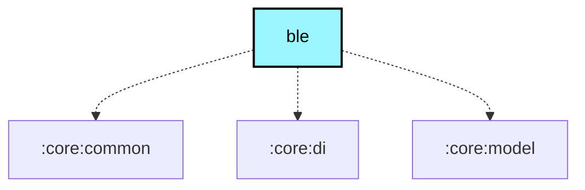

# `:core:ble`

## Module dependency graph

<!--region graph-->

<!--endregion-->

## Overview

The `:core:ble` module contains the foundation for Bluetooth Low Energy (BLE) communication in the Meshtastic Android app. It has been modernized to use **Nordic Semiconductor's Android Common Libraries** and **Kotlin BLE Library**.

This modernization replaces legacy callback-based implementations with robust, Coroutine-based architecture, ensuring better stability, maintainability, and standard compliance.

## Key Components

### 1. `NordicBleInterface`
The primary implementation of `IRadioInterface` for BLE devices. It acts as the bridge between the app's `RadioInterfaceService` and the physical Bluetooth device.

- **Responsibility:**
    - Managing the connection lifecycle.
    - Discovering GATT services and characteristics.
    - Handling data transmission (ToRadio) and reception (FromRadio).
    - Managing MTU negotiation and connection priority.

### 2. `BluetoothRepository`
A Singleton repository responsible for the global state of Bluetooth on the Android device.

- **Features:**
    - **State Management:** Exposes a `StateFlow<BluetoothState>` reflecting whether Bluetooth is enabled, permissions are granted, and which devices are bonded.
    - **Scanning:** Uses Nordic's `Scanner` to find devices.
    - **Bonding:** Handles the creation of bonds with peripherals.

### 3. `BleConnection`
A wrapper around Nordic's `ClientBleGatt` that simplifies the connection process.

- **Features:**
    - **Connection & Await:** Provides suspend functions to connect and wait for a specific connection state.
    - **Service Discovery:** Helper functions to discover specific services and characteristics with timeouts and retries.
    - **Observability:** Logs connection parameters, PHY updates, and state changes.

### 4. `BleRetry`
A utility for executing BLE operations with exponential backoff and retry logic. This is crucial for handling the inherent unreliability of wireless communication.

## Usage

Dependencies are managed via the version catalog (`libs.versions.toml`).

```toml
[versions]
nordic-ble = "2.0.0-alpha15"
nordic-common = "2.8.2"

[libraries]
nordic-client-android = { module = "no.nordicsemi.kotlin.ble:client-android", version.ref = "nordic-ble" }
# ... other nordic dependencies
```

## Architecture

The module follows a clean architecture approach:

- **Repository Pattern:** `BluetoothRepository` mediates data access.
- **Coroutines & Flow:** All asynchronous operations use Kotlin Coroutines and Flows.
- **Dependency Injection:** Hilt is used for dependency injection.

## Testing

The module includes unit tests for key components, mocking the underlying Nordic libraries to ensure logic correctness without requiring a physical device.
