# `:core:common`

## Overview
The `:core:common` module contains low-level utility functions, extensions, and common data structures that do not depend on any other Meshtastic-specific modules. It is designed to be highly reusable across the project.

## Key Components

### 1. `util` package
Contains general-purpose extensions and helpers:
- **Coroutines**: Helpers for structured concurrency and Flow transformations.
- **Time**: Utilities for handling timestamps and durations.
- **Exceptions**: Standardized exception types for common error scenarios.

### 2. `ByteUtils.kt`
Low-level operations for working with `ByteArray` and binary data, essential for parsing radio protocol packets.

### 3. `BuildConfigProvider.kt`
An interface for accessing build-time configuration in a multiplatform-friendly way.

## Module dependency graph

```mermaid
graph TB
  :core:common[common]:::kmp-library

classDef android-application fill:#CAFFBF,stroke:#000,stroke-width:2px,color:#000;
classDef android-application-compose fill:#CAFFBF,stroke:#000,stroke-width:2px,color:#000;
classDef compose-desktop-application fill:#CAFFBF,stroke:#000,stroke-width:2px,color:#000;
classDef android-feature fill:#FFD6A5,stroke:#000,stroke-width:2px,color:#000;
classDef android-library fill:#9BF6FF,stroke:#000,stroke-width:2px,color:#000;
classDef android-library-compose fill:#9BF6FF,stroke:#000,stroke-width:2px,color:#000;
classDef android-test fill:#A0C4FF,stroke:#000,stroke-width:2px,color:#000;
classDef jvm-library fill:#BDB2FF,stroke:#000,stroke-width:2px,color:#000;
classDef kmp-feature fill:#FFD6A5,stroke:#000,stroke-width:2px,color:#000;
classDef kmp-library fill:#FFC1CC,stroke:#000,stroke-width:2px,color:#000;
classDef unknown fill:#FFADAD,stroke:#000,stroke-width:2px,color:#000;

```

<!--region graph-->

<!--endregion-->
