# `:core:data`

## Overview
The `:core:data` module holds the concrete implementations of the `:core:repository` contracts, serving as the primary data source for ViewModels in feature modules. It orchestrates data flow between the local database (`core:database`), remote services, and network repositories.

## Key Components

### 1. Repository implementations (`repository/`)
- **`NodeRepositoryImpl`**: High-level access to node information and mesh state (Room KMP backed).
- **`MeshLogRepositoryImpl`**: Access to historical logs and diagnostics.
- **`FirmwareReleaseRepositoryImpl`**: Manages the discovery and retrieval of firmware updates.

### 2. Manager implementations (`manager/`)
- **`SessionManagerImpl`**: Per-node remote-admin passkey store.
- **`PacketHandlerImpl`** / **`MeshMessageProcessorImpl`**: Inbound mesh packet handling and message processing.

## Dependency Graph

```mermaid
graph TB
  :core:data[data]:::kmp-library
  :core:data --> :core:repository
  :core:data -.-> :core:common
  :core:data -.-> :core:database
  :core:data -.-> :core:datastore
  :core:data -.-> :core:di
  :core:data -.-> :core:model
  :core:data -.-> :core:network
  :core:data -.-> :core:prefs
  :core:data -.-> :core:takserver
  :core:data -.-> :core:testing

classDef android-application fill:#CAFFBF,stroke:#000,stroke-width:2px,color:#000;
classDef android-application-compose fill:#CAFFBF,stroke:#000,stroke-width:2px,color:#000;
classDef compose-desktop-application fill:#CAFFBF,stroke:#000,stroke-width:2px,color:#000;
classDef android-feature fill:#FFD6A5,stroke:#000,stroke-width:2px,color:#000;
classDef android-library fill:#9BF6FF,stroke:#000,stroke-width:2px,color:#000;
classDef android-library-compose fill:#9BF6FF,stroke:#000,stroke-width:2px,color:#000;
classDef android-test fill:#A0C4FF,stroke:#000,stroke-width:2px,color:#000;
classDef jvm-library fill:#BDB2FF,stroke:#000,stroke-width:2px,color:#000;
classDef kmp-feature fill:#FFD6A5,stroke:#000,stroke-width:2px,color:#000;
classDef kmp-library-compose fill:#FFC1CC,stroke:#000,stroke-width:2px,color:#000;
classDef kmp-library fill:#FFC1CC,stroke:#000,stroke-width:2px,color:#000;
classDef unknown fill:#FFADAD,stroke:#000,stroke-width:2px,color:#000;

```

<!--region graph-->

<!--endregion-->
