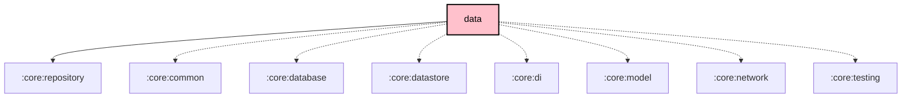

# `:core:data`

## Overview
The `:core:data` module holds the concrete implementations of the `:core:repository` contracts, serving as the primary data source for ViewModels in feature modules. It orchestrates data flow between the local database (`core:database`), remote services, and network repositories.

## Key Components

### 1. Repository implementations (`repository/`)
- **`NodeRepositoryImpl`**: High-level access to node information and mesh state (Room KMP backed).
- **`PacketRepositoryImpl`** / **`MeshLogRepositoryImpl`**: Stored messages and packets, and historical logs and diagnostics.
- **`RadioConfigRepositoryImpl`**: The connected device's config, module config and channel set.
- **`FirmwareReleaseRepositoryImpl`** / **`DeviceHardwareRepositoryImpl`**: Firmware releases and the hardware list, served by `staleWhileRevalidateFlow` from the local data sources and bundled assets in `datasource/`, refreshed from the `:core:network` remote data sources.

### 2. Manager implementations (`manager/`)
- **`MeshConnectionManagerImpl`** / **`MeshConfigFlowManagerImpl`**: Connection lifecycle and the config handshake.
- **`CommandSenderImpl`**: Sends data and admin packets through the outbound queue; `:core:service`'s `RadioControllerImpl` issues commands through it.
- **`SessionManagerImpl`**: Per-node remote-admin passkey store.
- **`PacketHandlerImpl`** / **`FromRadioPacketHandlerImpl`** / **`MeshMessageProcessorImpl`**: Inbound mesh packet handling and message processing, with per-port handlers (`AdminPacketHandlerImpl`, `TelemetryPacketHandlerImpl`, `TracerouteHandlerImpl`, and others).
- **`NodeManagerImpl`**, **`MqttManagerImpl`**, **`XModemManagerImpl`**: The in-memory node database, the MQTT proxy, and XModem file transfer.

### 3. `ai/`
`AiFunctionProvider` is the contract for operations a system assistant can invoke (on Android, through AppFunctions), with `FuzzyNameResolver` resolving node and channel names.

## Dependency Graph

<!--region graph-->

```mermaid
graph TB
  :core:data[data]:::kmp-library
  :core:data --> :core:repository
  :core:data -.-> :core:common
  :core:data -.-> :core:database
  :core:data -.-> :core:datastore
  :core:data -.-> :core:di
  :core:data -.-> :core:model
  :core:data -.-> :core:network
  :core:data -.-> :core:testing

classDef android-application fill:#CAFFBF,stroke:#000,stroke-width:2px,color:#000;
classDef android-application-compose fill:#CAFFBF,stroke:#000,stroke-width:2px,color:#000;
classDef compose-desktop-application fill:#CAFFBF,stroke:#000,stroke-width:2px,color:#000;
classDef android-feature fill:#FFD6A5,stroke:#000,stroke-width:2px,color:#000;
classDef android-library fill:#9BF6FF,stroke:#000,stroke-width:2px,color:#000;
classDef android-library-compose fill:#9BF6FF,stroke:#000,stroke-width:2px,color:#000;
classDef android-test fill:#A0C4FF,stroke:#000,stroke-width:2px,color:#000;
classDef jvm-library fill:#BDB2FF,stroke:#000,stroke-width:2px,color:#000;
classDef kmp-feature fill:#FFD6A5,stroke:#000,stroke-width:2px,color:#000;
classDef kmp-library-compose fill:#FFC1CC,stroke:#000,stroke-width:2px,color:#000;
classDef kmp-library fill:#FFC1CC,stroke:#000,stroke-width:2px,color:#000;
classDef unknown fill:#FFADAD,stroke:#000,stroke-width:2px,color:#000;

```
<!--endregion-->
