# `:core:database`

This module provides the local Room database persistence layer for the application.

## Key Components

-   **`MeshtasticDatabase`**: The main Room database class.
-   **DAOs (Data Access Objects)**:
    -   `NodeInfoDao`: Manages storage and retrieval of node information (`NodeEntity`). Contains critical logic for handling Public Key Conflict (PKC) resolution and preventing identity wiping attacks.
    -   `PacketDao`: Handles storage of mesh packets.
    -   `ChatMessageDao`: Manages chat message history.
-   **Entities**:
    -   `NodeEntity`: Represents a node on the mesh.
    -   `PacketEntity`: Represents a stored packet.

## Security Considerations

### Public Key Conflict (PKC) Handling
The `NodeInfoDao` implements specific logic to protect against impersonation and "wipe" attacks:
-   **Wipe Protection**: Receiving an `is_licensed=true` packet (which normally clears the public key for compliance) will **not** clear an existing valid public key if one is already known. This prevents attackers from sending fake licensed packets to wipe keys from the DB.
-   **Conflict Detection**: If a new key arrives for an existing node ID that conflicts with a known valid key, the key is set to `ERROR_BYTE_STRING` to flag the potential impersonation.

## Module dependency graph

```mermaid
graph TB
  :core:database[database]:::null

classDef android-application fill:#CAFFBF,stroke:#000,stroke-width:2px,color:#000;
classDef android-application-compose fill:#CAFFBF,stroke:#000,stroke-width:2px,color:#000;
classDef android-feature fill:#FFD6A5,stroke:#000,stroke-width:2px,color:#000;
classDef android-library fill:#9BF6FF,stroke:#000,stroke-width:2px,color:#000;
classDef android-library-compose fill:#9BF6FF,stroke:#000,stroke-width:2px,color:#000;
classDef android-test fill:#A0C4FF,stroke:#000,stroke-width:2px,color:#000;
classDef jvm-library fill:#BDB2FF,stroke:#000,stroke-width:2px,color:#000;
classDef kmp-library fill:#FFC1CC,stroke:#000,stroke-width:2px,color:#000;
classDef unknown fill:#FFADAD,stroke:#000,stroke-width:2px,color:#000;

```

<!--region graph-->

<!--endregion-->
