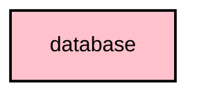

# `:core:database`

This module provides the local Room database persistence layer for the application using Room Kotlin Multiplatform (KMP).

## Key Components

-   **`MeshtasticDatabase`**: The main Room database class, defined in `commonMain`.
-   **DAOs (Data Access Objects)**:
    -   `PacketDao`: Handles storage of mesh packets, including text messages, waypoints, and reactions.
    -   `NodeMetadataDao`: Manages app-local node annotations (favorites, notes, muting).
-   **Entities**:
    -   `Packet`: Represents a stored packet.
    -   `ReactionEntity`: Represents emoji reactions to packets.
    -   `NodeMetadataEntity`: Persists user annotations that survive process death.

## Notes

Node data (positions, telemetry, user info) is managed by the SDK's SqlDelight database.
The Room database only stores messages, logs, and user-local annotations.

## Module dependency graph

<!--region graph-->

```mermaid
graph TB
  :core:database[database]:::kmp-library

classDef android-application fill:#CAFFBF,stroke:#000,stroke-width:2px,color:#000;
classDef android-application-compose fill:#CAFFBF,stroke:#000,stroke-width:2px,color:#000;
classDef compose-desktop-application fill:#CAFFBF,stroke:#000,stroke-width:2px,color:#000;
classDef android-feature fill:#FFD6A5,stroke:#000,stroke-width:2px,color:#000;
classDef android-library fill:#9BF6FF,stroke:#000,stroke-width:2px,color:#000;
classDef android-library-compose fill:#9BF6FF,stroke:#000,stroke-width:2px,color:#000;
classDef android-test fill:#A0C4FF,stroke:#000,stroke-width:2px,color:#000;
classDef jvm-library fill:#BDB2FF,stroke:#000,stroke-width:2px,color:#000;
classDef kmp-feature fill:#FFD6A5,stroke:#000,stroke-width:2px,color:#000;
classDef kmp-library-compose fill:#FFC1CC,stroke:#000,stroke-width:2px,color:#000;
classDef kmp-library fill:#FFC1CC,stroke:#000,stroke-width:2px,color:#000;
classDef unknown fill:#FFADAD,stroke:#000,stroke-width:2px,color:#000;

```
<!--endregion-->
