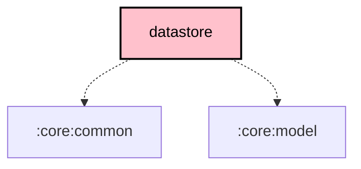

# `:core:datastore`

## Overview

**Targets:** Android · JVM (Desktop) · iOS

The `:core:datastore` module manages structured, asynchronous data storage using **Jetpack DataStore**. It is primarily used for storing complex configuration objects like radio channel sets and local device configurations.

## Key Components

### 1. Data Sources
- **`ChannelSetDataSource`**: Manages the storage of radio channel configurations.
- **`LocalConfigDataSource`** / **`ModuleConfigDataSource`**: Store the connected device's `LocalConfig` and `LocalModuleConfig` protos.
- **`LocalStatsDataSource`**: Stores the latest local device statistics telemetry.
- **`RecentAddressesDataSource`**: Stores a list of recently connected radio addresses (BLE/USB/TCP).
- **`BootloaderWarningDataSource`** / **`FirmwareRecoveryDataSource`**: Persist firmware-update safety state (bootloader warnings, pending recovery).

> UI preferences live in [`:core:prefs`](../prefs/README.md) (`UiPrefs` / `UiPrefsImpl`), not here.

### 2. Serializers
Uses **Kotlin Serialization** to convert between Protobuf/JSON and the underlying DataStore storage.

## Dependency Graph

<!--region graph-->

<!--endregion-->
