# `:core:di`

## Overview
The `:core:di` module defines the core Koin modules and provides standard dependencies that are shared across all other modules.

## Key Components

### 1. `AppModule.kt`
Defines bindings for application-wide singletons like `Application`, `Context`, and `Resources`.

### 2. `CoroutineDispatchers.kt`
Provides a wrapper for standard Kotlin `CoroutineDispatchers` (`IO`, `Default`, `Main`), allowing for easy mocking in unit tests.

### 3. `ProcessLifecycle.kt`
Exposes the application's global process lifecycle as a Koin binding, enabling components to react to the app entering the foreground or background.

## Module dependency graph

```mermaid
graph TB
  :core:di[di]:::kmp-library

classDef android-application fill:#CAFFBF,stroke:#000,stroke-width:2px,color:#000;
classDef android-application-compose fill:#CAFFBF,stroke:#000,stroke-width:2px,color:#000;
classDef compose-desktop-application fill:#CAFFBF,stroke:#000,stroke-width:2px,color:#000;
classDef android-feature fill:#FFD6A5,stroke:#000,stroke-width:2px,color:#000;
classDef android-library fill:#9BF6FF,stroke:#000,stroke-width:2px,color:#000;
classDef android-library-compose fill:#9BF6FF,stroke:#000,stroke-width:2px,color:#000;
classDef android-test fill:#A0C4FF,stroke:#000,stroke-width:2px,color:#000;
classDef jvm-library fill:#BDB2FF,stroke:#000,stroke-width:2px,color:#000;
classDef kmp-feature fill:#FFD6A5,stroke:#000,stroke-width:2px,color:#000;
classDef kmp-library fill:#FFC1CC,stroke:#000,stroke-width:2px,color:#000;
classDef unknown fill:#FFADAD,stroke:#000,stroke-width:2px,color:#000;

```

<!--region graph-->

<!--endregion-->
