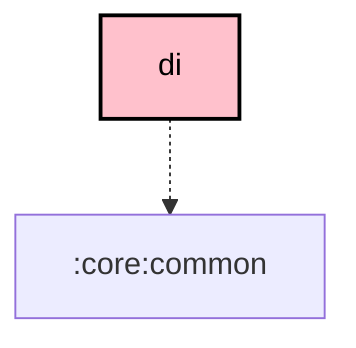

# `:core:di`

## Overview

**Targets:** Android · JVM (Desktop) · iOS

The `:core:di` module defines the core Koin modules and provides standard dependencies that are shared across all other modules.

## Key Components

### 1. `CoroutineDispatchers.kt`
A small data class wrapping the standard coroutine dispatchers (`io`, `main`, `default`), allowing injected classes to swap in test dispatchers instead of hard-coding `Dispatchers.*`.

### 2. `di/CoreDiModule.kt`
The Koin `@Module` for this module. Provides the `CoroutineDispatchers` singleton — `main`/`default` from `kotlinx.coroutines.Dispatchers`, `io` from `:core:common`'s platform-aware `ioDispatcher`.

## Dependency Graph

<!--region graph-->

<!--endregion-->
