```mermaid
graph TB
  :core:domain[domain]:::kmp-library
  :core:domain -.-> :core:repository
  :core:domain -.-> :core:model
  :core:domain -.-> :core:common
  :core:domain -.-> :core:database
  :core:domain -.-> :core:datastore
  :core:domain -.-> :core:resources
  :core:domain -.-> :core:testing

classDef android-application fill:#CAFFBF,stroke:#000,stroke-width:2px,color:#000;
classDef android-application-compose fill:#CAFFBF,stroke:#000,stroke-width:2px,color:#000;
classDef compose-desktop-application fill:#CAFFBF,stroke:#000,stroke-width:2px,color:#000;
classDef android-feature fill:#FFD6A5,stroke:#000,stroke-width:2px,color:#000;
classDef android-library fill:#9BF6FF,stroke:#000,stroke-width:2px,color:#000;
classDef android-library-compose fill:#9BF6FF,stroke:#000,stroke-width:2px,color:#000;
classDef android-test fill:#A0C4FF,stroke:#000,stroke-width:2px,color:#000;
classDef jvm-library fill:#BDB2FF,stroke:#000,stroke-width:2px,color:#000;
classDef kmp-feature fill:#FFD6A5,stroke:#000,stroke-width:2px,color:#000;
classDef kmp-library-compose fill:#FFC1CC,stroke:#000,stroke-width:2px,color:#000;
classDef kmp-library fill:#FFC1CC,stroke:#000,stroke-width:2px,color:#000;
classDef unknown fill:#FFADAD,stroke:#000,stroke-width:2px,color:#000;

```

# `:core:domain`

## Overview

The `:core:domain` module is the **business-logic layer** of the KMP architecture. It contains exclusively use-case classes — no UI, no platform code, no mutable state. Each use case is a thin orchestrator that coordinates one or more repository/model dependencies to fulfil a single application action.

**Targets:** Android · JVM · iOS (via `meshtastic.kmp.library` convention plugin)

## Key Responsibilities

- Orchestrate radio configuration reads/writes (config, module config, channels, owner, position)
- Manage remote-admin session lifecycle (per-node passkey negotiation)
- Process radio admin responses and manage mesh log settings
- Data export (CSV mesh log, profile `.zip`)
- Profile and security-config import/install
- Node database maintenance (clean, reset, selective purge) and OTA capability checks

## Source Structure

```
src/commonMain/kotlin/org/meshtastic/core/domain/
├── di/
│   └── CoreDomainModule.kt          ← Koin @Module + component scan
└── usecase/
    ├── session/
    │   ├── EnsureRemoteAdminSessionUseCase.kt
    │   ├── EnsureSessionResult.kt
    │   └── ObserveRemoteAdminSessionStatusUseCase.kt
    └── settings/
        ├── AdminActionsUseCase.kt
        ├── CleanNodeDatabaseUseCase.kt
        ├── ExportDataUseCase.kt
        ├── ExportProfileUseCase.kt
        ├── ImportProfileUseCase.kt
        ├── ImportSecurityConfigUseCase.kt
        ├── InstallProfileUseCase.kt
        ├── IsOtaCapableUseCase.kt
        ├── ProcessRadioResponseUseCase.kt
        ├── RadioConfigUseCase.kt
        └── SetMeshLogSettingsUseCase.kt
```

## Notable APIs

### `EnsureRemoteAdminSessionUseCase`

Ensures a per-node remote-admin passkey session exists before entering the remote admin UI. Uses a `Mutex`-guarded `inFlight` map so that double-taps coalesce onto a single `Deferred`.

```kotlin
sealed interface EnsureSessionResult {
    data object AlreadyActive   : EnsureSessionResult  // passkey already fresh
    data object Refreshed       : EnsureSessionResult  // metadata response arrived
    data object Timeout         : EnsureSessionResult  // no response within 10 s
    data object Disconnected    : EnsureSessionResult  // radio not connected
}
```

### `RadioConfigUseCase`

Radio configuration read/write operations, all returning the `packetId` for async tracking:

| Method | Description |
|---|---|
| `setOwner` / `getOwner` | Node owner info |
| `setConfig` / `getConfig` | `Config` proto (device, position, power, …) |
| `setModuleConfig` / `getModuleConfig` | `ModuleConfig` proto |
| `getChannel` / `setRemoteChannel` | Channel configuration |
| `setFixedPosition` / `removeFixedPosition` | Fixed GPS position |
| `setRingtone` / `getRingtone` | External notification ringtone |
| `setCannedMessages` / `getCannedMessages` | Canned message slots |

### `AdminActionsUseCase`

```kotlin
reboot(destNum)
shutdown(destNum)
factoryReset(destNum, isLocal)   // also clears local NodeDB when isLocal = true
nodedbReset(destNum, preserveFavorites, isLocal)
```

### `ExportDataUseCase`

Streams all mesh log packets to a CSV `BufferedSink`. Columns: date, time, from, sender name/location, received location/elevation, SNR, distance, hop limit, payload.

## Dependency Graph

```
core:domain
  ├── core:repository              (use-case interfaces & contracts)
  ├── core:model                   (domain models)
  ├── org.meshtastic:protobufs     (Meshtastic protobuf types, Maven)
  ├── core:common
  ├── core:database
  ├── core:datastore
  └── core:resources
```

## DI

All use cases are registered via Koin component scan on `org.meshtastic.core.domain`. No manual binding is needed — annotate a new use case with `@Single` and it is picked up automatically.

## Dependency Graph

<!--region graph-->

<!--endregion-->
