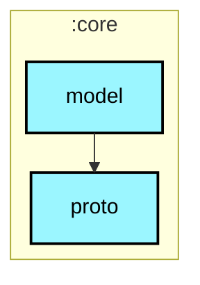
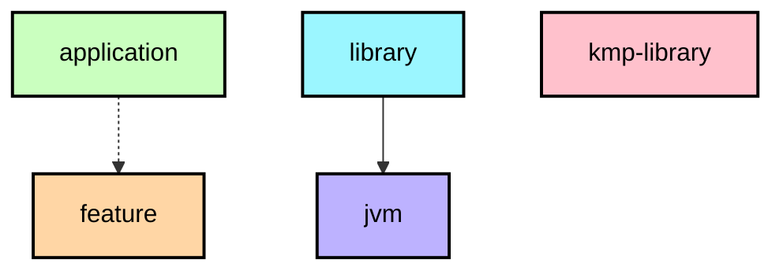

# `:core:model`

## Module dependency graph

<!--region graph-->


<details><summary>📋 Graph legend</summary>



</details>
<!--endregion-->

## Meshtastic Core Models

This module contains the Parcelable data classes used by the Meshtastic Android app and its API. These models are designed to be shared between the service and client applications via AIDL.

### Key Classes

*   **`DataPacket`**: Represents a mesh packet (text, telemetry, etc.).
*   **`MeshUser`**: Represents a user/node on the mesh.
*   **`NodeInfo`**: Contains detailed information about a node (position, SNR, battery, etc.).
*   **`Position`**: GPS location data.

### Usage

This module is typically used as a dependency of `core:api` but can be used independently if you need to work with Meshtastic data structures.

```kotlin
implementation("com.github.meshtastic.Meshtastic-Android:core-model:v2.7.12")
```