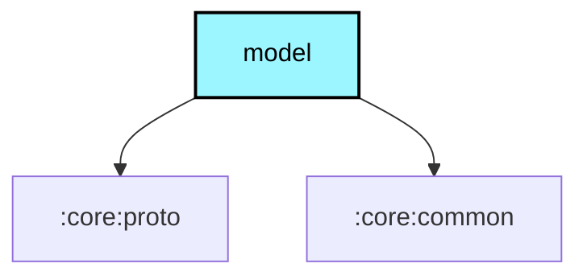

# `:core:model`

## Overview
The `:core:model` module contains the domain models and Parcelable data classes used throughout the application and its API. These models are designed to be shared between the service and client applications via AIDL.

## Key Models

- **`DataPacket`**: Represents a mesh packet (text, telemetry, etc.).
- **`NodeInfo`**: Contains detailed information about a node (position, SNR, battery, etc.).
- **`DeviceHardware`**: Represents supported Meshtastic hardware devices and their capabilities.
- **`Channel`**: Represents a mesh channel configuration.

## Usage
This module is a core dependency of `core:api` and most feature modules.

```kotlin
implementation(projects.core.model)
```

## Module dependency graph

<!--region graph-->

```mermaid
graph TB
  :core:model[model]:::android-library
  :core:model --> :core:proto
  :core:model --> :core:common

classDef android-application fill:#CAFFBF,stroke:#000,stroke-width:2px,color:#000;
classDef android-application-compose fill:#CAFFBF,stroke:#000,stroke-width:2px,color:#000;
classDef android-feature fill:#FFD6A5,stroke:#000,stroke-width:2px,color:#000;
classDef android-library fill:#9BF6FF,stroke:#000,stroke-width:2px,color:#000;
classDef android-library-compose fill:#9BF6FF,stroke:#000,stroke-width:2px,color:#000;
classDef android-test fill:#A0C4FF,stroke:#000,stroke-width:2px,color:#000;
classDef jvm-library fill:#BDB2FF,stroke:#000,stroke-width:2px,color:#000;
classDef kmp-library fill:#FFC1CC,stroke:#000,stroke-width:2px,color:#000;
classDef unknown fill:#FFADAD,stroke:#000,stroke-width:2px,color:#000;

```
<!--endregion-->
