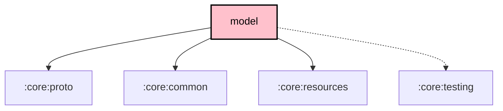

# `:core:model` (Meshtastic Domain Models)

## Overview
The `:core:model` module is a **Kotlin Multiplatform (KMP)** library containing the domain models and data classes used throughout the application and its API. These models are platform-agnostic and designed to be shared across Android, JVM, and future supported platforms.

## Multiplatform Support
Models are plain `commonMain` Kotlin types — `@Serializable` (kotlinx.serialization) data classes and
`@JvmInline value class`es — with no Android `Parcelable` dependency, so they are shared verbatim
across Android, JVM, and iOS.

## Key Models

- **`DataPacket`**: Represents a mesh packet (text, telemetry, etc.).
- **`Node`**: Contains detailed information about a node (position, SNR, battery, etc.).
- **`NodeAddress` / `ContactKey`**: Type-safe node addressing (`Broadcast`/`Local`/`ByNum`/`ById`) and contact-key parsing, replacing stringly-typed `"^all"`/`"!hex"` handling.
- **`DeviceHardware`**: Represents supported Meshtastic hardware devices and their capabilities.
- **`Channel`**: Represents a mesh channel configuration.

## Usage
This module is a core dependency of most feature modules.

```kotlin
// In commonMain
implementation(projects.core.model)
```

## Structure
- **`commonMain`**: Contains the majority of domain models and logic.
- **`androidMain`**: Contains Android-specific utilities and implementations for `expect` declarations.
- **`androidUnitTest`**: Contains unit tests that require Android-specific features (like `Parcel` testing via Robolectric).


## Dependency Graph

<!--region graph-->

```mermaid
graph TB
  :core:model[model]:::kmp-library
  :core:model --> :core:proto
  :core:model --> :core:common
  :core:model --> :core:resources
  :core:model -.-> :core:testing

classDef android-application fill:#CAFFBF,stroke:#000,stroke-width:2px,color:#000;
classDef android-application-compose fill:#CAFFBF,stroke:#000,stroke-width:2px,color:#000;
classDef compose-desktop-application fill:#CAFFBF,stroke:#000,stroke-width:2px,color:#000;
classDef android-feature fill:#FFD6A5,stroke:#000,stroke-width:2px,color:#000;
classDef android-library fill:#9BF6FF,stroke:#000,stroke-width:2px,color:#000;
classDef android-library-compose fill:#9BF6FF,stroke:#000,stroke-width:2px,color:#000;
classDef android-test fill:#A0C4FF,stroke:#000,stroke-width:2px,color:#000;
classDef jvm-library fill:#BDB2FF,stroke:#000,stroke-width:2px,color:#000;
classDef kmp-feature fill:#FFD6A5,stroke:#000,stroke-width:2px,color:#000;
classDef kmp-library-compose fill:#FFC1CC,stroke:#000,stroke-width:2px,color:#000;
classDef kmp-library fill:#FFC1CC,stroke:#000,stroke-width:2px,color:#000;
classDef unknown fill:#FFADAD,stroke:#000,stroke-width:2px,color:#000;

```
<!--endregion-->
