# `:core:navigation`

## Overview
The `:core:navigation` module defines the type-safe Navigation 3 route model for Android and Desktop using Kotlin Serialization.

## Key Components

### 1. `Routes.kt`
Contains serializable `NavKey` route classes/objects used by shared feature graphs.

### 2. `DeepLinkRouter.kt`
Parses Meshtastic deep-link URIs and synthesizes a typed backstack (for example `/nodes/1234/device-metrics`).

### 3. `NavigationConfig.kt`
Defines `MeshtasticNavSavedStateConfig` so Navigation 3 backstacks can be persisted/restored safely.

## Features
- **Type-Safety**: Uses serializable `NavKey` routes instead of ad-hoc string routes.
- **Deep-link synthesis**: Converts incoming URIs into typed backstacks via `DeepLinkRouter`.
- **Centralized definition**: Routes and saved-state serializers are declared in one place to avoid feature-module cycles.

## Usage
Feature modules depend on this module to define their entry points and navigate via `NavBackStack<NavKey>`.

```kotlin
import androidx.navigation3.runtime.NavBackStack
import androidx.navigation3.runtime.NavKey
import org.meshtastic.core.navigation.NodesRoutes

fun openNodeDetail(backStack: NavBackStack<NavKey>, destNum: Int) {
    backStack.add(NodesRoutes.NodeDetail(destNum))
}
```

## Module dependency graph

```mermaid
graph TB
  :core:navigation[navigation]:::kmp-library-compose

classDef android-application fill:#CAFFBF,stroke:#000,stroke-width:2px,color:#000;
classDef android-application-compose fill:#CAFFBF,stroke:#000,stroke-width:2px,color:#000;
classDef compose-desktop-application fill:#CAFFBF,stroke:#000,stroke-width:2px,color:#000;
classDef android-feature fill:#FFD6A5,stroke:#000,stroke-width:2px,color:#000;
classDef android-library fill:#9BF6FF,stroke:#000,stroke-width:2px,color:#000;
classDef android-library-compose fill:#9BF6FF,stroke:#000,stroke-width:2px,color:#000;
classDef android-test fill:#A0C4FF,stroke:#000,stroke-width:2px,color:#000;
classDef jvm-library fill:#BDB2FF,stroke:#000,stroke-width:2px,color:#000;
classDef kmp-feature fill:#FFD6A5,stroke:#000,stroke-width:2px,color:#000;
classDef kmp-library-compose fill:#FFC1CC,stroke:#000,stroke-width:2px,color:#000;
classDef kmp-library fill:#FFC1CC,stroke:#000,stroke-width:2px,color:#000;
classDef unknown fill:#FFADAD,stroke:#000,stroke-width:2px,color:#000;

```

<!--region graph-->

<!--endregion-->
