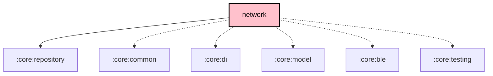

# `:core:network`

## Overview
The `:core:network` module handles all internet-based communication, including fetching firmware metadata, device hardware definitions, and map tiles (in the `fdroid` flavor). It also provides the shared radio transport layer (`TcpTransport`/`TcpRadioTransport`, `SerialTransport`, `BleRadioTransport`).

## Key Components

### 1. `Ktor` Client
The module uses **Ktor** as its primary HTTP client for high-performance, asynchronous networking.

### 2. Remote Data Sources
- **`FirmwareReleaseRemoteDataSource`**: Fetches the latest firmware versions from GitHub or Meshtastic's metadata servers.
- **`DeviceHardwareRemoteDataSource`**: Fetches definitions for supported Meshtastic hardware devices.

### 3. Shared Transports
- **`TcpTransport`** (`transport/`) + **`TcpRadioTransport`** (`radio/`): Multiplatform TCP transport and its `RadioTransport` adapter.
- **`SerialTransport`**: JVM-shared USB/Serial transport powered by jSerialComm.
- **`BleRadioTransport`** (`radio/`): The `RadioTransport` implementation for Bluetooth devices.
- **`BaseRadioTransportFactory`**: Common factory for instantiating the KMP transports.

> **BLE:** the `RadioTransport` implementation (`BleRadioTransport`) lives **here** in `radio/`; it delegates to the lower-level Kable connection primitives (`BleConnection`, `BleScanner`, `BluetoothRepository`, …) provided by [`:core:ble`](../ble/README.md). `BaseRadioTransportFactory` instantiates it when an address with the `x` (or `!`) prefix is resolved.

## Dependency Graph

<!--region graph-->

<!--endregion-->
