# `:core:network`

## Overview
The `:core:network` module handles all internet-based communication, including fetching firmware metadata, device hardware definitions, and map tiles (in the `fdroid` flavor).

## Key Components

### 1. `Ktor` Client
The module uses **Ktor** as its primary HTTP client for high-performance, asynchronous networking.

### 2. Remote Data Sources
- **`FirmwareReleaseRemoteDataSource`**: Fetches the latest firmware versions from GitHub or Meshtastic's metadata servers.
- **`DeviceHardwareRemoteDataSource`**: Fetches definitions for supported Meshtastic hardware devices.

## Module dependency graph

```mermaid
graph TB
  :core:network[network]:::kmp-library

classDef android-application fill:#CAFFBF,stroke:#000,stroke-width:2px,color:#000;
classDef android-application-compose fill:#CAFFBF,stroke:#000,stroke-width:2px,color:#000;
classDef compose-desktop-application fill:#CAFFBF,stroke:#000,stroke-width:2px,color:#000;
classDef android-feature fill:#FFD6A5,stroke:#000,stroke-width:2px,color:#000;
classDef android-library fill:#9BF6FF,stroke:#000,stroke-width:2px,color:#000;
classDef android-library-compose fill:#9BF6FF,stroke:#000,stroke-width:2px,color:#000;
classDef android-test fill:#A0C4FF,stroke:#000,stroke-width:2px,color:#000;
classDef jvm-library fill:#BDB2FF,stroke:#000,stroke-width:2px,color:#000;
classDef kmp-library fill:#FFC1CC,stroke:#000,stroke-width:2px,color:#000;
classDef unknown fill:#FFADAD,stroke:#000,stroke-width:2px,color:#000;

```

<!--region graph-->

<!--endregion-->
