# `:core:nfc`

## Overview
The `:core:nfc` module provides Near Field Communication (NFC) capabilities for the application. It is a KMP module with Android NFC hardware implementation isolated to `androidMain`. The shared NFC contract is provided via `LocalNfcScannerProvider` in `core:ui`.

## Key Components

### 1. `NfcScannerEffect` (androidMain)
A Composable side-effect that manages Android NFC adapter state and listens for NDEF tags. Located in `androidMain` since NFC hardware APIs are Android-specific.

### 2. `LocalNfcScannerProvider` (core:ui/commonMain)
The shared capability contract for NFC scanning, injected via `CompositionLocalProvider` from the app layer.

## Module dependency graph

```mermaid
graph TB
  :core:nfc[nfc]:::kmp-library

classDef android-application fill:#CAFFBF,stroke:#000,stroke-width:2px,color:#000;
classDef android-application-compose fill:#CAFFBF,stroke:#000,stroke-width:2px,color:#000;
classDef android-feature fill:#FFD6A5,stroke:#000,stroke-width:2px,color:#000;
classDef android-library fill:#9BF6FF,stroke:#000,stroke-width:2px,color:#000;
classDef android-library-compose fill:#9BF6FF,stroke:#000,stroke-width:2px,color:#000;
classDef android-test fill:#A0C4FF,stroke:#000,stroke-width:2px,color:#000;
classDef jvm-library fill:#BDB2FF,stroke:#000,stroke-width:2px,color:#000;
classDef kmp-library fill:#FFC1CC,stroke:#000,stroke-width:2px,color:#000;
classDef unknown fill:#FFADAD,stroke:#000,stroke-width:2px,color:#000;

```

<!--region graph-->

<!--endregion-->
