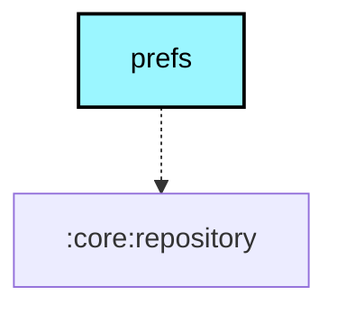

# `:core:prefs`

## Overview
The `:core:prefs` module provides a type-safe wrapper around `SharedPreferences` for managing application and radio configuration preferences.

## Key Components

### 1. `PrefDelegate.kt`
Uses Kotlin property delegates to simplify reading and writing preferences.

### 2. Specialized Prefs
- **`RadioPrefs`**: Manages radio-specific settings (e.g., the last connected device address).
- **`UiPrefs`**: Manages UI preferences (e.g., theme selection, unit systems).
- **`MapPrefs`**: Manages mapping preferences (e.g., preferred map provider).

## Module dependency graph

<!--region graph-->

<!--endregion-->
