# `:core:proto`

## Module dependency graph

```mermaid
graph TB
  :core:proto[proto]:::null

classDef android-application fill:#CAFFBF,stroke:#000,stroke-width:2px,color:#000;
classDef android-application-compose fill:#CAFFBF,stroke:#000,stroke-width:2px,color:#000;
classDef android-feature fill:#FFD6A5,stroke:#000,stroke-width:2px,color:#000;
classDef android-library fill:#9BF6FF,stroke:#000,stroke-width:2px,color:#000;
classDef android-library-compose fill:#9BF6FF,stroke:#000,stroke-width:2px,color:#000;
classDef android-test fill:#A0C4FF,stroke:#000,stroke-width:2px,color:#000;
classDef jvm-library fill:#BDB2FF,stroke:#000,stroke-width:2px,color:#000;
classDef kmp-library fill:#FFC1CC,stroke:#000,stroke-width:2px,color:#000;
classDef unknown fill:#FFADAD,stroke:#000,stroke-width:2px,color:#000;

```

<!--region graph-->

<!--endregion-->

## Meshtastic Protobuf Definitions

This module contains the generated Kotlin and Java code from the Meshtastic Protobuf definitions. It uses the [Wire](https://github.com/square/wire) library for efficient and clean model generation.

### Key Components

*   **Port Numbers**: Defines the `PortNum` enum for identifying different types of data payloads.
*   **Mesh Protocol**: Contains the core `MeshPacket` and protocol message definitions.
*   **Modules**: Includes definitions for telemetry, position, administration, and more.

### Usage

This module is typically used as a dependency of `core:api` and `core:model`.

```kotlin
implementation("com.github.meshtastic.Meshtastic-Android:meshtastic-android-proto:v2.7.13")
```
