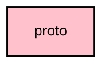

# `:core:proto`

## Overview
This module contains the generated Kotlin and Java code from the Meshtastic Protobuf definitions. It uses the [Wire](https://github.com/square/wire) library for efficient and clean model generation.

## Key Components

- **`PortNum`**: Defines the identification for different types of data payloads.
- **`MeshPacket`**: The core protocol message definition.
- **Protobuf Modules**: Definitions for telemetry, position, administration, and more.

## Usage
This module is a low-level dependency for any module that needs to encode or decode Meshtastic protocol data.

```kotlin
implementation(projects.core.proto)
```

## Module dependency graph

<!--region graph-->

```mermaid
graph TB
  :core:proto[proto]:::kmp-library

classDef android-application fill:#CAFFBF,stroke:#000,stroke-width:2px,color:#000;
classDef android-application-compose fill:#CAFFBF,stroke:#000,stroke-width:2px,color:#000;
classDef compose-desktop-application fill:#CAFFBF,stroke:#000,stroke-width:2px,color:#000;
classDef android-feature fill:#FFD6A5,stroke:#000,stroke-width:2px,color:#000;
classDef android-library fill:#9BF6FF,stroke:#000,stroke-width:2px,color:#000;
classDef android-library-compose fill:#9BF6FF,stroke:#000,stroke-width:2px,color:#000;
classDef android-test fill:#A0C4FF,stroke:#000,stroke-width:2px,color:#000;
classDef jvm-library fill:#BDB2FF,stroke:#000,stroke-width:2px,color:#000;
classDef kmp-library fill:#FFC1CC,stroke:#000,stroke-width:2px,color:#000;
classDef unknown fill:#FFADAD,stroke:#000,stroke-width:2px,color:#000;

```
<!--endregion-->
