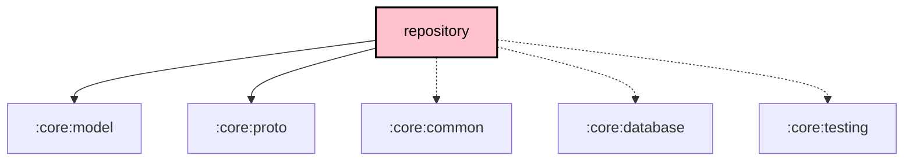

# `:core:repository`

## Overview

The `:core:repository` module defines the **data and infrastructure contracts** for the Meshtastic KMP architecture. It is almost entirely interfaces — concrete implementations live in `:core:service` and platform modules. Consumers receive `:core:model` and `:core:proto` transitively because both are `api()`-exported.

**Targets:** Android · JVM · iOS (via `meshtastic.kmp.library` convention plugin)

## Key Responsibilities

- Define the reactive data contracts between the long-running mesh service and all feature/UI layers
- Declare the raw hardware I/O interface (`RadioTransport`)
- Provide the mesh node database interface (`NodeRepository`)
- Expose per-node remote-admin passkey management (`SessionManager`)
- Host all packet handlers (admin, telemetry, traceroute, store-and-forward, neighbour info)
- Manage the outbound message queue, MQTT bridge, and XModem firmware transfer
- Provide the `AppWidgetUpdater` contract so the mesh service can trigger widget refreshes without depending on Android widget APIs directly

## Source Structure

```
src/
├── commonMain/kotlin/org/meshtastic/core/repository/
│   ├── RadioTransport.kt              ← interface: raw hardware I/O
│   ├── ServiceRepository.kt           ← interface: service ↔ UI bridge
│   ├── NodeRepository.kt              ← interface: mesh node database
│   ├── SessionManager.kt              ← interface: per-node passkey store
│   ├── MeshConnectionManager.kt       ← interface: connection lifecycle callbacks
│   ├── AppWidgetUpdater.kt            ← interface: trigger widget refresh
│   ├── LocationRepository.kt
│   ├── LocationService.kt
│   ├── CommandSender.kt
│   ├── AdminPacketHandler.kt
│   ├── FromRadioPacketHandler.kt
│   ├── MeshActionHandler.kt
│   ├── MeshConfigFlowManager.kt
│   ├── MeshConfigHandler.kt
│   ├── MeshDataHandler.kt
│   ├── MeshLocationManager.kt
│   ├── MeshLogRepository.kt
│   ├── MeshMessageProcessor.kt
│   ├── MeshRouter.kt
│   ├── MessageFilter.kt
│   ├── MessageQueue.kt
│   ├── MqttManager.kt
│   ├── NeighborInfoHandler.kt
│   ├── NodeManager.kt
│   ├── Notification.kt / NotificationManager.kt
│   ├── PacketHandler.kt / PacketRepository.kt
│   ├── QuickChatActionRepository.kt
│   ├── RadioConfigRepository.kt
│   ├── RadioInterfaceService.kt
│   ├── RadioTransportCallback.kt / RadioTransportFactory.kt
│   ├── ServiceBroadcasts.kt
│   ├── StoreForwardPacketHandler.kt
│   ├── TelemetryPacketHandler.kt
│   ├── TracerouteHandler.kt / TracerouteSnapshotRepository.kt
│   ├── XModemFile.kt / XModemManager.kt
│   ├── usecase/
│   │   └── SendMessageUseCase.kt
│   └── di/
│       └── CoreRepositoryModule.kt
├── androidMain/kotlin/    ← Android LocationRepository actual
├── iosMain/kotlin/        ← iOS LocationRepository actual
└── jvmMain/kotlin/        ← Desktop LocationRepository actual
```

## Core Interfaces

### `RadioTransport`

Raw hardware I/O contract for all physical transports (BLE, USB, TCP, Mock).

```kotlin
interface RadioTransport {
    fun handleSendToRadio(p: ByteArray)
    fun start()
    fun keepAlive()
    suspend fun close()
}
```

### `ServiceRepository`

The primary reactive bridge between the long-running mesh service and all feature/UI layers.

```kotlin
interface ServiceRepository {
    val connectionState: StateFlow<ConnectionState>
    val clientNotification: StateFlow<ClientNotification?>
    val errorMessage: StateFlow<String?>
    val connectionProgress: StateFlow<String?>
    val meshPacketFlow: Flow<MeshPacket>
    val tracerouteResponse: Flow<...>
    val neighborInfoResponse: Flow<...>
    val serviceAction: Flow<ServiceAction>

    fun setConnectionState(state: ConnectionState)
    fun emitMeshPacket(packet: MeshPacket)
    fun onServiceAction(action: ServiceAction)
}
```

### `NodeRepository`

Reactive mesh node database. Backed by Room KMP in `:core:service`.

```kotlin
interface NodeRepository {
    val myNodeInfo: StateFlow<MyNodeInfo?>
    val ourNodeInfo: StateFlow<Node?>
    val myId: StateFlow<String?>
    val localStats: StateFlow<LocalStats>
    val nodeDBbyNum: StateFlow<Map<Int, Node>>
    val onlineNodeCount: Flow<Int>
    val totalNodeCount: Flow<Int>

    fun getNodes(sort, filter, includeUnknown, onlyOnline, onlyDirect): Flow<List<Node>>
    suspend fun upsert(node: Node)
    suspend fun clearNodeDB(preserveFavorites: Boolean = false)
    suspend fun deleteNode(num: Int)
    suspend fun insertMetadata(nodeNum: Int, metadata: DeviceMetadata)
    suspend fun installConfig(mi: MyNodeInfo, nodes: List<NodeInfo>)
}
```

### `SessionManager`

Per-node remote-admin passkey store, consumed by `:core:domain`'s `EnsureRemoteAdminSessionUseCase`.

```kotlin
interface SessionManager {
    fun recordSession(srcNodeNum: Int, passkey: ByteString)
    fun getPasskey(destNum: Int): ByteString
    fun clearAll()
    val sessionRefreshFlow: Flow<Int>
    fun observeSessionStatus(destNum: Int): Flow<SessionStatus>
}
```

## Dependency Graph

```
core:repository
  ├── api → core:model    (exported to consumers)
  ├── api → core:proto    (exported to consumers)
  ├── core:common
  ├── core:database
  └── kotlinx.coroutines, kermit, androidx.paging.common
```

## Dependency Graph

<!--region graph-->

<!--endregion-->
