# `:core:resources`

## Overview
The `:core:resources` module is the centralized source for all UI strings and localizable resources. It uses the **Compose Multiplatform Resource** library to provide a type-safe way to access strings.

## Key Features

- **Single Source of Truth**: All UI strings must be defined in this module, not in the `app` module or feature modules.
- **Type-Safety**: Generates a `Res` object that allows accessing strings like `Res.string.your_key` with compile-time checking.

## Usage
The library provides a standard way to access strings in Jetpack Compose.

```kotlin
import org.jetbrains.compose.resources.stringResource
import org.meshtastic.core.resources.Res
import org.meshtastic.core.resources.your_string_key

Text(text = stringResource(Res.string.your_string_key))
```

## Module dependency graph

```mermaid
graph TB
  :core:resources[resources]:::kmp-library

classDef android-application fill:#CAFFBF,stroke:#000,stroke-width:2px,color:#000;
classDef android-application-compose fill:#CAFFBF,stroke:#000,stroke-width:2px,color:#000;
classDef android-feature fill:#FFD6A5,stroke:#000,stroke-width:2px,color:#000;
classDef android-library fill:#9BF6FF,stroke:#000,stroke-width:2px,color:#000;
classDef android-library-compose fill:#9BF6FF,stroke:#000,stroke-width:2px,color:#000;
classDef android-test fill:#A0C4FF,stroke:#000,stroke-width:2px,color:#000;
classDef jvm-library fill:#BDB2FF,stroke:#000,stroke-width:2px,color:#000;
classDef kmp-library fill:#FFC1CC,stroke:#000,stroke-width:2px,color:#000;
classDef unknown fill:#FFADAD,stroke:#000,stroke-width:2px,color:#000;

```

<!--region graph-->

<!--endregion-->
