# `:core:service`

## Overview

**Targets:** Android · JVM (Desktop) · iOS

The `:core:service` module contains the abstractions and client-side logic for interacting with the main Meshtastic Android Service.

## Key Components

### 1. `MeshService`
Android foreground service entry point that hosts the orchestrator lifecycle.

### 2. `ServiceRepository`
A high-level repository that wraps the service connection and exposes reactive `Flow`s for connection status and data arrival.

### 3. `ConnectionState`
Represents the current state of the radio connection (`Connected`, `Disconnected`, `DeviceSleep`, etc.).

### 4. `RadioControllerImpl`
The in-process `RadioController` composition root (Desktop, iOS, and single-process Android). It assembles four focused sub-controllers — `AdminControllerImpl`, `MessagingControllerImpl`, `NodeControllerImpl`, `QueryControllerImpl` — via Kotlin interface delegation, and owns the cross-cutting concerns (connection state, packet-id, location, device-address switching). Commands are direct suspend calls to `CommandSender`; admin sends are fire-and-forget (the device is the source of truth). Config writes use the `editSettings { }` transaction.

## Dependency Graph

```mermaid
graph TB
  :core:service[service]:::kmp-library
  :core:service --> :core:repository
  :core:service -.-> :core:common
  :core:service -.-> :core:data
  :core:service -.-> :core:database
  :core:service -.-> :core:di
  :core:service -.-> :core:model
  :core:service -.-> :core:navigation
  :core:service -.-> :core:network
  :core:service -.-> :core:ble
  :core:service -.-> :core:prefs
  :core:service -.-> :core:takserver
  :core:service -.-> :core:testing

classDef android-application fill:#CAFFBF,stroke:#000,stroke-width:2px,color:#000;
classDef android-application-compose fill:#CAFFBF,stroke:#000,stroke-width:2px,color:#000;
classDef compose-desktop-application fill:#CAFFBF,stroke:#000,stroke-width:2px,color:#000;
classDef android-feature fill:#FFD6A5,stroke:#000,stroke-width:2px,color:#000;
classDef android-library fill:#9BF6FF,stroke:#000,stroke-width:2px,color:#000;
classDef android-library-compose fill:#9BF6FF,stroke:#000,stroke-width:2px,color:#000;
classDef android-test fill:#A0C4FF,stroke:#000,stroke-width:2px,color:#000;
classDef jvm-library fill:#BDB2FF,stroke:#000,stroke-width:2px,color:#000;
classDef kmp-feature fill:#FFD6A5,stroke:#000,stroke-width:2px,color:#000;
classDef kmp-library-compose fill:#FFC1CC,stroke:#000,stroke-width:2px,color:#000;
classDef kmp-library fill:#FFC1CC,stroke:#000,stroke-width:2px,color:#000;
classDef unknown fill:#FFADAD,stroke:#000,stroke-width:2px,color:#000;

```

<!--region graph-->

<!--endregion-->
