# `:core:service`

## Overview
The `:core:service` module contains the abstractions and client-side logic for interacting with the main Meshtastic Android Service.

## Key Components

### 1. `ServiceClient`
The main entry point for other parts of the app (or third-party apps) to bind to and interact with the mesh service via AIDL.

### 2. `ServiceRepository`
A high-level repository that wraps the service connection and exposes reactive `Flow`s for connection status and data arrival.

### 3. `ConnectionState`
An enum representing the current state of the radio connection (`Connected`, `Disconnected`, `DeviceSleep`, etc.).

### 4. `ServiceAction`
Defines Intent actions for starting, stopping, and interacting with the background service.

## Module dependency graph

```mermaid
graph TB
  :core:service[service]:::kmp-library

classDef android-application fill:#CAFFBF,stroke:#000,stroke-width:2px,color:#000;
classDef android-application-compose fill:#CAFFBF,stroke:#000,stroke-width:2px,color:#000;
classDef android-feature fill:#FFD6A5,stroke:#000,stroke-width:2px,color:#000;
classDef android-library fill:#9BF6FF,stroke:#000,stroke-width:2px,color:#000;
classDef android-library-compose fill:#9BF6FF,stroke:#000,stroke-width:2px,color:#000;
classDef android-test fill:#A0C4FF,stroke:#000,stroke-width:2px,color:#000;
classDef jvm-library fill:#BDB2FF,stroke:#000,stroke-width:2px,color:#000;
classDef kmp-library fill:#FFC1CC,stroke:#000,stroke-width:2px,color:#000;
classDef unknown fill:#FFADAD,stroke:#000,stroke-width:2px,color:#000;

```

<!--region graph-->

<!--endregion-->
