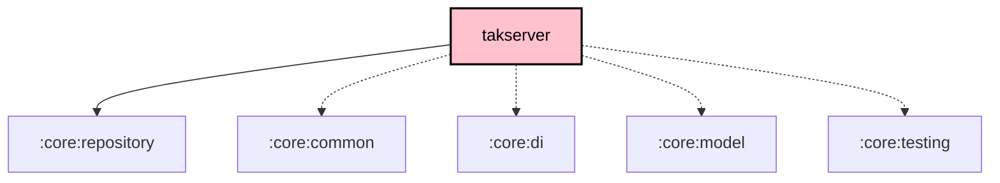

# `:core:takserver`

## Overview

The `:core:takserver` module implements the **Meshtastic ↔ TAK (Team Awareness Kit) bridge**. It embeds an mTLS TCP server (port 8089) compatible with ATAK (Android), iTAK (iOS), and WinTAK clients, enabling mesh-networked position sharing and GeoChat with TAK-enabled devices.

**Targets:** Android · JVM (Desktop) · iOS — fully multiplatform with `expect`/`actual` splits for compression, file I/O, and the TCP server itself.

## Key Responsibilities

- Serve an mTLS TCP listener (port 8089) compatible with the CoT (Cursor-on-Target) protocol
- Convert Meshtastic protobuf packets (`TAKPacketV2`) to CoT XML events and vice versa
- Generate ATAK Data Package `.zip` exports (team contacts, map overlays)
- Compress CoT payloads using Zstd (TAK SDK format) with `expect`/`actual` platform implementations
- Buffer up to 50 CoT messages for 5 minutes when no TAK clients are connected; drain on reconnect
- Provide Crowdin-localised TAK preference XML for ATAK client provisioning

## Source Structure

```
src/
├── commonMain/kotlin/org/meshtastic/core/takserver/
│   ├── TAKServer.kt                 ← interface + expect createTAKServer()
│   ├── TAKServerManager.kt          ← interface + TAKServerManagerImpl (offline queue)
│   ├── TAKMeshIntegration.kt        ← bridges mesh service ↔ TAK server
│   ├── CoTConversion.kt             ← Position/User → CoTMessage extension fns
│   ├── CoTXml.kt / CoTXmlParser.kt / CoTXmlFrameBuffer.kt
│   ├── CoTXmlDataClasses.kt
│   ├── CoTDetailStripper.kt
│   ├── TAKModels.kt                 ← CoTMessage, TAKClientInfo, TAKConnectionEvent
│   ├── TAKPacketConversion.kt
│   ├── TAKPacketV2Conversion.kt
│   ├── TAKDefaults.kt
│   ├── TAKDataPackageGenerator.kt
│   ├── RouteDataPackageGenerator.kt
│   ├── TAKPrefXmlDataClasses.kt
│   ├── TakV2TypeMapper.kt
│   ├── TakConversionHelpers.kt
│   ├── XmlUtils.kt
│   ├── AtakFileWriter.kt            ← expect
│   ├── TakSdkCompressor.kt          ← expect (Zstd TAK-SDK frame)
│   ├── TakV2Compressor.kt           ← expect (Zstd TAKPacketV2 frame)
│   ├── ZipArchiver.kt               ← expect
│   ├── TakFixtureLoader.kt          ← expect (test fixtures)
│   ├── TakMeshTestRunner.kt
│   └── di/
│       └── CoreTakServerModule.kt
├── jvmAndroidMain/kotlin/           ← actual TAKServerJvm, TAKClientConnection, TakCertLoader
├── androidMain/kotlin/              ← actual AtakFileWriter (Android)
├── jvmMain/kotlin/                  ← actual AtakFileWriter (Desktop), XML pull-parser
└── iosMain/kotlin/                  ← actual TAKServerIos, actual compression impls
```

## Notable APIs

### `TAKServer` (interface)

```kotlin
interface TAKServer {
    val connectionCount: StateFlow<Int>
    var onMessage: ((CoTMessage, TAKClientInfo?) -> Unit)?
    var onClientConnected: (() -> Unit)?

    suspend fun start(scope: CoroutineScope): Result<Unit>
    fun stop()
    suspend fun broadcast(cotMessage: CoTMessage)
    suspend fun broadcastRawXml(xml: String)
    suspend fun hasConnections(): Boolean
}
```

The mTLS listener binds on port 8089 using a bundled `server.p12` / `ca.pem` identity, compatible with the ATAK Data Package provisioning flow.

### `TAKServerManager` (interface)

```kotlin
interface TAKServerManager {
    val isRunning: StateFlow<Boolean>
    val connectionCount: StateFlow<Int>
    val inboundMessages: SharedFlow<InboundCoTMessage>

    suspend fun start(scope: CoroutineScope)
    fun stop()
    suspend fun broadcast(cotMessage: CoTMessage)
    suspend fun broadcastRawXml(xml: String)
}
```

`TAKServerManagerImpl` adds an **offline queue**: buffers up to 50 CoT messages for 5 minutes when no clients are connected and drains them automatically on the next `onClientConnected` callback.

### `CoTMessage`

```kotlin
@Serializable
data class CoTMessage(
    val uid: String,
    val type: String,              // e.g. "a-f-G-U-C" (friendly ground unit)
    val time: Instant,
    val lat: Double, val lon: Double, val hae: Double,
    val contact: CoTContact?,
    val group: CoTGroup?,
    val track: CoTTrack?,
    val chat: CoTChat?,
    val remarks: String?,
    // ...
)

// Factory helpers
CoTMessage.pli(uid, callsign, lat, lon, ...)   // Position Location Information
CoTMessage.chat(senderUid, callsign, message, chatroom)
```

### CoT Conversion

```kotlin
// Meshtastic proto → CoT
org.meshtastic.proto.Position.toCoTMessage(uid, callsign, team, role, battery): CoTMessage
org.meshtastic.proto.User.toCoTMessage(position, team, role, battery): CoTMessage
```

## Dependency Graph

```
core:takserver
  ├── api → core:repository     (exported)
  ├── core:common, core:di, core:model, org.meshtastic:protobufs (Maven)
  ├── okio, kotlinx.serialization.json
  ├── xmlutil-core, xmlutil-serialization
  ├── ktor-client-core, ktor-network   (TCP socket)
  └── kotlinx.datetime, kermit         (zstd rides on the SDK's transitive kzstd)
```

## Local TAK Server Feature

The Local TAK Server can be enabled from the app's Settings screen. When running, ATAK/iTAK clients on the same network can connect to `<device-ip>:8089` and their position reports are automatically bridged onto the mesh. Mesh node positions are broadcast to all connected TAK clients in real time.

## TAKPacket-SDK consumer & version-bump playbook

This module consumes the external [TAKPacket-SDK](https://github.com/meshtastic/TAKPacket-SDK) (`org.meshtastic:takpacket-sdk`, KMP since 0.7.0; pinned as `takpacket-sdk` in `gradle/libs.versions.toml`, currently 0.8.0) for the V2 wire format. The SDK does CoT-XML ↔ `TAKPacketV2` ↔ zstd-compressed bytes; it owns the dictionaries and the schema. The `TAKPacketV2` proto types themselves come from the `org.meshtastic:protobufs` Maven artifact (pinned as `meshtastic-protobufs`, api()-exported by `:core:model`).

**Two V2 wire paths — keep both in mind when the SDK changes:**

- **Path A (primary, SDK-delegated):** `TakSdkCompressor` / `TakV2Compressor` call the SDK's parser/builder/compressor. This path is insulated from proto field renames *as long as* the SDK and `meshtastic-protobufs` versions are bumped together.
- **Path B (fallback):** `TAKPacketV2Conversion.kt` builds and reads the Wire-generated `TAKPacketV2` **directly** (SDK-failure send fallback; iOS receive stub). It references proto fields by name, so it **breaks at compile time** on any schema change and must be updated in lockstep.

**When bumping to a new (wire-breaking) SDK version:**
1. `gradle/libs.versions.toml` → bump `takpacket-sdk` (and, if the schema moved, `meshtastic-protobufs` to the matching protobufs release).
2. **Leave `:core:model`'s exclude block intact** (`core/model/build.gradle.kts`): the SDK still declares a transitive, older `org.meshtastic:protobufs` pin, so `:core:model` api()-exports the SDK with `exclude(group = "org.meshtastic", module = "protobufs" / "protobufs-jvm" / "protobufs-android")` — that keeps the app's single protobufs version authoritative and prevents duplicate-class / proto-ABI breakage. (The `.toString()` string-notation there is load-bearing: catalog dependencies are immutable, so `exclude {}` only works on the string copy.)
3. Update **Path B** (`TAKPacketV2Conversion.kt`) and the **bridge** (`TakV2Compressor.kt`) for any renamed/removed/added wire fields.
4. Test: `./gradlew :core:takserver:jvmTest` — against a locally published SDK add `-PuseMavenLocal` (gated in `settings.gradle.kts`); against a published version add `--refresh-dependencies` instead.

**Wire facts (don't re-introduce phantom changes):** PLI is **implicit** — no payload variant + an `a-f-*` cot type is a PLI. `DrawnShape` vertices are two packed `repeated sint32` delta columns. **`course` stays `deg×100`, `uid` stays a string, `stale_seconds` stays tag 16** — deliberate; do not "fix" them in `TAKPacketV2Conversion.kt`.

**Debug "Send Test CoTs":** `TakMeshTestRunner` sends the bundled `tak_test_fixtures/*.xml` through the SDK path (parse → strip → compress → send). They ride the SDK path, so they need no edits across wire breaks — they ARE the regression surface.

## Dependency Graph

<!--region graph-->

<!--endregion-->
