/*
 * Copyright (c) 2026 Meshtastic LLC
 *
 * This program is free software: you can redistribute it and/or modify
 * it under the terms of the GNU General Public License as published by
 * the Free Software Foundation, either version 3 of the License, or
 * (at your option) any later version.
 *
 * This program is distributed in the hope that it will be useful,
 * but WITHOUT ANY WARRANTY; without even the implied warranty of
 * MERCHANTABILITY or FITNESS FOR A PARTICULAR PURPOSE.  See the
 * GNU General Public License for more details.
 *
 * You should have received a copy of the GNU General Public License
 * along with this program.  If not, see <https://www.gnu.org/licenses/>.
 */

# `:core:testing`

## Module dependency graph

```mermaid
graph TB
  :core:testing[testing]:::kmp-library

classDef android-application fill:#CAFFBF,stroke:#000,stroke-width:2px,color:#000;
classDef android-application-compose fill:#CAFFBF,stroke:#000,stroke-width:2px,color:#000;
classDef compose-desktop-application fill:#CAFFBF,stroke:#000,stroke-width:2px,color:#000;
classDef android-feature fill:#FFD6A5,stroke:#000,stroke-width:2px,color:#000;
classDef android-library fill:#9BF6FF,stroke:#000,stroke-width:2px,color:#000;
classDef android-library-compose fill:#9BF6FF,stroke:#000,stroke-width:2px,color:#000;
classDef android-test fill:#A0C4FF,stroke:#000,stroke-width:2px,color:#000;
classDef jvm-library fill:#BDB2FF,stroke:#000,stroke-width:2px,color:#000;
classDef kmp-feature fill:#FFD6A5,stroke:#000,stroke-width:2px,color:#000;
classDef kmp-library-compose fill:#FFC1CC,stroke:#000,stroke-width:2px,color:#000;
classDef kmp-library fill:#FFC1CC,stroke:#000,stroke-width:2px,color:#000;
classDef unknown fill:#FFADAD,stroke:#000,stroke-width:2px,color:#000;

```

<!--region graph-->

<!--endregion-->

## Overview
The `:core:testing` module is a dedicated **Kotlin Multiplatform (KMP)** library that provides shared test fakes, doubles, rules, and utilities. It is designed to be consumed by the `commonTest` source sets of all other KMP modules to ensure consistent and unified testing behavior across the codebase.

By centralizing fakes and mocking utilities here, we prevent duplication of test setups and enforce a standard approach to testing ViewModels, Repositories, and pure domain logic.

## Key Components

- **Test Doubles / Fakes**: Provides in-memory implementations of core repositories (e.g., `FakeNodeRepository`, `FakeMeshLogRepository`) to isolate components under test.
- **Coroutines Testing**: Provides dispatchers and test rules that replace the main dispatcher with `TestDispatcher` to allow time-control and synchronous execution of coroutines in tests.
- **Mokkery Support**: Integrated with the Mokkery compiler plugin to provide robust and unified mocking capabilities in `commonTest`.

## Usage
Add this module to your `commonTest` source set dependencies in your KMP module's `build.gradle.kts`:

```kotlin
kotlin {
    sourceSets {
        commonTest.dependencies {
            implementation(projects.core.testing)
        }
    }
}
```
