# `:core:ui`

## Overview
The `:core:ui` module contains shared Jetpack Compose components, themes, and utility functions used across the entire Meshtastic Android application. It ensures a consistent look and feel following Material 3 guidelines.

## Key Components

### 1. Alert Dialogs (`org.meshtastic.core.ui.component.AlertDialogs.kt`)
- **`MeshtasticDialog`**: The base dialog component for all alerts.
- **`MeshtasticResourceDialog`**: Optimized for dialogs with resource-only content.
- **`MeshtasticTextDialog`**: Optimized for dialogs with mixed resource and raw text content.

### 2. Common UI Elements
- **`LastHeardInfo`**: Displays when a node was last seen.
- **`TelemetryInfo`**: Displays battery, voltage, and other telemetry data.
- **`TransportIcon`**: Shows the connection type (BLE, USB, TCP).
- **`MainAppBar`**: The standard top app bar used in the app.

### 3. Preferences
Standardized Material 3 preference components for settings screens:
- `RegularPreference`
- `SwitchPreference`
- `DropDownPreference`
- `SliderPreference`
- `EditTextPreference`

### 4. Utilities
- **`ModifierExtensions.kt`**: Useful Compose Modifiers (e.g., conditional modifiers).
- **`ProtoExtensions.kt`**: Extensions for mapping Protobuf models to UI-friendly strings or icons.

## Usage
Most components are designed to be used with the **Compose Multiplatform Resource** library for strings.

```kotlin
import org.meshtastic.core.ui.component.MeshtasticResourceDialog
import org.meshtastic.core.resources.Res
import org.meshtastic.core.resources.ok

MeshtasticResourceDialog(
    title = Res.string.your_title,
    message = Res.string.your_message,
    onDismissRequest = { /* ... */ },
    confirmButtonText = Res.string.ok
)
```

## Module dependency graph

```mermaid
graph TB
  :core:ui[ui]:::compose-desktop-application

classDef android-application fill:#CAFFBF,stroke:#000,stroke-width:2px,color:#000;
classDef android-application-compose fill:#CAFFBF,stroke:#000,stroke-width:2px,color:#000;
classDef compose-desktop-application fill:#CAFFBF,stroke:#000,stroke-width:2px,color:#000;
classDef android-feature fill:#FFD6A5,stroke:#000,stroke-width:2px,color:#000;
classDef android-library fill:#9BF6FF,stroke:#000,stroke-width:2px,color:#000;
classDef android-library-compose fill:#9BF6FF,stroke:#000,stroke-width:2px,color:#000;
classDef android-test fill:#A0C4FF,stroke:#000,stroke-width:2px,color:#000;
classDef jvm-library fill:#BDB2FF,stroke:#000,stroke-width:2px,color:#000;
classDef kmp-feature fill:#FFD6A5,stroke:#000,stroke-width:2px,color:#000;
classDef kmp-library fill:#FFC1CC,stroke:#000,stroke-width:2px,color:#000;
classDef unknown fill:#FFADAD,stroke:#000,stroke-width:2px,color:#000;

```

<!--region graph-->

<!--endregion-->
