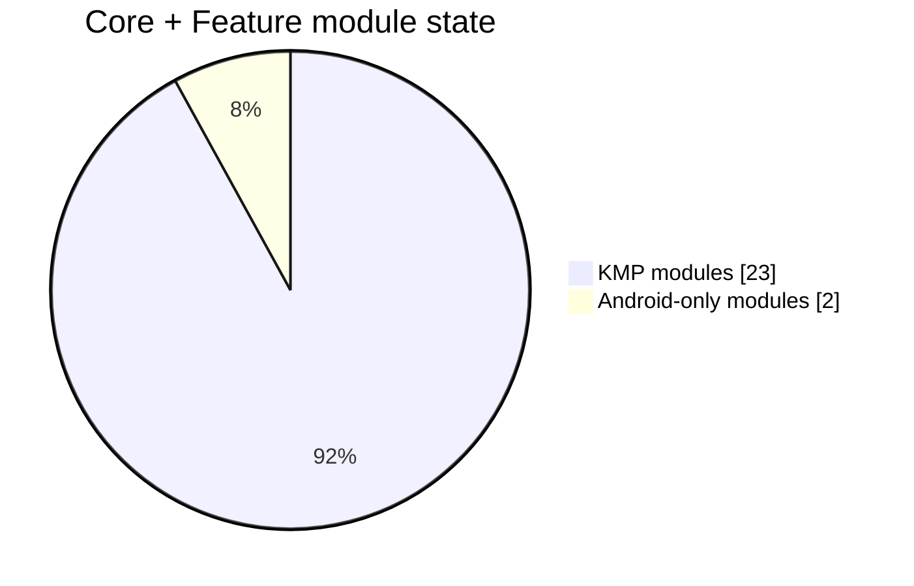
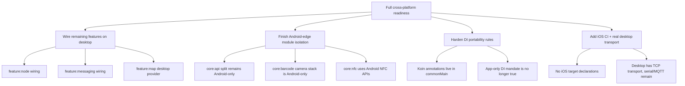

# KMP Progress Re-evaluation — March 2026

> Snapshot date: 2026-03-10
>
> This document is an evidence-backed re-baseline of Meshtastic-Android's Kotlin Multiplatform migration progress. It supplements and partially corrects the historical narrative in [`docs/kmp-migration.md`](./kmp-migration.md).

## Scope

This review covers:

- all `core:*` and `feature:*` modules in [`settings.gradle.kts`](../settings.gradle.kts)
- build conventions in [`build-logic/convention`](../build-logic/convention)
- current DI wiring in [`app/src/main/kotlin/org/meshtastic/app/di/AppKoinModule.kt`](../app/src/main/kotlin/org/meshtastic/app/di/AppKoinModule.kt)
- current application startup in [`app/src/main/kotlin/org/meshtastic/app/MeshUtilApplication.kt`](../app/src/main/kotlin/org/meshtastic/app/MeshUtilApplication.kt)
- local git history through 2026-03-10
- current dependency state in [`gradle/libs.versions.toml`](../gradle/libs.versions.toml)

---

## Executive summary

Meshtastic-Android has made **substantial structural KMP progress** very quickly in early 2026.

The migration is **farther along than a normal Android app**, but **not as far along as the existing migration guide sometimes implies**.

### Headline assessment

| Dimension | Status | Assessment |
|---|---:|---|
| Core + feature module structural KMP conversion | **23 / 25** | Strong |
| Core-only structural KMP conversion | **17 / 19** | Strong |
| Feature module structural KMP conversion | **6 / 6** | Excellent |
| Explicit non-Android target declarations | **23 / 25** | Strong — all KMP modules have `jvm()` |
| Android-only blocker modules left | **2** | Clear, bounded |
| Cross-target CI verification | **1 JVM smoke step** | Full coverage — 17 core + 6 feature + desktop:test |

### Bottom line

- **If the question is "Have we mostly moved business logic into shared KMP modules?"** → **yes**.
- **If the question is "Could we realistically add iOS/Desktop with limited cleanup?"** → **getting close** — full JVM validation is passing, desktop boots with a Navigation 3 shell using shared routes, real feature screen wiring is next.
- **If the question is "Are we now on the right architecture path?"** → **yes, strongly**.

### Progress scorecard

| Area | Score | Notes |
|---|---:|---|
| Shared business/data logic | **8.5 / 10** | `core:data`, `core:domain`, `core:database`, `core:prefs`, `core:network`, `core:repository` are structurally shared |
| Shared feature/UI logic | **9.5 / 10** | All 6 feature modules are KMP with `jvm()` target and compile clean; `feature:node` and `feature:settings` UI fully in `commonMain`; `core:ui` and Navigation 3 are in place |
| Android decoupling | **8.5 / 10** | `commonMain` is clean; 11 passthrough Android ViewModel wrappers eliminated; `BaseUIViewModel` extracted to `core:ui` |
| Multi-target readiness | **8 / 10** | 23/25 modules have JVM target; desktop has Navigation 3 shell with shared routes; TCP transport with `want_config` handshake working; `feature:settings` wired with ~35 real screens on desktop (including 5 desktop-specific config screens); all feature modules validated on JVM |
| DI portability hygiene | **5 / 10** | Koin works, but `commonMain` now contains Koin modules/annotations despite prior architectural guidance |
| CI confidence for future iOS/Desktop | **8.5 / 10** | CI JVM smoke compile covers all 17 core + all 6 feature modules + `desktop:test` |



---

## What is genuinely complete

### 1. The architectural center of gravity has moved into shared modules

This is the biggest success.

Evidence in current build files shows these are already on `meshtastic.kmp.library`:

- `core:ble`
- `core:common`
- `core:data`
- `core:database`
- `core:datastore`
- `core:di`
- `core:domain`
- `core:model`
- `core:navigation`
- `core:network`
- `core:nfc`
- `core:prefs`
- `core:proto`
- `core:repository`
- `core:resources`
- `core:service`
- `core:ui`
- all feature modules: `intro`, `messaging`, `map`, `node`, `settings`, `firmware`

That is a major milestone. The repo is no longer “Android app with a few shared helpers”; it is now “Android app with a shared KMP core and KMP feature stack.”

### 2. Shared UI architecture is materially real, not aspirational

Current evidence supports the following:

- `core:ui` is KMP via [`core/ui/build.gradle.kts`](../core/ui/build.gradle.kts) — with `commonMain`, `androidMain`, and `jvmMain` source sets
- `core:ui` includes shared `BaseUIViewModel` in `commonMain` and `ConnectionsViewModel` in `commonMain`
- `core:resources` uses Compose Multiplatform resources via [`core/resources/build.gradle.kts`](../core/resources/build.gradle.kts)
- `core:navigation` uses Navigation 3 runtime in `commonMain` via [`core/navigation/build.gradle.kts`](../core/navigation/build.gradle.kts)
- feature modules are KMP Compose modules via their `build.gradle.kts` files
- `feature:node` UI components have been migrated from `androidMain` → `commonMain`
- `feature:settings` UI components have been migrated from `androidMain` → `commonMain`
- `feature:settings` is the first feature **fully wired on desktop** with ~35 real composable screens (including 5 desktop-specific config screens for Device, Position, Network, Security, and ExternalNotification)
- Desktop has a **working TCP transport** (`DesktopRadioInterfaceService`) with auto-reconnect and a **mesh service controller** (`DesktopMeshServiceController`) that orchestrates the full `want_config` handshake

This is unusually advanced for an Android-first app.

### 3. The Hilt → Koin migration is complete enough to unblock KMP

Current app startup and root assembly are clearly Koin-based:

- [`MeshUtilApplication.kt`](../app/src/main/kotlin/org/meshtastic/app/MeshUtilApplication.kt)
- [`AppKoinModule.kt`](../app/src/main/kotlin/org/meshtastic/app/di/AppKoinModule.kt)

This is strategically important because Hilt would have remained one of the strongest barriers to deeper KMP adoption.

### 4. The BLE architecture is moving in the correct direction

The repo's BLE direction is good:

- `core:ble` is KMP
- Android Nordic dependencies are isolated to `androidMain` in [`core/ble/build.gradle.kts`](../core/ble/build.gradle.kts)
- the repo already adopted an abstraction-first BLE shape instead of leaking vendor APIs through the domain layer

That makes future alternative platform implementations possible.

---

## What is **not** complete yet

## 1. The repo is structurally KMP, but not yet truly multi-target

This is the single most important correction.

Most KMP modules currently use the Android KMP library plugin and define only an Android target.

The clearest evidence is in build logic:

- [`KmpLibraryConventionPlugin.kt`](../build-logic/convention/src/main/kotlin/KmpLibraryConventionPlugin.kt) applies:
  - `org.jetbrains.kotlin.multiplatform`
  - `com.android.kotlin.multiplatform.library`
- [`KotlinAndroid.kt`](../build-logic/convention/src/main/kotlin/org/meshtastic/buildlogic/KotlinAndroid.kt) configures Android KMP targets automatically
- [`core/proto/build.gradle.kts`](../core/proto/build.gradle.kts) explicitly adds `jvm()`
- [`core/common/build.gradle.kts`](../core/common/build.gradle.kts) explicitly adds `jvm()`
- [`core:model/build.gradle.kts`](../core/model/build.gradle.kts) explicitly adds `jvm()`
- [`core:repository/build.gradle.kts`](../core/repository/build.gradle.kts) explicitly adds `jvm()`
- [`core/di/build.gradle.kts`](../core/di/build.gradle.kts) explicitly adds `jvm()`
- [`core/navigation/build.gradle.kts`](../core/navigation/build.gradle.kts) explicitly adds `jvm()`
- [`core/resources/build.gradle.kts`](../core/resources/build.gradle.kts) explicitly adds `jvm()`
- [`core/datastore/build.gradle.kts`](../core/datastore/build.gradle.kts) explicitly adds `jvm()`
- [`core/database/build.gradle.kts`](../core/database/build.gradle.kts) explicitly adds `jvm()`
- [`core/domain/build.gradle.kts`](../core/domain/build.gradle.kts) explicitly adds `jvm()`
- [`core/prefs/build.gradle.kts`](../core/prefs/build.gradle.kts) explicitly adds `jvm()`
- [`core/network/build.gradle.kts`](../core/network/build.gradle.kts) explicitly adds `jvm()`
- [`core/nfc/build.gradle.kts`](../core/nfc/build.gradle.kts) explicitly adds `jvm()`
- [`feature/settings/build.gradle.kts`](../feature/settings/build.gradle.kts) explicitly adds `jvm()`
- [`feature/firmware/build.gradle.kts`](../feature/firmware/build.gradle.kts) explicitly adds `jvm()`
- [`feature/intro/build.gradle.kts`](../feature/intro/build.gradle.kts) explicitly adds `jvm()`
- [`feature/messaging/build.gradle.kts`](../feature/messaging/build.gradle.kts) explicitly adds `jvm()`
- [`feature/map/build.gradle.kts`](../feature/map/build.gradle.kts) explicitly adds `jvm()`
- [`feature/node/build.gradle.kts`](../feature/node/build.gradle.kts) explicitly adds `jvm()`

So today the repo has:

- **broad shared source-set adoption**
- **meaningful explicit second-target validation**, with a repo-wide JVM pilot across all current KMP modules

That means the current state is best described as:

> **"Android-first KMP with full JVM cross-compilation"** — the entire shared graph (17 core + 6 feature modules) compiles on JVM, desktop boots with a full DI graph, and CI enforces it.

## 2. Two core modules remain plainly Android-only

These are the remaining structural holdouts:

- [`core/api/build.gradle.kts`](../core/api/build.gradle.kts) → `meshtastic.android.library`
- [`core/barcode/build.gradle.kts`](../core/barcode/build.gradle.kts) → `meshtastic.android.library`

`core:nfc` was previously Android-only but has been converted to a KMP module with its NFC hardware code isolated to `androidMain`.

CI has also begun to enforce that pilot with a dedicated JVM smoke compile step covering all 17 core + 6 feature modules + `desktop:test` in [`.github/workflows/reusable-check.yml`](../.github/workflows/reusable-check.yml).

These are not minor details; they sit exactly at the platform edge:

- AIDL / service API surface
- camera + barcode scanning
- NFC hardware integration

This is acceptable in the short term, but it means the “full KMP core” is not done.

## 3. The historical migration narrative overstated `core:api`

Earlier migration wording grouped `core:service` and `core:api` together as if both had become KMP modules.

Current code shows a split reality:

- `core:service` **is** KMP
- `core:api` **is not**; it is still Android-only, which makes sense because AIDL is Android-only

The accurate statement is:

> `core:service` is KMP, while `core:api` remains an Android adapter/public integration module.

## 4. Shared-module DI became a real architecture change during the migration sprint

Earlier migration guidance aimed to keep DI-dependent components centralized in `app`.

That is **not how the current codebase ended up**.

Current codebase evidence:

- [`core/domain/src/commonMain/kotlin/org/meshtastic/core/domain/di/CoreDomainModule.kt`](../core/domain/src/commonMain/kotlin/org/meshtastic/core/domain/di/CoreDomainModule.kt) contains `@Module` + `@ComponentScan`
- [`feature/map/src/commonMain/kotlin/org/meshtastic/feature/map/di/FeatureMapModule.kt`](../feature/map/src/commonMain/kotlin/org/meshtastic/feature/map/di/FeatureMapModule.kt) contains `@Module`
- [`feature/settings/src/commonMain/kotlin/org/meshtastic/feature/settings/di/FeatureSettingsModule.kt`](../feature/settings/src/commonMain/kotlin/org/meshtastic/feature/settings/di/FeatureSettingsModule.kt) contains `@Module`
- [`feature/map/src/commonMain/kotlin/org/meshtastic/feature/map/SharedMapViewModel.kt`](../feature/map/src/commonMain/kotlin/org/meshtastic/feature/map/SharedMapViewModel.kt) contains `@KoinViewModel`

So the real state is:

> Koin has been pushed down into shared modules already.

That is not necessarily wrong, but it is a **material architectural change** from the old migration mandate and should be treated explicitly.

---

## Git-history timeline

Before the explicit KMP conversion wave in 2026, the repo spent roughly **20+ months** accumulating the architectural preconditions for KMP.

### Long-runway foundations before explicit KMP

- **2022-06-11 — `54f611290`**: LocalConfig moved to **DataStore**
  - This was an early signal away from Android-only preference plumbing and toward serializable/shared state management.
- **2024-02-06 — `c8f93db00`**: Repository pattern for **NodeDB**
  - This started separating storage/service concerns from direct consumers.
- **2024-08-25 — `0b7718f8d`**: Write to proto **DataStore** using dynamic field updates
  - Important because it normalized protobuf-backed state handling in a way that later mapped cleanly into shared logic.
- **2024-09-13 — `39a18e641`**: Replace service local node DB with **Room NodeDB**
  - A precursor to the later Room KMP move.
- **2024-11-21 — `80f8f2a59`**: Repository-pattern replacement for **AIDL methods**
  - Important platform-edge cleanup ahead of any `core:api` / `core:service` separation.
- **2024-11-30 — `716a3f535`**: **NavGraph decoupled** from ViewModel and entity types
  - This is classic KMP-enabling work: remove Android-navigation entanglement before trying to share navigation state.
- **2025-04-24 — `5cd3a0229`**: `DeviceHardwareRepository` moved toward **local + network data sources**
  - Strengthened repository boundaries and data-source isolation.
- **2025-05-22 — `02bb3f02e`**: Introduce **network module**
  - Module boundaries became real rather than conceptual.
- **2025-08-16 — `acc3e3f63`**: **Mesh service bind decoupled** from `MainActivity`
  - A high-value Android untangling step before service logic could be shared.
- **2025-08-18 to 2025-08-19 — prefs repo migration sweep**
  - This was a major cleanup of app-level preference access into repository abstractions.
- **2025-09-15 to 2025-10-12 — modularization burst**
  - `build-logic` modularized, nav routes moved to `:core:navigation`, new `:core:model/:core:navigation/:core:network/:core:prefs` modules added, then `:core:ui`, `:core:service`, `:feature:node`, `:feature:intro`, settings, map, and messaging code were progressively extracted.
- **2025-11-10 — `28590bfcd`**: `:core:strings` became a **Compose Multiplatform** library
  - This is one of the clearest pre-KMP waypoints because it introduced shared resource infrastructure ahead of wider KMP conversion.
- **2025-11-15 — `0f8e47538`**: BLE scanning/bonding moved to the **Nordic BLE library**
  - A major modernization that later made the BLE abstraction strategy viable.
- **2025-12-17 — `61bc9bfdd`**: `core:common` migrated to **KMP**
- **2025-12-28 — `0776e029f`**: **Timber → Kermit**
  - A direct removal of an Android/JVM-centric logging dependency.

```mermaid
gantt
    title Meshtastic Android KMP timeline
    dateFormat  YYYY-MM-DD
    axisFormat  %b %d

    section Early runway
    DataStore foundations begin             :milestone, a1, 2022-06-11, 1d
    NodeDB repository pattern               :milestone, a2, 2024-02-06, 1d
    Proto DataStore dynamic updates         :milestone, a3, 2024-08-25, 1d
    Room-backed NodeDB service move         :milestone, a4, 2024-09-13, 1d
    AIDL methods moved behind repositories  :milestone, a5, 2024-11-21, 1d
    NavGraph decoupled from VM/entities     :milestone, a6, 2024-11-30, 1d

    section Modular architecture runway
    network module introduced               :milestone, b1, 2025-05-22, 1d
    Mesh service bind decoupled             :milestone, b2, 2025-08-16, 1d
    prefs repo migration sweep              :active, b3, 2025-08-18, 2025-08-19
    App Intro -> Navigation 3               :milestone, b4, 2025-09-05, 1d
    build-logic modularized                 :milestone, b5, 2025-09-15, 1d
    nav routes -> core:navigation           :milestone, b6, 2025-09-17, 1d
    new core modules land                   :milestone, b7, 2025-09-19, 1d
    core:ui extracted                       :milestone, b8, 2025-09-25, 1d
    core:service extracted                  :milestone, b9, 2025-09-30, 1d
    feature:node extracted                  :milestone, b10, 2025-10-01, 1d
    settings + messaging modularization     :active, b11, 2025-10-06, 2025-10-12

    section KMP enablers
    core:strings -> Compose MP              :milestone, c1, 2025-11-10, 1d
    KMP strings cleanup                     :milestone, c2, 2025-11-11, 1d
    Nordic BLE migration                    :milestone, c3, 2025-11-15, 1d
    Navigation3 stable dep adopted          :milestone, c4, 2025-11-19, 1d
    DataStore 1.2 adopted                   :milestone, c5, 2025-11-20, 1d
    firmware update module lands            :milestone, c6, 2025-11-24, 1d
    core:common -> KMP                      :milestone, c7, 2025-12-17, 1d
    Timber -> Kermit                        :milestone, c8, 2025-12-28, 1d

    section Explicit KMP execution wave
    core:api created                        :milestone, d1, 2026-01-29, 1d
    Hilt -> Koin migration wave             :active, d2, 2026-02-20, 2026-02-24
    core:data / datastore / database KMP    :active, d3, 2026-02-21, 2026-03-03
    repository interfaces to common         :milestone, d4, 2026-03-02, 1d
    prefs + domain KMP                      :milestone, d5, 2026-03-05, 1d
    network + di + service KMP              :milestone, d6, 2026-03-06, 1d
    messaging + intro KMP                   :milestone, d7, 2026-03-06, 1d
    settings/node/firmware KMP              :active, d8, 2026-03-08, 2026-03-10
    core:ui KMP + Navigation 3 split        :milestone, d9, 2026-03-09, 1d
```

### Interpreting the timeline

The earlier version of this review understated how long the repo had been preparing for KMP.

The better reading is:

- **2022-2024:** early storage and repository abstraction groundwork
- **2025:** deliberate modularization, decoupling, shared resources, Navigation 3, BLE modernization, and logging abstraction
- **late 2025 to early 2026:** explicit KMP conversion work

So while the visible conversion burst did happen from **2026-02-20 through 2026-03-10**, it was built on a **much longer, roughly 18–24 month architectural runway**.

That suggests two things:

1. the migration momentum is real and recent
2. the team had already been systematically removing Android lock-in well before the KMP label appeared in commit messages
3. the architecture likely still has some “first-pass” decisions that need hardening before declaring the migration mature

---

## Main blockers, ranked



### Blocker 1 — ~~No real non-Android target expansion yet~~ → Largely resolved

JVM target expansion is now complete: all 23 KMP modules (17 core + 6 feature) declare `jvm()` and compile clean on JVM. Desktop boots with a full Koin DI graph and a Navigation 3 shell using shared routes. `feature:settings` is fully wired with ~35 real composable screens on desktop (including 5 desktop-specific config screens). TCP transport is working with full `want_config` handshake. CI enforces this.

**Remaining:** iOS targets (`iosArm64()`/`iosSimulatorArm64()`) are not yet declared. Map feature still uses placeholder on desktop. Serial/USB and MQTT transports not yet implemented.

**Impact:** medium-low (was high)

### Blocker 2 — Android-edge modules are partially resolved

The remaining Android-only modules have been narrowed:

- `core:api` bundles Android AIDL concerns directly (intentionally Android-only)
- `core:barcode` bundles camera + scanning + flavor-specific engines in one Android module (shared contract in `core:ui/commonMain`)
- ~~`core:nfc` bundles Android NFC APIs directly~~ → ✅ converted to KMP with shared contract in `core:ui/commonMain`

**Impact:** medium (was high)

**Why it matters:** these modules define some of the user-facing input and integration surfaces.

### Blocker 3 — DI portability discipline drifted during the migration sprint

The repo originally aimed to keep DI packaging centralized in `app`, but now shared modules include Koin annotations and Koin component scans.

That may still be workable, but it creates two risks:

- cross-target packaging/tooling complexity grows inside shared modules
- the documentation and the implementation no longer agree

**Impact:** medium-high

**Why it matters:** DI entropy spreads silently and becomes expensive later.

### Blocker 4 — Platform-heavy integrations still dominate the outer shell

These are not failures; they are the expected “last 20%” items:

- BLE vendor SDKs
- DFU/update flows
- map engines
- camera stack
- NFC stack
- WorkManager, widgets, notifications, analytics, Play Services integrations

**Impact:** medium

**Why it matters:** the deeper your KMP story goes, the more these must be isolated as adapters instead of mixed into shared logic.

### Blocker 5 — ~~CI only partially enforces the future architecture~~ → Largely resolved for JVM

CI JVM smoke compile now covers 23 modules + `desktop:test`. Every KMP module with a `jvm()` target is verified on every PR.

**Remaining:** No iOS CI target. Desktop runs tests but doesn't verify the app starts or navigates.

**Impact:** low-medium (was medium)

Current CI in [`.github/workflows/reusable-check.yml`](../.github/workflows/reusable-check.yml) now runs a JVM smoke compile for the entire KMP graph: all 17 core modules, all 6 feature modules, and `desktop:test`, alongside the Android build, lint, unit-test, and instrumented-test paths. It does **not** yet validate iOS targets.
  - `core:domain`
  - then likely `core:database` or `core:data`, depending on which layer proves cheaper to isolate
  - keep using the pilot to surface shared-contract leaks (for example, database entity types escaping repository APIs)

This will expose library compatibility gaps quickly without forcing iOS immediately.

### Phase C — Finish the platform-edge seams

**Effort:** 1–3 weeks

Priorities:

1. split transport-neutral API/service contracts from Android AIDL packaging
2. turn barcode into a shared scan contract + platform camera implementations
3. keep NFC as a platform adapter, but make the interface intentionally shared

### Phase D — Bring up iOS/Desktop experimentation

**Effort:** 2–6 weeks depending on scope

- iOS is the cleaner next target for BLE relevance
- Desktop/JVM is the faster smoke target for compilation discipline
- Web remains longest-tail because of BLE, maps, scanning, and service assumptions

### Revised completion estimate

| Lens | Completion |
|---|---:|
| Android-first structural KMP migration | **~97%** |
| Shared business-logic migration | **~93%** |
| Shared feature/UI migration | **~93%** |
| True multi-target readiness | **~72%** |
| End-to-end "add iOS/Desktop without surprises" readiness | **~66%** |

---

## Best-practice review against the 2026 KMP ecosystem

### Where the repo aligns well with current guidance

### Strong alignment

1. **Use KMP for business logic and state, not for every platform concern**
   - The repo is doing this well in `core:data`, `core:domain`, `core:repository`, `core:model`, and most features.

2. **Prefer thin platform adapters over shared platform conditionals**
   - BLE direction is good.
   - Map providers being pushed to `app` is good.
   - `CommonUri` and file-handling abstractions in firmware are good.

3. **Use Compose Multiplatform resources for shared UI**
   - The repo already does this in `core:resources`.

4. **Keep Android framework imports out of `commonMain`**
   - Current grep checks show no direct Android imports in `core/**/src/commonMain` or `feature/**/src/commonMain`.

5. **Adopt Room KMP and Flow-based state for shared persistence/state**
   - Current architecture is aligned here.

6. **Use Navigation 3 shared backstack state**
   - This is one of the repo's most forward-looking choices.

### Where the repo diverges from the latest best-practice direction

### ~~Divergence 1~~ — Resolved: KMP modules are now validated on a second target

All 23 KMP modules declare `jvm()` and compile clean. CI enforces this on every PR.

### ~~Divergence 2~~ — Resolved: Shared modules use Koin annotations (Standard 2026 KMP Practice)

The repo uses Koin `@Module`, `@ComponentScan`, and `@KoinViewModel` in `commonMain` modules. While early KMP guidance advised keeping DI isolated to the app layer, by 2026 standards, **this is actually the recommended Koin KMP pattern** for Koin 4.0+. Koin Annotations natively supports module scanning in shared code, neatly encapsulating dependency graphs per feature.

Meshtastic's current Koin setup is not a "portability tradeoff"—it is a modern, valid KMP architecture.

### ~~Divergence 3~~ — Resolved: CI now enforces cross-target compilation

The JVM smoke compile step covers all 23 KMP modules and `desktop:test` on every PR. This is aligned with 2026 KMP best practice.

---

## Dependency review: prerelease and high-risk choices

Current prerelease entries in [`gradle/libs.versions.toml`](../gradle/libs.versions.toml) deserve explicit policy, not passive inheritance.

| Dependency | Current | Assessment | Recommendation |
|---|---|---|---|
| Compose Multiplatform | `1.11.0-alpha03` | Required for KMP Adaptive | Do not downgrade; `1.11.0-alpha03` is strictly required to support JetBrains Material 3 Adaptive `1.3.0-alpha05` and Nav3 `1.1.0-alpha03` |
| JetBrains Material 3 Adaptive | `1.3.0-alpha05` (version catalog + desktop) | Available at `1.3.0-alpha05` | ✅ Added to version catalog and desktop module; version-aligned with CMP `1.11.0-alpha03` and Nav3 `1.1.0-alpha03`; see [`docs/kmp-adaptive-compose-evaluation.md`](./kmp-adaptive-compose-evaluation.md) |
| Koin | `4.2.0-RC1` | Reasonable short-term | Keep for now if Navigation 3 + compiler plugin behavior is required; switch to stable `4.2.x` once available |
| JetBrains Lifecycle fork | `2.10.0-alpha08` | Required for KMP | Needed for multiplatform `lifecycle-viewmodel-compose` and `lifecycle-runtime-compose`; track JetBrains releases |
| JetBrains Navigation 3 fork | `1.1.0-alpha03` | Required for KMP | Needed for `navigation3-ui` on non-Android targets; the AndroidX `1.0.x` line is Android-only |
| Dokka | `2.2.0-Beta` | Unnecessary risk | Prefer stable `2.1.0` unless a verified `2.2` feature is needed |
| Wire | `6.0.0-alpha03` | Moderate risk | Keep isolated to `core:proto`; avoid wider adoption until 6.x stabilizes |
| Nordic BLE | `2.0.0-alpha16` | High-value but alpha | Keep behind `core:ble` abstraction only; do not let it leak outward |
| Glance | `1.2.0-rc01` | Low KMP relevance | Fine to keep app-only if needed |
| AndroidX Compose BOM | alpha channel | App-side risk only | Reassess if instability shows up in previews/tests |
| Core location altitude | beta | Low impact | Acceptable if scoped and stable in practice |

### What the latest release signals suggest

- **Koin**: current repo version matches the latest GitHub release (`4.2.0-RC1`). This is defensible because it adds Navigation 3 support and compiler-plugin improvements.
- **Compose Multiplatform**: repo uses `1.11.0-alpha03` explicitly because it is the foundational requirement for the JetBrains Material 3 Adaptive multiplatform layout libraries. Do not downgrade until a stable version aligns with the Adaptive layout requirements.
- **Dokka**: repo is on beta while latest stable is `2.1.0`. This is a good downgrade candidate.
- **Nordic BLE**: repo is already on the latest alpha (`2.0.0-alpha16`). Acceptable only because the abstraction boundary is solid.

### Dependency policy recommendation

Use this rule:

- **stable by default** for infrastructure and docs tooling
- **RC only when it directly unlocks needed KMP functionality**
- **alpha only behind hard abstraction seams**

By that rule:

- keep **Nordic BLE alpha** short-term
- probably keep **Koin RC** short-term
- strongly consider stabilizing **Dokka** (but keep **Compose Multiplatform** pinned to support KMP Adaptive layouts)

---

## Replacement candidates for Android-blocking dependencies

### 1. BLE

### Current state

- Android implementation depends on Nordic Kotlin BLE
- common abstraction shape is already present

### Recommendation

Keep current architecture, but evaluate **Kable** as a future non-Android implementation candidate for desktop/web-oriented expansion.

### Why

The current repo already did the hard part: it separated the interface from the implementation.

### 2. DFU / firmware updates

### Current state

- firmware feature is KMP, but Nordic DFU remains Android-side

### Recommendation

Do **not** force DFU into shared code prematurely.

Keep a shared firmware orchestration layer and separate platform update engines.

### Why

DFU is highly platform- and vendor-specific. Treat it as an adapter boundary, not a KMP purity target.

### 3. Maps

### Current state

- map feature is KMP
- actual map engines live in the `app` module by flavor

### Recommendation

Current direction is correct. If Android+iOS map unification becomes a real product goal, evaluate a **MapLibre-centered** provider strategy.

### Why

Google Maps and OSMdroid are not a future-proof shared-map stack.

### 4. Barcode scanning

### Current state

- `core:barcode` remains Android-only due to product flavors (ML Kit / ZXing) and CameraX
- Shared scan contract (`BarcodeScanner` interface + `LocalBarcodeScannerProvider`) is already in `core:ui/commonMain`
- Pure Kotlin utility (`extractWifiCredentials`) has been moved to `core:common/commonMain`

### Recommendation

Keep `core:barcode` as an Android platform adapter. The shared contract is already properly abstracted:

- `BarcodeScanner` interface in `core:ui/commonMain`
- `LocalBarcodeScannerProvider` compositionLocal in `core:ui/commonMain`
- Platform implementations injected via `CompositionLocalProvider` from `app`

For future platforms (Desktop/iOS), provide alternative scanner implementations (e.g., file-based QR import on Desktop, iOS AVFoundation on iOS) via the existing `LocalBarcodeScannerProvider` pattern.

### 5. NFC

### Current state

- ✅ `core:nfc` has been converted to a KMP module
- Android NFC hardware code (`NfcScannerEffect`) is isolated to `androidMain`
- Shared capability contract (`LocalNfcScannerProvider`) is in `core:ui/commonMain`
- JVM target compiles clean and is included in CI smoke compile

### Recommendation

✅ Done. The shared capability contract pattern using `CompositionLocal` (provided by the app layer) is the correct architecture. No further structural work needed unless a non-Android NFC implementation becomes relevant.

### Why

NFC support varies too much by platform to justify a premature common implementation.

### 5. Transport Layer Duplication (TCP & Stream Framing)

### Current state

- The Android `app` module implements `TCPInterface.kt`, `StreamInterface.kt`, and `MockInterface.kt` using `java.net.Socket` and `java.io.*`.
- The `desktop` module implements `DesktopRadioInterfaceService.kt` which completely duplicates the TCP socket logic and the Meshtastic stream framing protocol (START1/START2 byte parsing).

### Recommendation

Extract the stream-framing protocol and TCP socket management into `core:network` or a new `core:transport` module.
- Use `ktor-network` sockets for a pure `commonMain` implementation, OR
- Move the existing `java.net.Socket` implementation to a shared `jvmAndroidMain` or `jvmMain` source set to immediately deduplicate the JVM targets.
- Move `MockInterface` to `commonMain` so all platforms can use it for UI tests or demo modes.

### 6. Connections UI Fragmentation

### Current state

- Android connections UI (`app/ui/connections`) is tightly bound to the app module because `ScannerViewModel` directly mixes BLE, USB, and Android Network Service Discovery (NSD) logic.
- Desktop connections UI (`desktop/.../DesktopConnectionsScreen.kt`) is a completely separate implementation built solely for TCP.

### Recommendation

Create a `feature:connections` KMP module.
- Abstract device discovery behind a `DiscoveryRepository` or `DeviceScanner` interface in `commonMain`.
- Move the `ScannerViewModel` to `feature:connections`.
- Inject platform-specific scanners (BLE/USB/NSD for Android, TCP/Serial for Desktop) via DI.
- Unify the UI into a shared `ConnectionsScreen`.

### 7. Android service API / AIDL

### Current state

- `core:api` is Android-only and should remain so at the transport layer

### Recommendation

Split any transport-neutral contracts from the Android AIDL packaging if reuse is desired, but keep AIDL itself Android-only.

### Why

AIDL is not a KMP concern; it is an Android integration concern.

---

## Recommended next moves

### Next 30 days

1. ~~add this review to the KMP docs canon~~ ✅
2. ~~expand the current JVM smoke pilot beyond `core:repository`~~ ✅ — now covers all 23 modules
3. ~~keep the non-Android CI smoke set and status docs in sync~~ ✅
4. ~~wire shared Navigation 3 backstack into the desktop app shell~~ ✅ — desktop has NavigationRail + NavDisplay with shared routes from `core:navigation`; JetBrains lifecycle/nav3 forks adopted
5. ~~wire real feature composables into the desktop nav graph (replacing placeholder screens)~~ ✅ — `feature:settings` fully wired (~35 real screens including 5 desktop-specific config screens); `feature:node` wired (real `DesktopNodeListScreen`); `feature:messaging` wired (real `DesktopContactsScreen`); TCP transport with `want_config` handshake working
6. ~~evaluate replacing real Room KMP database and DataStore in desktop (graduating from no-op stubs)~~ in progress
7. ~~add JetBrains Material 3 Adaptive `1.3.0-alpha05` to version catalog and desktop module~~ ✅ — deps added and desktop compile verified; see [`docs/kmp-adaptive-compose-evaluation.md`](./kmp-adaptive-compose-evaluation.md)
8. migrate `AdaptiveContactsScreen` and node adaptive scaffold to `commonMain` using JetBrains adaptive deps (Phase 2-3 in evaluation doc)
9. ~~fill remaining placeholder settings sub-screens~~ ✅ — 5 desktop-specific config screens created (Device, Position, Network, Security, ExtNotification); only Debug Panel and About remain as placeholders
10. wire serial/USB transport for direct radio connection on Desktop
11. wire MQTT transport for cloud relay operation
12. ~~**Abstract the "Holdout" Modules:**~~ Partially done — `core:nfc` converted to KMP with Android NFC code in `androidMain`. Pure `extractWifiCredentials()` utility moved from `core:barcode` to `core:common`. `core:barcode` remains Android-only due to product flavors (ML Kit / ZXing) and CameraX dependencies; its shared contract (`BarcodeScanner` interface + `LocalBarcodeScannerProvider`) already lives in `core:ui/commonMain`.
13. **Turn on iOS Compilation in CI:** Add `iosArm64()` and `iosSimulatorArm64()` targets to KMP convention plugins and CI to catch strict memory/concurrency bugs at compile time.
14. **Dependency Tracking:** Track stable releases for currently required alpha/RC dependencies (Compose 1.11.0-alpha03, Koin 4.2.0-RC1). Do not downgrade these prematurely, as they specifically enable critical KMP features (JetBrains Material 3 Adaptive layouts, Navigation 3, Koin K2 Compiler Plugin).

### Next 60 days

1. **Deduplicate TCP & Stream Transport:** Move the TCP socket and START1/START2 stream-framing protocol out of `app` and `desktop` into a shared `core:network` or `core:transport` module using Ktor Network or `jvmMain`.
2. **Unify Connections UI:** Create `feature:connections`, abstract device discovery into a shared interface, and unify the Android and Desktop connection screens.
3. split `core:api` narrative into "shared service core" vs "Android adapter API"
4. ~~define shared contracts for barcode and NFC boundaries~~ ✅ — `BarcodeScanner` + `LocalBarcodeScannerProvider` + `LocalNfcScannerProvider` already in `core:ui/commonMain`; `core:nfc` converted to KMP
3. ~~wire desktop TCP transport for radio connectivity~~ ✅ — wire remaining serial/USB transport
4. decide whether Koin-in-`commonMain` is the long-term architecture or a temporary migration convenience
5. add `feature:map` dependency to desktop (MapLibre evaluation for cross-platform maps)

### Next 90 days

1. bring up a small iOS proof target (start with `iosArm64()/iosSimulatorArm64()` declarations)
2. stabilize dependency policy around prerelease libraries
3. publish a living module maturity dashboard

---

## Recommended canonical wording

If you want one sentence that is accurate today, use this:

> Meshtastic-Android has completed its **Android-first structural KMP migration** across core logic and feature modules, with **full JVM cross-compilation validated in CI** for all 23 KMP modules. The desktop target has a **Navigation 3 shell with shared routes**, **TCP transport with full `want_config` handshake**, and **`feature:settings` fully wired with ~35 real composable screens** (including 5 desktop-specific config screens), using JetBrains multiplatform forks of lifecycle and navigation3 libraries. Eleven passthrough Android ViewModel wrappers have been eliminated, and both `feature:node` and `feature:settings` UI have been migrated to `commonMain`. The remaining work for true multi-platform delivery centers on **serial/MQTT transport layers**, **chart-based metric screens**, and completing **platform-edge abstraction** for barcode scanning.

---

## References

### Repository evidence

- [`docs/kmp-migration.md`](./kmp-migration.md)
- [`docs/koin-migration-plan.md`](./koin-migration-plan.md)
- [`docs/ble-kmp-abstraction-plan.md`](./ble-kmp-abstraction-plan.md)
- [`gradle/libs.versions.toml`](../gradle/libs.versions.toml)
- [`build-logic/convention/src/main/kotlin/KmpLibraryConventionPlugin.kt`](../build-logic/convention/src/main/kotlin/KmpLibraryConventionPlugin.kt)
- [`build-logic/convention/src/main/kotlin/KmpLibraryComposeConventionPlugin.kt`](../build-logic/convention/src/main/kotlin/KmpLibraryComposeConventionPlugin.kt)
- [`build-logic/convention/src/main/kotlin/org/meshtastic/buildlogic/KotlinAndroid.kt`](../build-logic/convention/src/main/kotlin/org/meshtastic/buildlogic/KotlinAndroid.kt)
- [`.github/workflows/reusable-check.yml`](../.github/workflows/reusable-check.yml)

### Official ecosystem references reviewed for this snapshot

- Kotlin Multiplatform docs: <https://kotlinlang.org/docs/multiplatform.html>
- Android KMP guidance: <https://developer.android.com/kotlin/multiplatform>
- Compose Multiplatform + Jetpack Compose: <https://kotlinlang.org/docs/multiplatform/compose-multiplatform-and-jetpack-compose.html>
- Koin Multiplatform docs: <https://insert-koin.io/docs/reference/koin-mp/kmp/>
- AndroidX Room release notes: <https://developer.android.com/jetpack/androidx/releases/room>
- Ktor client docs: <https://ktor.io/docs/client-create-and-configure.html>

For raw evidence tables, see [`docs/kmp-progress-review-evidence.md`](./kmp-progress-review-evidence.md).

