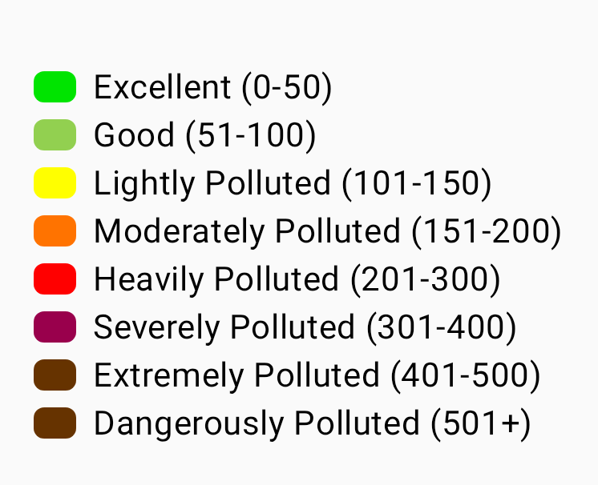
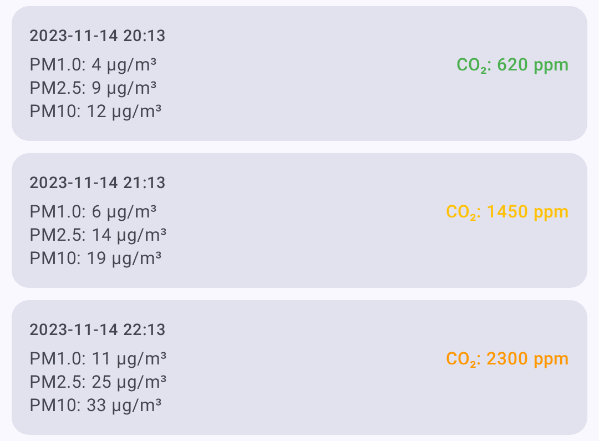

# Node Metrics

The node detail screen provides comprehensive telemetry and metrics for each node on your mesh.

## Gerätedaten

Basic operating information reported by each node:

| Metrisch        | Beschreibung                        |
| --------------- | ----------------------------------- |
| Batterie Ladung | Current battery percentage          |
| Spannung        | Battery voltage reading             |
| Kanalbelegung   | Percentage of airtime consumed      |
| Airtime         | Transmission time used by this node |
| Laufzeit        | Time since last reboot              |

Device metrics are displayed as individual cards with trend sparklines showing battery level, voltage, channel utilization, airtime, and uptime over time.

> 💡 **Tip:** Tap any metric card to expand it into a full chart with historical data points. Pinch to zoom the time axis.

## Umweltdaten

Environmental sensor data (requires compatible hardware):

| Metrisch                             | Sensor Examples       |
| ------------------------------------ | --------------------- |
| Temperatur                           | BME280, BME680, SHT31 |
| Luftfeuchtigkeit                     | BME280, BME680, SHT31 |
| Luftdruck                            | BME280, BMP280        |
| Gaswiderstand                        | BME680                |
| IAQ (Air Quality) | BME680                |

Umgebungsmesswerte werden zur einfachen Trendanalyse im Zeitverlauf dargestellt – Temperatur, Luftfeuchtigkeit und Luftdruck erhalten jeweils ein eigenes Liniendiagramm, wobei die Maßeinheit auf der Y-Achse angezeigt wird.

Der **IAQ-Index (Indoor Air Quality / Raumluftqualität)** des BME680 ist ein einzelner Wert im Bereich von 0 bis über 500, der aus dem Gaswiderstand abgeleitet und auf einer farbcodierten Skala von _Ausgezeichnet_ bis _Gefährlich belastet_ dargestellt wird:



> 💡 **Tip:** Environment metrics require a sensor connected to the remote node. Not all nodes report environmental data. See [Telemetry & Sensors](telemetry-and-sensors) for a full list of supported sensors.

## Air Quality Metrics

Air Quality is a dedicated metrics view for nodes equipped with a particulate-matter and/or CO₂ sensor. Dies ist **unabhängig vom BME680-IAQ-Messwert**, der unter „Environment Metrics“ (Umgebungsmesswerte) aufgeführt ist – IAQ ist ein einzelner, aus dem Gaswiderstand abgeleiteter Index, während die Luftqualitätsansicht die zugrundeliegenden Messwerte für Feinstaub und CO₂ grafisch darstellt.

| Metrisch              | Einheit | Beschreibung                                         |
| --------------------- | ------- | ---------------------------------------------------- |
| PM1.0 | µg/m³   | Particulate matter up to 1.0 micron  |
| PM2.5 | µg/m³   | Particulate matter up to 2.5 microns |
| PM10                  | µg/m³   | Particulate matter up to 10 microns                  |
| CO₂                   | ppm     | Carbon dioxide concentration                         |

CO₂ readings are color-coded by severity to make air quality easy to read at a glance:

| Band     | CO₂ Range (ppm) | Farbe    |
| -------- | ---------------------------------- | -------- |
| Gut      | < 1000    | Grün     |
| Stuffy   | < 2000    | Gelb     |
| Schlecht | < 5000    | Orange   |
| Unsafe   | < 30000   | Rot      |
| Evacuate | ≥ 30000                            | Dark red |



An air-quality log/metrics button appears on the node detail screen **only when the node has reported air-quality telemetry**. From the Air Quality view you can:

- Select a **time frame** for the charts.
- Filter with **metric chips** — only metrics that have data are shown.
- **Refresh / request** the latest air-quality telemetry.
- **Export to CSV** for analysis in a spreadsheet.

> 💡 **Tip:** Air Quality metrics require a compatible air-quality sensor on the remote node. If a node has no particulate or CO₂ sensor, the air-quality button won't appear. See [Telemetry & Sensors](telemetry-and-sensors) for supported hardware.

## Signaldaten

Radio signal quality information:

| Metrisch    | Beschreibung                                                                   |
| ----------- | ------------------------------------------------------------------------------ |
| SNR         | Signal-to-Noise Ratio (higher is better)                    |
| RSSI        | Received Signal Strength Indicator (closer to 0 is better)  |
| Noise Floor | Local background RF noise in dBm (more negative is quieter) |
| Sprungweite | Number of mesh hops for last message                                           |

### Signal Quality Reference

Die Signalqualität wird auf der Grundlage des **Signal-Rauschabstand im Verhältnis zur Demodulationsschwelle der aktiven LoRa-Modem-Voreinstellung** bewertet, nicht anhand fester Schwellenwerte – ein bestimmter Wert des Signal-Rauschabstand hat je nach Voreinstellung unterschiedliche Bedeutungen (z. B. sind −15 dB bei „LongSlow“ in Ordnung, bei „ShortFast“ jedoch unbrauchbar). RSSI is shown but is not part of the rating. Letting `limit` be the preset's SNR limit:

| Quality                  | Criteria                                         |
| ------------------------ | ------------------------------------------------ |
| Gut                      | SNR above the preset's limit                     |
| Ordentliche Signalstärke | within 5.5 dB below the limit    |
| Schlecht                 | within 7.5 dB below the limit    |
| Keins                    | more than 7.5 dB below the limit |

See [Understanding the Signal Meter](signal-meter) for the full explanation.

Local Stats from your connected radio are also shown in Signal Quality when available. These logs include noise floor, traffic counters, relay counters, online node counts, and radio uptime. The noise floor chart uses a dashed reference line at -85 dBm to help identify a busy RF environment. Verwenden Sie **Anfordern**, um beim verbundenen Funkgerät einen aktuellen Telemetriebericht zu den lokalen Statistiken (Local Stats) abzurufen, **Löschen**, um die Protokolle der lokalen Statistiken für diesen Knoten zu löschen, und **Speichern**, um den sichtbaren Verlauf der lokalen Statistiken als CSV-Datei zu exportieren.

## Energiedaten

Power management telemetry (requires INA sensor or compatible hardware):

| Metrisch    | Beschreibung            |
| ----------- | ----------------------- |
| Bus Voltage | Supply voltage          |
| Stromstärke | Power draw in milliamps |
| Leistung    | Calculated wattage      |

## Traceroute

Traceroute shows the path a message takes through the mesh:

1. From the node detail screen, tap **Traceroute**.
2. The app sends a traceroute request to the target node.
3. Results show each hop with SNR/RSSI values.

### Reading Traceroute Results

```
You → Node A (SNR: 8.5) → Node B (SNR: 5.2) → Target
```

Each hop represents a relay node that forwarded the message.

## Standortprotokoll

Historical position data for nodes that share their location:

- GPS coordinates
- Höhe
- Speed (if moving)
- Timestamp for each position report

## Nachbarinformation

Shows which nodes a given node can directly hear, useful for understanding mesh topology.

## Viewing Metrics

1. Navigate to **Nodes**.
2. Tap the node you want to inspect.
3. Select the metric category from the detail tabs.


The position tab shows location data for nodes that share GPS:


> ⚠️ **Note:** Metrics are only available when they have been reported by the remote node. Metrics update at intervals configured on each node's telemetry settings.

## Related Topics

- [Nodes](nodes) — node list, filtering, and sorting
- [Telemetry & Sensors](telemetry-and-sensors) — supported sensors and configuration
- [Signal Meter](signal-meter) — how signal quality is calculated from SNR and RSSI
- [Discovery](discovery) — traceroute details and neighbor info
- [Units & Locale](units-and-locale) — temperature, distance, and speed display formats

---
