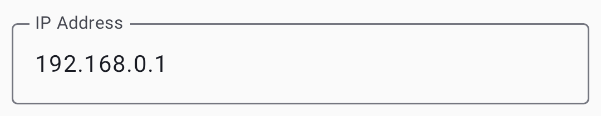
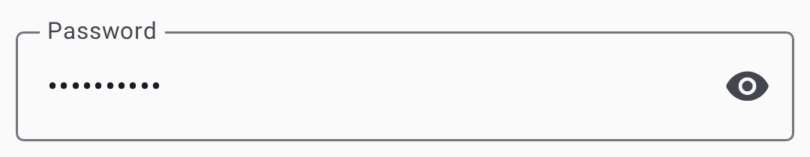
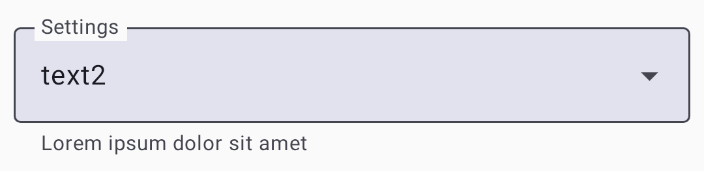
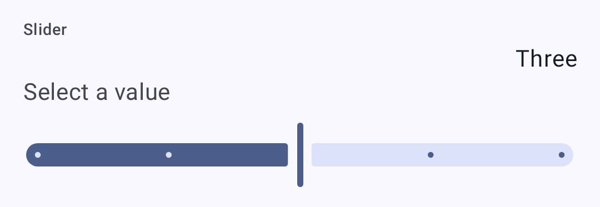

# Settings — Radio & User

Configure your radio hardware and user identity parameters.

## Benutzereinstellungen

### User Profile

| Einstellung       | Beschreibung                                                                          |
| ----------------- | ------------------------------------------------------------------------------------- |
| Langer Name       | Your display name (up to 39 characters)                            |
| Kurzname          | 4-character abbreviated name                                                          |
| Licensed Operator | Enable if you hold an amateur radio license (enables higher power) |

### Applying Changes

After modifying settings, tap **Save** to write the configuration to your radio. The device may reboot to apply changes.

## Funkgeräteeinstellung

### Geräteeinstellungen

| Einstellung                                | Beschreibung                                                            | Standardwert |
| ------------------------------------------ | ----------------------------------------------------------------------- | ------------ |
| Rolle                                      | Node behavior (Client, Router, etc.) | Client       |
| Weiterleitungsmodus                        | How the node retransmits messages                                       | Alle         |
| Node Info Broadcast (s) | Interval for broadcasting node info                                     | 10800        |
| Double-tap Button                          | Action for double-tap button press                                      | Deaktiviert  |

### LoRa Einstellungen

| Einstellung            | Beschreibung                                                            | Standardwert                              |
| ---------------------- | ----------------------------------------------------------------------- | ----------------------------------------- |
| Region                 | Regulatory region for frequency bands                                   | Unset (must configure) |
| Modem Voreinstellungen | Speed/range tradeoff                                                    | LongFast                                  |
| Sprungweite            | Maximum retransmit hops                                                 | 3                                         |
| TX Power               | Transmission power (dBm); 0 = max allowed for region | 0 (region max)         |
| Frequenzversatz        | Fine-tune frequency (MHz)                            | 0                                         |
| Channel Bandwidth      | Bandwidth setting                                                       | Default for preset                        |

> ⚠️ **Important:** You **must** set your region before transmitting. Operating without the correct region may violate local radio regulations. See the [region configuration guide](https://meshtastic.org/docs/getting-started/initial-config) on meshtastic.org for details.

### Modem Presets

> 💡 **Tip:** The **SNR Limit** values are negative on purpose. LoRa can decode signals _below_ the noise floor, so a more-negative limit means the preset tolerates a weaker, noisier signal (more range). See [How the Signal Meter Works](signal-meter) for the full explanation.

| Preset                           | Bereich                 | Geschwindigkeit           | SNR Limit                | Best For                                                                                                 |
| -------------------------------- | ----------------------- | ------------------------- | ------------------------ | -------------------------------------------------------------------------------------------------------- |
| SHORT_TURBO | ~1 km   | 21.9 kbps | −5 dB                    | Dense urban with line-of-sight; data-heavy applications                                                  |
| Short Fast                       | ~3 km   | 10.9 kbps | −7.5 dB  | Urban neighborhoods; buildings within a few blocks                                                       |
| Short Slow                       | ~5 km   | 5.5 kbps  | −10 dB                   | Suburban short-range; moderate building density                                                          |
| MEDIUM_FAST | ~5 km   | 5.5 kbps  | −10 dB                   | Suburban areas; moderate building density                                                                |
| MEDIUM_SLOW | ~8 km   | 1.1 kbps  | −12.5 dB | Suburban/rural; moderate range with slower speed                                                         |
| Long Turbo                       | ~10 km  | 4.4 kbps  | −10 dB                   | Similar range to Long Fast but with 500 kHz bandwidth; faster throughput                                 |
| Long Fast                        | ~10 km  | 1.1 kbps  | −12.5 dB | **General use (default)** — balanced range and speed                                  |
| Long Moderate                    | ~20 km  | 0,34 kbit/s               | −15 dB                   | Rural with some terrain; occasional use                                                                  |
| Lite Fast                        | ~5 km   | 5.5 kbps  | −10 dB                   | EU 866 MHz SRD band (125 kHz BW); comparable to Medium Fast                           |
| Lite Slow                        | ~10 km  | 1.1 kbps  | −12.5 dB | EU 866 MHz SRD band (125 kHz BW); comparable to Long Fast                             |
| Narrow Fast                      | ~5 km   | 2.7 kbps  | −10 dB                   | EU 868 MHz band (62.5 kHz BW); avoids interference with other devices |
| Narrow Slow                      | ~10 km  | 1.1 kbps  | −12.5 dB | EU 868 MHz band (62.5 kHz BW); comparable to Long Fast                |
| ~~Long Slow~~                    | ~30 km  | 0,18 kbit/s               | −17.5 dB | ⚠️ **Deprecated** — still selectable but may be removed in a future firmware release                     |
| ~~Very Long Slow~~               | ~40+ km | 0.09 kbps | −20 dB                   | ⚠️ **Deprecated** — still selectable but may be removed in a future firmware release                     |

> ℹ️ **Note:** This table uses the common short names. In the app's preset dropdown they read as **Short Range - Fast**, **Long Range - Fast**, **Lite - Fast**, **Narrow - Fast**, and so on.

#### Choosing a Modem Preset

The modem preset controls the fundamental tradeoff between **range** and **data rate**:

- **Slower presets** use more spreading, making signals decodable at weaker signal levels (lower SNR limit). This means longer range but fewer bytes per second.
- **Faster presets** pack more data per transmission but require a stronger signal to decode.

**Practical guidance:**

- **Urban mesh (many nodes, short distances):** Use **Long Fast** (default) or **Short Fast**. Higher speed means less airtime congestion when many nodes share the channel.
- **Rural/sparse mesh (few nodes, long distances):** Use **Long Moderate**. Range matters more than speed when nodes are far apart.
- **Einhaltung der EU-Vorschriften für 866/868 MHz:** Verwenden Sie **Lite Fast**, **Lite Slow**, **Narrow Fast** oder **Narrow Slow** – diese sind für die EU-SRD-/868-MHz-Bänder mit geringerer Bandbreite optimiert.
- **Fixed infrastructure links:** Use **Short Turbo** or **Long Turbo** for dedicated point-to-point links with good antennas and line-of-sight.
- **Mixed environments:** Stick with **Long Fast** — it's the community default and ensures compatibility with others in your area.

> ⚠️ **Important:** All nodes on the same channel **must** use the same modem preset. Nodes with mismatched presets cannot communicate even if they share the same frequency and encryption key.

> 💡 **Tip:** The range estimates above assume flat terrain and modest antennas. Elevation advantage (hilltop, rooftop) dramatically increases effective range. A well-placed Router with Long Fast can often outperform a ground-level node with Long Slow.

### Anzeigeeinstellungen

| Einstellung        | Beschreibung                                                                         |
| ------------------ | ------------------------------------------------------------------------------------ |
| Anzeigeabschaltung | Time before display sleeps                                                           |
| Anzeigeeinheiten   | Metric or Imperial                                                                   |
| OLED Typ           | Auto, SSD1306, SH1106, SH1107                                                        |
| Kompassausrichtung | Rotation offset for compass display (0°, 90°, 180°, 270°)         |
| ~~Compass North~~  | ⚠️ **Deprecated** — replaced by Compass Orientation; still visible in older firmware |

### Standorteinstellungen

| Einstellung                               | Beschreibung                       |
| ----------------------------------------- | ---------------------------------- |
| GPS Enabled                               | Enable/disable GPS                 |
| GPS Aktualisierungsintervall              | How often to acquire GPS fix       |
| Position Broadcast (s) | How often to share position        |
| Intelligente Position                     | Enable movement-based broadcasting |
| Fester Standort                           | Use a manually set position        |

### Energie Einstellungen

| Einstellung                             | Beschreibung                            |
| --------------------------------------- | --------------------------------------- |
| Energiesparen                           | Enable low-power sleep mode             |
| Shutdown After (s)   | Auto-shutdown idle timer                |
| ADC Multiplier                          | Battery voltage calibration factor      |
| Wait Bluetooth (s)   | Time to wait for BLE connection at boot |
| Mesh SDS Timeout (s) | Super-deep-sleep timeout                |

### Netzwerkeinstellungen

| Einstellung    | Beschreibung                                         |
| -------------- | ---------------------------------------------------- |
| WLAN aktiviert | Enable WiFi radio (ESP32 devices) |
| WLAN SSID      | Network name to connect to                           |
| WLAN PSK       | Netzwerkpasswort                                     |
| NTP Server     | Time synchronization server                          |
| Syslog Server  | Remote logging server                                |

### Bluetooth Einstellungen

| Einstellung       | Beschreibung                                                              |
| ----------------- | ------------------------------------------------------------------------- |
| Bluetooth Enabled | Enable/disable BLE radio                                                  |
| Kopplungsmodus    | Fixed PIN, Random PIN, or No PIN                                          |
| Feste PIN         | PIN code for pairing (default: 123456) |

### Sicherheitseinstellungen

| Einstellung                                     | Beschreibung                                                               |
| ----------------------------------------------- | -------------------------------------------------------------------------- |
| Öffentlicher Schlüssel                          | Your node's public key (read-only)                      |
| Administrativer Schlüssel                       | Key for remote administration                                              |
| Privater Schlüssel                              | Your node's private key (handle securely)               |
| ~~Admin Channel Enabled~~                       | ⚠️ Removed — now configured automatically when an admin key is set         |
| Fehlersuchprotokolle (Debug) | Output live debug logging over serial/bluetooth                            |
| Serial Enabled                                  | Enable serial console access (moved from Device Config) |
| Verwalteter Modus                               | Restrict non-admin channel changes                                         |

Settings use standard preference controls — dropdowns, toggles, and sliders:

| Control  | Bildschirmfoto                                              |
| -------- | ----------------------------------------------------------- |
| Dropdown |  |
| Toggle   |      |
| Slider   |      |

## Related Topics

- [Settings — Modules & Admin](settings-module-admin) — optional feature modules and device administration
- [Signal Meter](signal-meter) — how modem presets affect signal quality thresholds
- [LoRa configuration](https://meshtastic.org/docs/configuration/radio/lora) — detailed LoRa settings reference on meshtastic.org
- [Initial configuration](https://meshtastic.org/docs/getting-started/initial-config) — region setup guide on meshtastic.org

---

