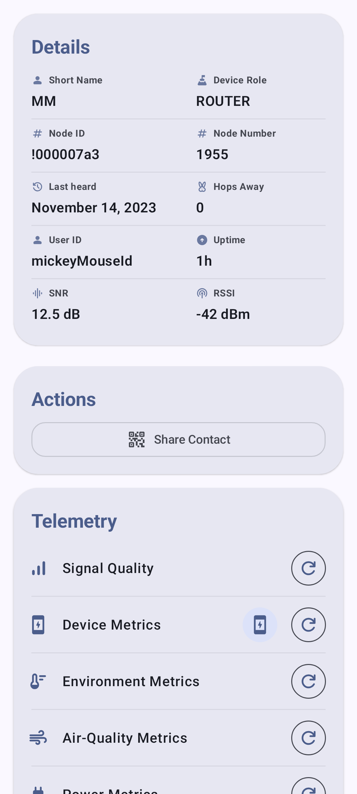
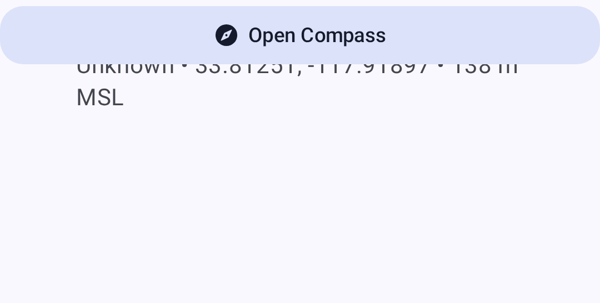

# Node Metrics

The node detail screen provides comprehensive telemetry and metrics for each node on your mesh.

## Device Metrics

Basic operating information reported by each node:

| Metric              | Περιγραφή                           |
| ------------------- | ----------------------------------- |
| Battery Level       | Current battery percentage          |
| Τάση                | Battery voltage reading             |
| Channel Utilization | Percentage of airtime consumed      |
| Airtime             | Transmission time used by this node |
| Uptime              | Time since last reboot              |

Device metrics are displayed as individual cards with trend sparklines showing battery level, voltage, channel utilization, airtime, and uptime over time.

> 💡 **Tip:** Tap any metric card to expand it into a full chart with historical data points. Pinch to zoom the time axis.

## Environment Metrics

Environmental sensor data (requires compatible hardware):

| Metric                               | Sensor Examples       |
| ------------------------------------ | --------------------- |
| Θερμοκρασία                          | BME280, BME680, SHT31 |
| Υγρασία                              | BME280, BME680, SHT31 |
| Βαρομετρική Πίεση                    | BME280, BMP280        |
| Gas Resistance                       | BME680                |
| IAQ (Air Quality) | BME680                |

Environment metrics are charted over time for easy trend analysis — temperature, humidity, and pressure each get their own line chart with the measurement unit displayed on the Y axis.

> 💡 **Tip:** Environment metrics require a sensor connected to the remote node. Not all nodes report environmental data. See [Telemetry & Sensors](telemetry-and-sensors) for a full list of supported sensors.

## Signal Metrics

Radio signal quality information:

| Metric    | Περιγραφή                                                                     |
| --------- | ----------------------------------------------------------------------------- |
| SNR       | Signal-to-Noise Ratio (higher is better)                   |
| RSSI      | Received Signal Strength Indicator (closer to 0 is better) |
| Hop Count | Number of mesh hops for last message                                          |

### Signal Quality Reference

| SNR Range                         | Quality   |
| --------------------------------- | --------- |
| > 10 dB                           | Excellent |
| 0 to 10 dB                        | Good      |
| -10 to 0 dB                       | Fair      |
| < -10 dB | Poor      |

## Power Metrics

Power management telemetry (requires INA sensor or compatible hardware):

| Metric      | Περιγραφή               |
| ----------- | ----------------------- |
| Bus Voltage | Supply voltage          |
| Current     | Power draw in milliamps |
| Power       | Calculated wattage      |

## Traceroute

Traceroute shows the path a message takes through the mesh:

1. From the node detail screen, tap **Traceroute**.
2. The app sends a traceroute request to the target node.
3. Results show each hop with SNR/RSSI values.

### Reading Traceroute Results

```
You → Node A (SNR: 8.5) → Node B (SNR: 5.2) → Target
```

Each hop represents a relay node that forwarded the message.

## Αρχείο Καταγραφής Τοποθεσίας

Historical position data for nodes that share their location:

- GPS coordinates
- Altitude
- Speed (if moving)
- Timestamp for each position report

## Neighbor Info

Shows which nodes a given node can directly hear, useful for understanding mesh topology.

## Viewing Metrics

1. Navigate to **Nodes**.
2. Tap the node you want to inspect.
3. Select the metric category from the detail tabs.



The position tab shows location data for nodes that share GPS:



> ⚠️ **Note:** Metrics are only available when they have been reported by the remote node. Metrics update at intervals configured on each node's telemetry settings.

## Related Topics

- [Nodes](nodes) — node list, filtering, and sorting
- [Telemetry & Sensors](telemetry-and-sensors) — supported sensors and configuration
- [Signal Meter](signal-meter) — how signal quality is calculated from SNR and RSSI
- [Discovery](discovery) — traceroute details and neighbor info
- [Units & Locale](units-and-locale) — temperature, distance, and speed display formats

---

