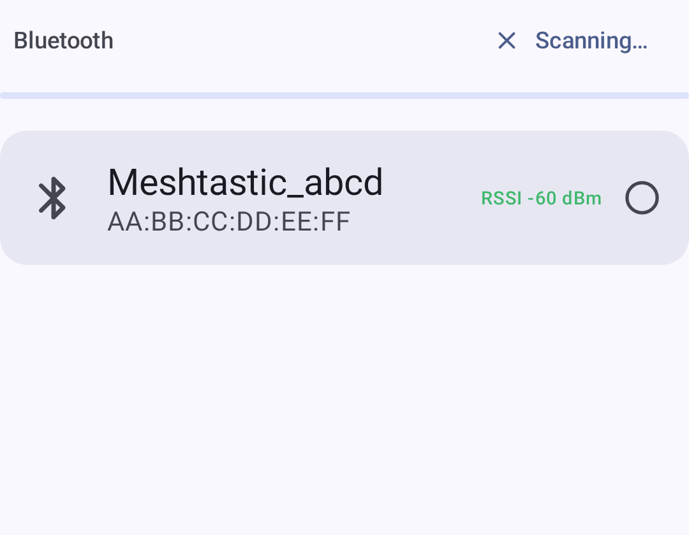
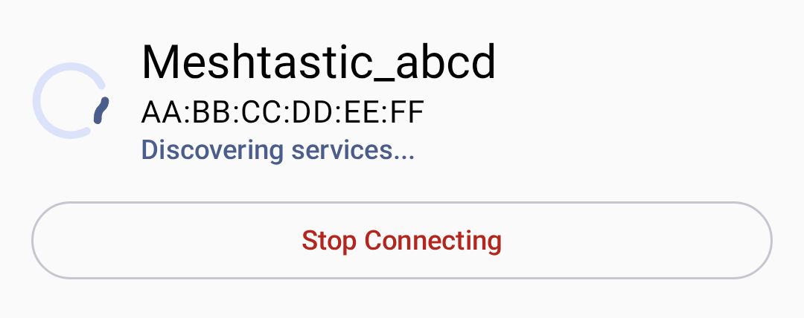
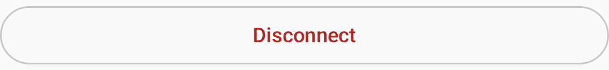

# Ühendus

Meshtastic toetab mitut transpordimeetodit telefoni/arvuti ja raadiosõlme vaheliseks suhtluseks.

## Sinihammas (BLE)

Sinihamba madal voolutarve on Androidi vaike- ja levinuim ühendusviis.

### Seadme sidumine

1. Veendu, et Meshtastic seade on sisse lülitatud ja sidumisrežiimis.
2. Ava rakendus ja navigeeri vahekaardile **Ühendused**.
3. Puuduta valikut **Otsi sinihamba seadmeid** – kuvatakse lähedalasuvad Meshtasticu raadiod.
4. Vali loendist oma seade.
5. Nõustu Bluetoothi ​​sidumise taotlusega, kui see kuvatakse.

Sinihamba, võrgu ja USB-transpordi vahel vahetamiseks (üks on korraga aktiivne) kasutage transpordivalijat – ühenduskaardi all asuvat segmenteeritud nuppude rida:

> 💡 **Tip:** If your device doesn't appear, check that the radio is not already connected to another device or out of range.

The screen names anything on the app's side that is blocking a scan, with the fix attached:

| What you see                                        | What it means                                                                                                                                                              |
| --------------------------------------------------- | -------------------------------------------------------------------------------------------------------------------------------------------------------------------------- |
| A card asking for **Nearby devices**                | The permission has not been granted. **Grant permission** requests it; once Android stops prompting, the button becomes **Open settings**. |
| **Bluetooth is off**                                | The adapter is disabled — the card opens Bluetooth settings.                                                                                               |
| **Bluetooth scanning also needs location services** | Android 11 and older only: the permission is held but the system location toggle is off.                                                   |
| No card, empty list                                 | Nothing on this side is blocking the scan — the radio is out of range, off, or already connected elsewhere.                                                |

Tapping **Scan** after you have declined the permission once explains what it is for before asking again, and lets you decline again without being cornered.

### Ühenduse olek

| Ikoon | Olek             | Kirjeldus                  |
| ----- | ---------------- | -------------------------- |
| 🟢    | Ühendatud        | Aktiivne raadioside loodud |
| 🟡    | Ühendan          | Kätlemine on pooleli       |
| 🔴    | Ühendus katkenud | Aktiivset ühendust pole    |
| ⚪     | Pole seadistatud | Seadet pole valitud        |

Ühenduse loomisel näitab olekuindikaator ühenduse praegust olekut:

Kui seadmeid ei leita, kuvab rakendus tühja oleku koos juhistega:

### Sinihamba veaotsing

- **Seadet ei leitud:** Lülita sinihammas sisse/välja ja veendu, et asukoha määramine on lubatud.
- **Connection drops:** Move closer to the radio; check for interference.
- **Sidumine tagasi lükatud:** Unusta seade Androidi sinihamba ​​seadetes ja proovi uuesti.

## USB port

USB ühendused pakuvad juhtmega alternatiivi, mis on kasulik lauaarvutite puhul või kui sinihammas pole saadaval.

### Seadistamine

1. Connect your radio via USB cable to your device.
2. Rakendus küsib USB luba – puuduta **Luba**.
3. The connection is established automatically.

> ⚠️ **Märkus:** USB ühenduste jaoks on Android-seadmetes vaja OTG tuge.

## TCP/IP (võrk)

Mõned Meshtastic raadiod toetavad WiFi/Etherneti ühendust, võimaldades TCP-põhiseid ühendusi kohaliku võrgu kaudu. Ühenda raadio esmalt oma võrku – kasutades raadio enda WiFi-seadeid (püsivara veebiliidese või muu ühenduse kaudu) – ja seejärel loo ühendus rakenduse kaudu.

### Connecting over the Network

1. Veendu, et raadio on samas kohtvõrgus kui sinu telefon/lauaarvuti.
2. Valige ühenduse loomise ekraanil transpordivalikus **Võrk**.
3. Choose the radio one of two ways:
   - **Võrguseadmete otsimine** – lülita see sisse, et automaatselt avastada raadioid, mis reklaamivad end kohalikus võrgus (mDNS / `_meshtastic._tcp`). Leitud seadmed kuvatakse loendis; ühenduse loomiseks puuduta neist ühte.
   - **Lisa seade käsitsi…** — Sisesta raadio IP-aadress (või hostinimi) ja port (vaikimisi: 4403).
4. Previously-used network addresses are remembered under **Recent Network Devices** for quick reconnection (long-press to remove one).

> 💡 **Vihje:** Võrgu tuvastamine kasutab mDNS-i, mis töötab ainult siis, kui mõlemad seadmed on samas alamvõrgus. Android 17+ puhul vajab rakendus skanniks kohaliku võrgu luba; kui otsing ei leia midagi, lisa seade käsitsi IP-aadressi järgi.

### Millal kasutada TCP

- Raadio on samas kohalikus võrgus
- Testing with a simulated radio
- Asukohad kus sinihambal on häireid

## Reconnection Behavior

Rakendus loob käivitamisel uuesti ühenduse **viimati valitud seadmega**. Transporti saab ühenduskuvalt igal ajal vahetada.

Ühenduse katkestamiseks puuduta ühenduse loomise ekraanil katkestamise nuppu:

## Desktop Connections

On Desktop (Linux/macOS/Windows), the app supports:

- **Sinihammas (BLE)** — Kable'i teegi kaudu; töötab macOS-is, Linuxis ja Windowsis
- **USB port** – peamine juhtmega ühendusmeetod
- **TCP/IP** – võrguühendusega raadiote jaoks

Platvormipõhiste üksikasjade ja kiirklahvide kohta vaata [Töölauarakendus] (desktop).

## Seotud teemad

- [Alustamine](onboarding) — esmakäivituse seadistamine ja load
- [Seaded — Raadio ja kasutaja](settings-radio-user) — sinihamba ​​ja võrgu seadistus
- [Desktop App](desktop) — desktop-specific connection details
- [Supported devices](https://meshtastic.org/docs/hardware/devices) — full list of compatible radios on meshtastic.org

---

