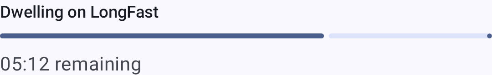
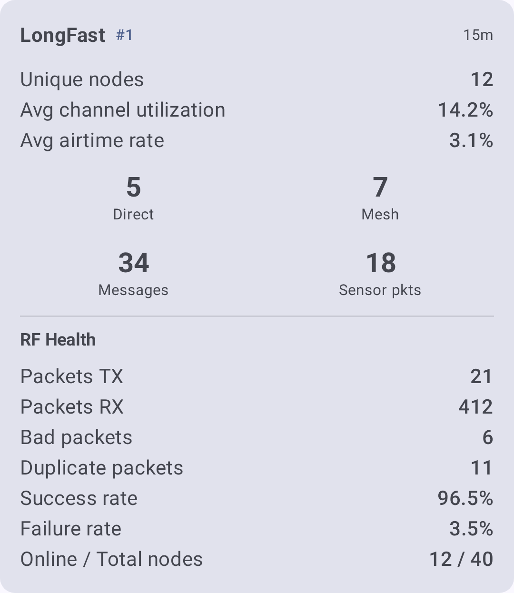

# Avastamine

Avastamistööriistad aitavad mõista, **kuidas** kärgvõrk on ühendatud – millised sõlmed üksteist kuulevad, milliseid teid sõnumid läbivad ja kus esinevad kitsaskohad või nõrgad lülid.

The app offers two complementary approaches:

- **Kohalik kärgvõrgu avastaja (skanner)** – automaatne režiim, mis perioodiliselt skaneerib ühendatud raadiol läbi erinevate LoRa eelhäälestuste, kuulab igaüht neist ja järjestab, milline eelhäälestus sinu asukohas kõige paremini toimib.
- **Manuaalne uurimine** – traceroute, naabri info ja sõlmede loend, mida saate igal ajal kasutada konkreetsete teede ja topoloogia uurimiseks.

---

## Kohalik kärgvõrgu avastaja (skanner)

Kohalik kärgvõrdu avastaja on spetsiaalne skaneerimisrežiim, mis aitab leida oma asukoha jaoks parima LoRa modemi eelseadistuse ja näha, millised sõlmed on igal eelseadistusel aktiivsed. See kerib ühendatud raadio läbi ühe või mitu valitud eelseadet, kuulab (või "ootab") igaüht neist määratud aja jooksul pakettide kogumiseks ning seejärel analüüsib ja järjestab tulemused.

Open it from **Settings → Advanced → Local Mesh Discovery**. On desktop, it has its own **Settings → Local Mesh Discovery** entry.

> ⚠️ **Märkus:** Discovery muudab skannimise ajal ajutiselt raadio LoRa seadeid ja taastab pärast skannimise lõppu algse konfiguratsiooni. Skannimise käivitamiseks peab seade olema ühendatud.

### Setting Up a Scan

Before starting, configure these controls:

| Control                | Kirjeldus                                                                                                                                                                                                                                |
| ---------------------- | ---------------------------------------------------------------------------------------------------------------------------------------------------------------------------------------------------------------------------------------- |
| **LoRa preset picker** | Select one or more presets to scan. Otsing peatub kordamööda iga valitud eelseadistuse juures, et kuulata liiklust.                                                                                      |
| **Kuulamisaeg**        | Time to listen on each preset. Choose from 1, 5, 15, 30, 45, 60, 90, 120, or 180 minutes. Pikemad kuulamisajad koguvad rohkem pakette ja annavad selgema pildi, kuid võtavad kauem aega. |
| **Keep screen awake**  | Valikuline lüliti, mis takistab ekraani pika skannimise ajal magamaminekut.                                                                                                                                              |

The **Start** button stays disabled — with an explanation of why — until the scan can run. Common reasons it's disabled:

- The device is **not connected**.
- **No presets** have been selected to scan.
- The selected preset uses **2.4 GHz**, which your hardware doesn't support.

### Live Progress

Skanni ajal näitab Discovery selle praegust etappi:

| Stage                                                 | What's happening                                                                                                |
| ----------------------------------------------------- | --------------------------------------------------------------------------------------------------------------- |
| **Preparing**                                         | Praeguste sätete salvestamine ja skannimiseks valmistumine.                                     |
| **Shifting to \<preset\>** | Switching the radio to the next preset to test.                                                 |
| **Reconnecting**                                      | Re-establishing the connection after the preset change.                                         |
| **Kuulamine**                                         | Kuulatakse praegust eelseadistust pakettide kogumiseks ja järgmise sammuni on oodata loendurit. |
| **Analysis**                                          | Kogutud pakettide töötlemine ja eelseadete järjestamine.                                        |
| **Restoring**                                         | Algsete LoRa seadete taastamine.                                                                |



### Reading the Results

Kui skann on lõppenud, kuvab Discovery iga testitud eelseadistuse kohta tulemuste kaardi ja üldise kokkuvõtte.



Metrics include:

| Meetriline                | What it tells you                                                                    |
| ------------------------- | ------------------------------------------------------------------------------------ |
| RF health                 | Overall quality of the radio environment on that preset.             |
| Kanali kasutus            | Kui hõivatud olid eetrisagedused kuulamise ajal.                     |
| Airtime                   | Transmission time observed.                                          |
| Otse- ja vahendussõlmed   | Kui mitu võrgusõlme kuuldi otse, võrreldes vahendaja kaudu.          |
| Halvad / duplikaatpaketid | Rikutud ja korduvate pakettide arv, mis näitab ummikuid või häireid. |

Additional features available from the results:

- **Scan History** — saved sessions you can revisit; view or delete past scans.
- **Avastuskaart** – skanni käigus leitud sõlmede kaart.
- **Aruande eksport** – ekspordi aruanne PDF-failina Androidis või tekstina muudel platvormidel.

> 💡 **Vihje:** Androidis saab Discovery genereerida tulemustest seadmesisese TI kokkuvõtte (Gemini Nano). If the on-device model isn't available, an algorithmic summary is used instead — so you always get a readable interpretation of the scan.

---

## Kärgvõrgu majakas

Mesh Beacon lets nodes invite others to join their mesh. A beaconing node periodically broadcasts an invitation — optionally advertising a channel, region, and modem preset — that nearby devices can hear even before they share a configuration.

Configure it under **Settings → Module Config → Mesh Beacon**:

- **Listen for beacons** — receive invitations broadcast by other nodes.
- **Broadcast beacon** — send your own invitation at a set interval, with an optional message and an offered channel.

Received invitations appear as **Mesh invitations** cards on the Discovery screen. Igal kaardil kuvatakse saatja sõnum koos pakutava kanali, piirkonna, eelseadistuse ja signaali kvaliteedi ning järgmiste toimingutega:

- **Liitu** — lülitu pakutavale kanalile ja seadista see eelhäälestamisega (häälestab raadio uuesti ja taaskäivitab selle). Kui pakkumine sobib praeguse sageduspesaga, lisab toiming **Lisa kanal** selle taaskäivituseta.
- **Avasta** – sisesta pakutud eelseadistusega avastusskannimisskeem, et saaksid enne liitumist seda võrku uurida (kuvatakse ainult siis, kui signaalijaam pakub eelseadistust).
- **Dismiss** — ignore the invitation.

Majakate poolt reklaamitud kanalid kuvatakse skannimise seadistuses ka **Majakakanalitena** – valige üks, et see skannimise sihtmärgina lisada.

---

## Manual Exploration

The tools below are available at any time from the node list and node detail screens. Use them to investigate specific paths and build a topology picture, alongside or instead of a full scan.

## Marsruudi

Traceroute näitab täpset teed, mida sõnum sõlmest mis tahes teise kärgvõrgu sõlme kulgeb. See on kõige kasulikum tööriist ühenduvusprobleemide tõrkeotsinguks.

### Running a Traceroute

1. Mine valikuni **Sõlmed** ja puuduta sõlme, mida soovid jälgida.
2. Sõlme üksikasjade ekraanil puuduta **Traceroute**.
3. The app sends a traceroute request and waits for the response.
4. Tulemused kuvatakse iga hüppe kohta, koos signaali kvaliteediga igal sammul.

### Reading the Results

A traceroute result looks like this:

```
You → Node A (SNR: 8.5, RSSI: -95) → Node B (SNR: 5.2, RSSI: -108) → Target
```

Iga hüpe näitab vahendussõlme, mis sõnumi edastas. The SNR and RSSI values at each hop tell you about the link quality on that specific segment.

| What to look for                                                                                         | What it means                                                               |
| -------------------------------------------------------------------------------------------------------- | --------------------------------------------------------------------------- |
| Kõik hüpped näitavad head signaali-müra suhet (≥ −7 dB, roheline)                     | Healthy path — messages flow reliably                                       |
| Üks hüpe näitab halba signaali-müra suhet (< −15 dB, punane) | Kehv ühendus – see releesegment on habras                                   |
| Mitu hüppet (4+)                                                                      | Pikk tee – kaalu sõlme ümberpaigutamist selle lühendamiseks                 |
| Different path on retry                                                                                  | Mesh is adapting — multiple routes exist (this is good!) |

> 💡 **Vihje:** Käivita traceroute'i mitu korda mõne minuti tagant. If the path changes, your mesh has redundant routes — a sign of a well-connected network.

### Troubleshooting with Traceroute

- **"Marsruuti ei leitud"** — Sihtsõlm võib olla võrguühenduseta, leviulatusest väljas või teisel kanalil. Kontrolli, et mõlemad sõlmed jagaksid vähemalt ühte kanalit sama krüpteerimisvõtmega.
- **Traceroute aegus** — Tee võib olla liiga pikk (ületab hüppete limiidi) või on vahendussõlm ülekoormatud. Proovi hüppe limiiti suurendada menüüs **Seaded → LoRa konfiguratsioon**.
- **Asümmeetrilised teed** – Jälgimismarsruut teelt A→B võib minna teist teed kui teelt B→A. This is normal — radio propagation is not always symmetric.

---

## Naabruse teave

Naabriinfo moodul võimaldab igal sõlmel levitada nimekirja sõlmedest, mida see **otse kuuleb** (üksik-hüpe). Kui mitu sõlme jagavad oma naaberloendeid, saate kokku panna kogu võrgu topoloogiakaardi.

### Naabriinfo lubamine

1. Mine menüüsse **Seaded → Mooduli konfiguratsioon → Naabriinfo**.
2. Luba moodul.
3. Määra levintervall (vaikimisi: 900 sekundit / 15 minutit).

Kui see on lubatud, levitab sõlm perioodiliselt oma naabri-tabelit. Teised sõlmed, millel on naabriinfo lubatud, teevad sama.

### Naabri andmete vaatamine

- Ava suvalise sõlme detailvaade ja otsi üles jaotis **Naabrid**.
- Iga naabri-kirje näitab otse kuuldud sõlme ja selle signaali kvaliteeti.
- Kogu kärgvõrgu topoloogia mõistmiseks kombineerige mitme sõlme naaberandmeid.

> ⚠️ **Märkus:** Naabriinfo suurendab eetriaega, kuna iga lubatud sõlm levitab perioodiliselt oma naabrite nimekirja. Paljude sõlmedega tiheda liiklusega kärgvõrgu puhul kaaluge ummikute vältimiseks pikemaid levitamise intervalle (3600 sekundit või rohkem).

---

## Sõlmede loend avastusvahendina

Sõlmede loend ise on võimas avastusvahend, kui kasutada selle filtreerimis- ja sortimisfunktsioone tõhusalt.

### Finding New Nodes

- Sort by **Last heard** to see the most recently active nodes at the top.
- Enable **Include unknown** to see nodes that have appeared on the mesh but haven't sent user info yet — these are often newly powered-on devices.

### Assessing Connectivity

- Sorteeri **Hüpete arvu järgi**, et näha, millised sõlmed on otse kättesaadavad (0 hüpet) ja millised vahendatavate sõlmedega.
- Sort by **Distance** to find nearby nodes and verify they're reachable.
- Kasuta **Välista MQTT** raadio teel (mitte internetisilla kaudu) ligipääsetavatele sõlmedele keskendumiseks.

### Infrastructure Audit

- Disable **Exclude infrastructure** to see Router, Router Late, and Client Base nodes.
- Check their signal quality and last-heard times to verify your infrastructure nodes are healthy.

See [Nodes](nodes) for full details on filtering and sorting options.

---

## Tips for Mesh Exploration

- **Start with traceroute** — it gives you immediate, actionable information about a specific path.
- **Luba naabriinfo funktsioon võtmesõlmedes** – eriti ruuterites ja repiiterites, et saada ülevaade magistraalvõrgust.
- **Kontrolli kaarti** — sõlmede asukohad [Kaart] (map-and-waypoints) koos signaaliandmetega aitavad sul mõista, miks mõned ühendused on tugevad ja teised nõrgad.
- **Compare signal over time** — use the [Signal Meter](signal-meter) guide to interpret SNR and RSSI values correctly.

---

