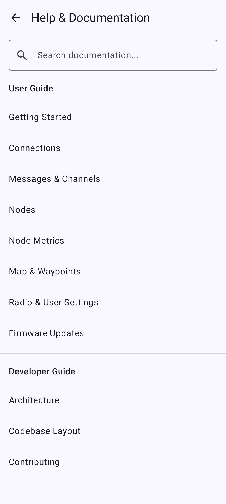
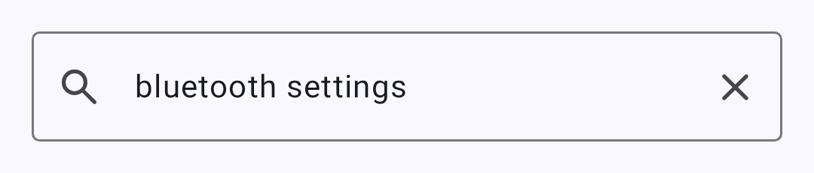
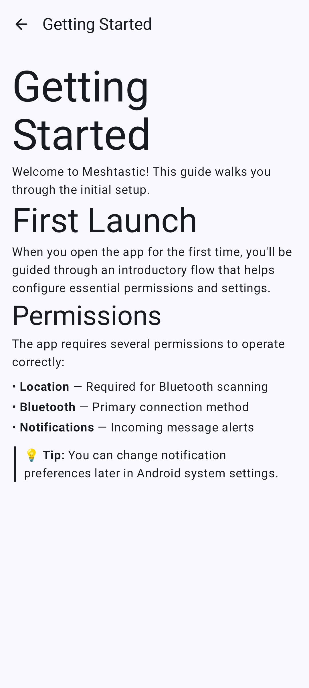
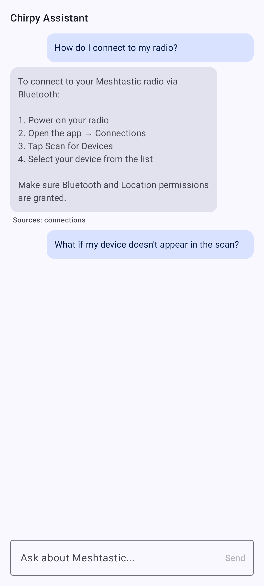

# Help & In-App Docs

This same user documentation ships **inside the app**, so you can read it offline without leaving Meshtastic. Open it from **Settings → Help & Documentation**.

## Browsing

The docs browser lists every user-guide page. Selle lugemiseks klõpsa lehel; pildid ja ristlingid toimivad ka.

### Search

Lehtede pealkirja ja märksõnade järgi filtreerimiseks puuduta otsinguikooni ja tippi – tulemused värskendatakse tippimise ajal.

A page open in the browser:

## Chirpy — the AI Assistant

**Chirpy** answers plain-language questions about Meshtastic using this bundled documentation as its source. Klõpsai dokumendibrauseris nuppu Chirpy, sisesta küsimus ja see vastab vastuse ja linkidega asjakohastele lehtedele.

> 🔒 **Privacy:** On supported Google-flavor devices, Chirpy runs **on-device** using Gemini Nano — your questions never leave your phone. Väike mudel laetakse alla esmakordsel kasutamisel.

> ⚠️ **Märkus:** F-Droidi, töölaua ja iOS-i versioonide puhul kasutab Chirpy dokumentatsiooni asemel **märksõnaotsingut**, mitte generatiivset mudelit. If your device doesn't support on-device AI, the assistant is hidden and you can still browse and search the docs normally.

## Related Topics

- [Tõlgi rakendus] (translate) — kuidas need lehed teistesse keeltesse lokaliseeritakse
- [App Functions](app-functions) — the separate system-AI integration (distinct from Chirpy)

---
