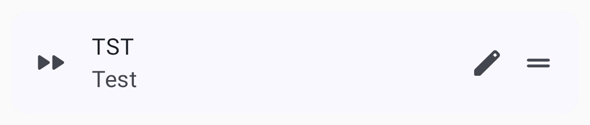
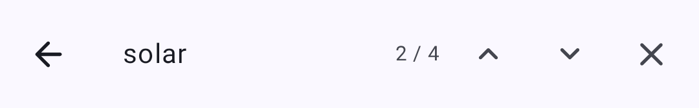
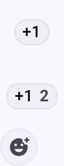

# Sõnumid ja kanalid

Meshtastic toetab kahte suhtlusrežiimi: **kanalite levitamine** ja **otsesõnumid**.

## Kanal

Kanalid on jagatud suhtlusgrupid. Kõik sama kanalivõtmega seadistatud sõlmed saavad sellel kanalil sõnumeid lugeda ja saata.

### Vaikekanal

Igal Meshtastic seadmel on vaikimisi **PikkKauge** kanal. See on krüpteerimata kanal, mida kasutatakse üldiseks võrgusuhtluseks.

### Kanali turvalisus

Kanalid toetavad mitut krüpteerimistaset:

| Ikoon | Security Level                       | Kirjeldus                                                                                                                                 |
| ----- | ------------------------------------ | ----------------------------------------------------------------------------------------------------------------------------------------- |
| 🔒    | PSK (256-bit AES) | Täielikult krüpteeritud eel-jagatud tugeva võtmega. Ainult sobiva võtmega sõlmed saavad sõnumeid lugeda.  |
| 🔐    | PSK (128-bit AES) | Krüpteeritud lühema võtmega. Secure for most uses but 256-bit is preferred for sensitive data.            |
| 🔓    | Default / Open                       | Kasutab teada-tuntud vaikevõtit. **Iga Meshtastic seade** saab sama eelseadistusega neid sõnumeid lugeda. |
| ⚠️    | Insecure + Position                  | Ava kanal, mis levitab ka sinu GPS asukohta. Use with caution in public meshes.                           |

> 🔒 **Turvanõuanne:** Privaatse suhtluse jaoks konfi alati unikaalne PSK. Vaikimisi kanal on tahtlikult avatud, et uued kasutajad saaksid kärgvõrku avastada – aga kõige tundliku jaoks peaksite looma eraldi krüptitud kanali.

### Lisa kanal

1. Mine **Sätted → Kanalid**.
2. Puuduta **Lisa kanal** või skanni QR-koodi.
3. Konfigureeri kanali nime ja krüpteerimisvõtit.
4. Jaga kanali URL-i/QR-koodi teistega, kes seda vajavad.

Kanali puudutamine kuvab selle üksikasjad ja jagamisvalikud.

## Direct Messages

Direct messages (DMs) are point-to-point encrypted communications between two specific nodes.

### Sending a Direct Message

1. Open the **Messages** tab.
2. Vali kontaktide loendist sõlm või puuduta sõlme loendis.
3. Tippi oma sõnum ja puuduta nuppu **Saada**.

### Sõnumi olek

Olekumärgis kuvatakse ainult **sinu enda** väljaminevate sõnumite all (teiste sissetulevate sõnumite puhul olekumärgist ei kuvata):

| Olek                              | Tähendus                                                                                                                                           |
| --------------------------------- | -------------------------------------------------------------------------------------------------------------------------------------------------- |
| Sending…                          | Järjekorras või juba raadiole antud, pole veel kumbagi teed lahendatud (nii järjekorras kui ka teel olles kuvatakse sama tekst) |
| Saajale kätte toimetatud          | The strongest confirmation for a direct message — an acknowledgment came back                                                                      |
| Kärgvõrku kohale jõudnud          | Kanali leviedastuse puhul jõuab sõnum kärgvõrku (leviedastustel puudub saajapõhine kinnitus)                                    |
| Vahendatud, saaja pole kinnitanud | Otsesõnumi puhul kuvatakse hoiatusvärviga – sõnum edastati, kuid kinnitust pole veel tulnud                                                        |
| Marsruutimine SF++ ahela kaudu…   | Being routed/buffered by the Store & Forward Plus Plus chain                                                                   |
| Kinnitatud SF++ ahel              | Kinnitatud kohaletoimetamine SF++ keti kaudu                                                                                                       |
| Tõrge                             | Delivery failed — tap the status for the specific reason (see Delivery Errors below)                                            |

### Delivery Errors

Kui sõnumit ei õnnestu kohale toimetada, näitab veaindikaator, mis valesti läks:

| Tõrge                        | Meaning                                      | What to Do                                                                                                                            |
| ---------------------------- | -------------------------------------------- | ------------------------------------------------------------------------------------------------------------------------------------- |
| No Route                     | No path exists to the destination node       | The recipient may be offline or out of mesh range. Try later or move closer.                          |
| Got NAK                      | Järgmise-hüppe sõlm keeldus edastamast       | Vahendussõlm võib olla ülekoormatud. Wait and retry.                                                  |
| Aegunud                      | No acknowledgment within retry window        | The recipient may be just out of range. Proovi hüppe limiiti suurendada või paremasse asukohta minna. |
| No radio interface           | No radio interface available to send         | Check that your radio is connected and available.                                                                     |
| Failed to deliver to mesh    | All retry attempts exhausted                 | Move closer, improve signal, or wait for mesh conditions to improve.                                                  |
| Channel/key mismatch         | Destination channel/key does not match       | Verify both nodes share the same channel and PSK.                                                                     |
| Message is too large to send | Sõnum ületab maksimaalset sõnumi mahtu       | Shorten the message and try again.                                                                                    |
| No app response              | App or plugin did not respond to the request | Retry or check the destination app or module state.                                                                   |
| Duty cycle limit             | Regional airtime limit reached               | Wait for the duty cycle window to reset.                                                                              |
| Invalid request              | Malformed or invalid request                 | Retry after updating or restarting the app if this persists.                                                          |

> 💡 **Vihje:** Enamik kohaletoimetamise vigu laheneb iseenesest. If a node is intermittently reachable, the mesh will retry. For persistent "No Route" errors, check that intermediate Router nodes are online.

## Message Features

### Quick Chat

Eelsalvestatud sõnumid kiireks suhtluseks:

- Juurdepääs läbi sõnumi sisestamise alas oleva kiirvestluse nupu
- Choose from built-in phrases or custom messages
- Kohanda kiirvestluse sõnumeid menüüs **Seaded → Kiirvestlus**
- Kasulik, kui trükkimine on ebapraktiline (kindad, väike ekraan, kiireloomuline)

Igal kiirvestluse kirjel on lühike **Nimi** (nupu silt), **Sõnum**, mille see lisab, ja **Saada kohe** lüliti – kui see on lubatud, saadetakse nupu puudutamisel sõnum kohe, selle asemel et see sisestada sisestusväljale redigeerimiseks:

[Uus kiirvestluse dialoog nime, sõnumi ja kohese saatmise lülitiga](../../assets/screenshots/messages_edit_quick_chat.png)

Kanalite loendis kuvatakse iga kanal koos selle viimase sõnumi eelvaatega.

### Searching Messages

You can search the full history of any conversation directly from the chat screen:

1. Ava vestlus (kanal või otsesõnum).
2. Puuduta ülemisel ribal **otsinguikooni**.
3. Type into the **Search messages…** field. The search runs as you type, across all stored messages in that conversation.
4. Use the **N / M** result counter and the **previous / next arrows** to jump between matches, which are highlighted in the conversation.

> 💡 **Vihje:** Otsing toimub täisteksti põhjal ja jääb vestlusse, kust sa selle avasid – see ei otsi teistest kanalitest ega kontaktide hulgast. It matches against the messages already stored on your device, so it works fully offline.

### Message Bubbles

Messages appear as chat bubbles — sent messages on the right, received messages on the left. Iga mull näitab saatjat, ajatempli ja kohaletoimetamise olekut. Messages with replies include a quoted preview of the original message above the response.

### Teksti vormindamine

Messages support lightweight inline **Markdown**. Received messages render the styling with the syntax characters removed:

| Tüüp          | Syntax                         | Renders as           |
| ------------- | ------------------------------ | -------------------- |
| Bold          | `**bold**`                     | **bold**             |
| Italic        | `*italic*`                     | _italic_             |
| Strikethrough | `~~strike~~`                   | ~~strike~~           |
| Inline code   | `` `code` ``                   | monospace `code`     |
| Ühendus       | `[label](https://example.com)` | a tappable **label** |

When composing, focus the message field and type at least three characters to reveal a **formatting toolbar** below the input. Vali tekst ja puuduta stiili, et see murda (puuduta uuesti, et see eemaldada); kui valikut pole, lisab stiil tühja paari, kusjuures kursor on markerite vahel. Linginupp avab URL-i sisestamiseks dialoogiboksi. As you type, the draft styles live in the field while the underlying text keeps its Markdown characters.

> 💡 **Vihje:** Vormindus kantakse kärgvõrgu literaalmärkidena – samad baidid, mida iOS saadab. Kliendid, mis ei toeta Markdowni (vanemad rakendused, tavalised püsivara kliendid), kuvavad toored `**`/`~~` märgid. URL-id, e-posti aadressid ja telefoninumbrid lingitakse endiselt automaatselt olenemata sellest, kas kasutate Markdowni või mitte.

### Mentions

Type `@` while composing to mention a node — a picker suggests matching contacts as you type. Saadud sõnumis kuvatakse mainimine esiletõstetud kiibina, mis näitab sõlme nime; puuduta seda, et hüpata otse selle sõlme üksikasjade lehele.

### Reactions

React to messages with emoji:

- **Long-press** a message to open the actions menu
- Emotikoni valimiseks puuduta **Lisa reaktsioon**
- Reactions appear below the message bubble
- Multiple users can react to the same message
- React to your own messages or others' messages

> 💡 **Vihje:** Reaktsioonid on kerged – need kasutavad täistekstisõnumitega võrreldes minimaalselt võrgu ribalaiust.

### Message Actions

Juurdepääsuks vajuta pikalt mis tahes sõnumit:

- **Copy** — copy message text to clipboard
- **Reply** — quote the message in your response
- **React** — add an emoji reaction
- **Tõlgi** – tõlgi vastuvõetud sõnum oma seadme keelde ja vaheta algse ja tõlgitud teksti vahel (ainult Google Play versioon; kasutab seadmesisest tõlget)
- **Delete** — remove a message you sent (local deletion)

### Message Priority

Messages are queued and transmitted based on priority:

1. Emergency/alert messages (highest)
2. Direct messages
3. Kanalite levitamine (madalaim)

### Message Limits

- **Maximum length:** 200 bytes (approximately 200 characters for ASCII text)
- The 200-byte cap applies to the in-app composer — the mesh payload limit itself is ~233 bytes, so messages from other senders (e.g., App Functions or Android Auto) may arrive slightly longer
- **Rate limiting:** The mesh enforces airtime fairness; heavy message volume may be throttled
- **Delivery:** Messages are retried automatically if no acknowledgment is received

## Best Practices

- Kasuta kanaleid grupi koordineerimiseks
- Use direct messages for private person-to-person communication
- Hoidke sõnumid lühikesed – võrgu ribalaius on piiratud
- Configure encryption for sensitive communications

## Related Topics

- [Sõlmed] (nodes) — otsesõnumi alustamiseks puuduta sõlme
- [Seaded — Raadio ja kasutaja](settings-radio-user) — kanalite krüpteerimise ja eelseadete konfimine
- [MQTT](mqtt) — silda kanali sõnumid internetti
- [Kanali konf](https://meshtastic.org/docs/configuration/radio/channels) — üksikasjalikud kanali seaded leiate aadressilt meshtastic.org

---

