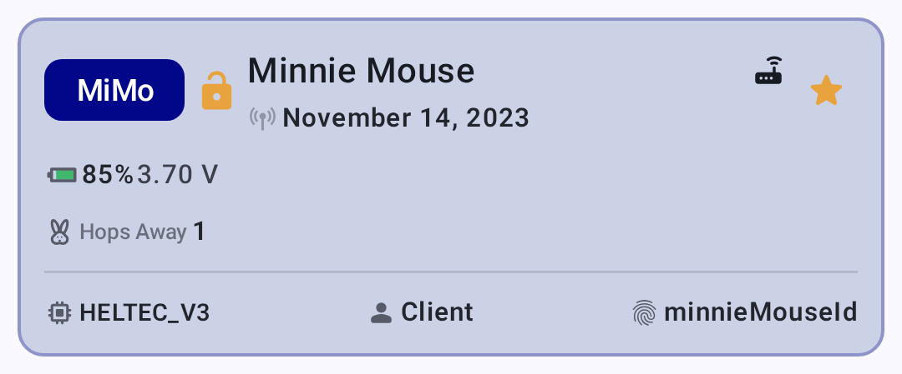
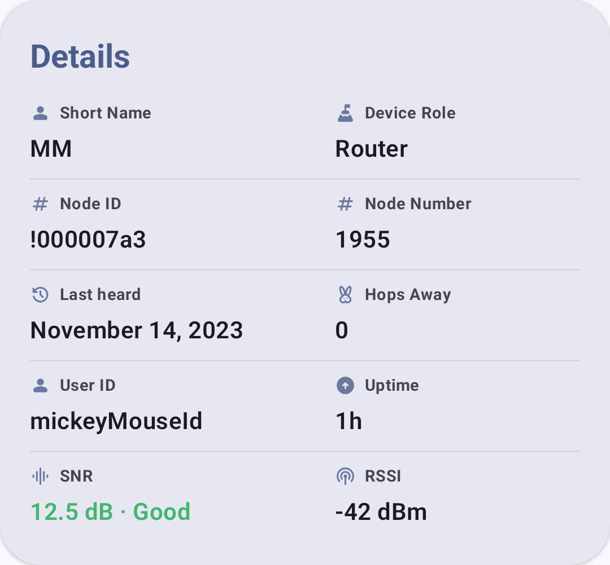
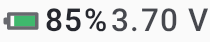

# Sõlmed

The Nodes screen displays all devices visible on your mesh network.

## Node List

Sõlmede loend näitab kõiki sõlmi, mida raadio on kuulnud, sealhulgas:

- **Sõlme nimi** — kasutaja pandud pikk nimi
- **Lühinimi** — 4-tähemärgiline identifikaator
- **Signal quality** — last heard signal strength
- **Last heard** — time since last communication
- **Vahemaa** — hinnanguline vahemaa (kui positsioone jagatakse)
- **Aku** — kaugsõlme aku tase (kui telemeetria on lubatud)

### Node Status Indicators

| Badge     | Meaning                             |
| --------- | ----------------------------------- |
| 🟢 Võrgus | Node heard within the last 2 hours  |
| ⚪ Offline | Node not heard for over 2 hours     |
| ⭐ Lemmik  | Node marked as favorite by the user |

A node is considered **online** if it was heard within the last 2 hours, and **offline** otherwise — there is no separate "away" tier.

### Node Roles

Sõlmedele saab määrata erinevaid rolle, mis mõjutavad nende kärgvõrgus käitumist:

| Roll                             | Kirjeldus                                                                                                                                                               |
| -------------------------------- | ----------------------------------------------------------------------------------------------------------------------------------------------------------------------- |
| Klient                           | Standard end-user device                                                                                                                                                |
| Klient-baas                      | Treats favorited-node traffic as Router Late priority; all other traffic as Client                                                                                      |
| Vaikne klient                    | Receives but doesn't retransmit                                                                                                                                         |
| Peidetud klient                  | Like Client Mute, plus hides from node list                                                                                                                             |
| Ruuter                           | Prioriseerib sõnumi edastamist; jääb edastamiseks ärkvele                                                                                                               |
| Hiline ruuter                    | Infrastruktuurisõlm, mis levitab signaali ühe korra, kuid alles pärast kõiki teisi režiime (pakub täiendavat leviala)                                |
| ~~Router Client~~                | ⚠️ **Vananenud** (eemaldatud püsivara versioonis 2.3.15) — enam mitte valitav; kasuta hoopis ruuterint või kliendina |
| ~~Repeater~~                     | ⚠️ **Vananenud** (eemaldatud püsivara versioonis 2.7.11) — enam mitte valitav; kasuta hoopis ruuterina               |
| Jälgitav                         | Optimized for position reporting at regular intervals                                                                                                                   |
| Andur                            | Optimized for telemetry reporting                                                                                                                                       |
| TAK                              | Ühildub TAK süsteemidega (saadab/võtab vastu CoT)                                                                                                    |
| Jälgitav TAK                     | Ainult TAK asukoha aruandlus                                                                                                                                            |
| Lost & Found | Pidev asukoha majakas taastamiseks                                                                                                                                      |

### Choosing a Role

Most users should keep the default **Client** role. Consider a different role when:

- **Router** — You have a node in a fixed, elevated location with reliable power (rooftop, hilltop). Ruuterid püsivad pidevalt ärkvel, et vahendada teistele sõnumeid ja on võrguühenduse laiendamiseks hädavajalikud. Ära kasuta ruuter akutoitel töötavatel käsiseadetel.
- **Ruuter hiline** – infrastruktuurisõlm, mis levitab pakette alati üks kord uuesti, aga alles pärast seda, kui kõik teised marsruutimisrežiimid on oma käigu teinud. Provides supplemental coverage for local clusters without competing with primary routers.
- **Baas klient** – käsitleb lemmiksõlmedesse suunduvat ja sealt tulevaid liiklusi ruuteri hilinemise prioriteediga (tagades, et need sõnumid saavad täiendava edastuskatte), samal ajal kui kõike muud käsitletakse tavalise kliendina.
- **Kliendi vaigistatud** — Soovid vastu võtta võrguliiklust, aga mitte edastamisse panustada. Useful for monitoring-only devices or to reduce congestion in dense areas.
- **Jälgimisseade** – järelevalveta seade, mille ainus eesmärk on oma GPS asukoha levitamine (nt sõiduk, lemmikloom või vara). Aku säästmiseks magab saadete vahel.
- **Sensor** — An unattended device reporting environmental telemetry (temperature, humidity, air quality). Sarnane võimsusprofiil jälgimisseadmele.
- **TAK / TAK jälgimisseade** — Vajalik ainult ATAK/WinTAK süsteemidega koostööl. Üksikasjade saamiseks vaata [TAK integratsioon](tak).

> 💡 **Vihje:** Kärgvõrk töötab kõige paremini, kui enamik sõlmi on **klient** või **ruuter**. Too many Mute nodes reduces mesh resilience; too many Routers in a dense area can cause congestion. A good rule of thumb: one Router per 5–10 Clients in your area.

### Encryption Indicators

Nodes display encryption status icons next to their name:

| Icon            | Meaning                                                                                                                          |
| --------------- | -------------------------------------------------------------------------------------------------------------------------------- |
| 🔒 Lukustatud   | Suhtlus kasutab PKI-d (avaliku võtme infrastruktuuri) – otsast lõpuni krüpteeritud kontrollitud identiteediga |
| 🔓 Lukust lahti | Suhtlus kasutab jagatud kanali PSK – krüpteeritud, kuid isikut pole individuaalselt kontrollitud                                 |
| ⚠️ Ebakõla      | Avaliku võtme mittevastavus — sõlme võti on viimasest nägemisest saadik muutunud (enne usaldamist uuri)       |

> 💡 **Vihje:** PKI krüpteering (püsivara 2,5+) pakub tugevamat turvalisust kui kanali PSK, kuna igal sõlmel on unikaalne võtmepaar. Kui näed võtme mittevastavuse hoiatust, võib sõlm olla lähtestatud või ohustatud.

## Quick Actions

From the node list, you can:

- **Puuduta** sõlmel, et vaadata üksikasjade lehte
- **Long-press** for quick actions:
  - Mark/remove favorite
  - Teavituste vaigistamine/vaigistuse tühistamine
  - Send a direct message
  - Trace route
  - Ignore/unignore
  - Remove node

## Filtering & Sorting

### Text Search

Sõlmede filtreerimiseks nime või lühinime järgi tipi otsinguväljal. Filter uueneb reaalajas kirjutamise ajal.

### Filter Toggles

| Filtreeri                  | Kirjeldus                                                                            |
| -------------------------- | ------------------------------------------------------------------------------------ |
| **Only online**            | Näita ainult viimase 2 tunni jooksul kuuldud sõlmi                                   |
| **Only direct**            | Kuva ainult otseühendustega (mitte releeühendusega) sõlmi         |
| **Include unknown**        | Näita sõlmi, mis pole veel kasutajainfot saatnud                                     |
| **Exclude infrastructure** | Hide infrastructure-role nodes (Router, Router Late, Client Base) |
| **Välista MQTT**           | Peida ainult MQTT internetisilla kaudu kuuldavad sõlmed                              |
| **Kuva ignoreeritud**      | Kuva sõlmed, mille olete varem sulgenud või vaigistanud                              |

### Sort Options

| Sort                                        | Kirjeldus                                                          |
| ------------------------------------------- | ------------------------------------------------------------------ |
| **Last heard** (default) | Most recently heard nodes first                                    |
| **Alphabetical**                            | Sorted by node long name                                           |
| **Distance**                                | Nearest nodes first (requires position sharing) |
| **Hüppe kaugusel**                          | Vähim vahendatud hüppeid esimesena                                 |
| **Kanal**                                   | Rühmitatud kanali loendi alusel                                    |
| **Läbi MQTT**                               | Rühmitatud MQTT ver raadiost kuuldud järgi                         |
| **Favorites**                               | Favorited nodes first                                              |

## Sõlme hüppe kohta

Puuduta sõlmede loendi rakenduse ribal hüppehistogrammi ikooni, et avada tulpdiagramm, mis näitab, mitu sõlme asub igal hüppekaugusel (0 = otse, 1 = ühe relee kaugusel jne). Filter the chart to a **last heard** window — All time, 1 hour, 8 hours, or 24 hours — to see how the mesh looks right now versus over a longer period. It's a quick way to gauge how busy and spread out your local mesh is.

## Node Detail

Sõlmel klõpsamine avab detailvaate koos põhjaliku teabega. See [Node Metrics](node-metrics) for full details on metrics and telemetry.

The detail screen includes device info, position, and action buttons:

Tekstisisesed olekuindikaatorid näitavad peamisi mõõdikuid lühidalt:

| Indicator       | Screenshot                                                        |
| --------------- | ----------------------------------------------------------------- |
| Signal quality  |         |
| Aku tase        |            |
| Hüppete loendur |             |
| Viimati kuuldud |  |
| Kaugus          |        |

### Seadme lingid ("Soovin ühte")

Kui sõlme riistvara tuvastatakse, kuvatakse detailvaates kokkupandav jaotis **„Soovin ühte”**, mis lingib kohtadele, kust seadet osta või selle kohta lisateavet saada: müüja tooteleht, tootevariandid ja piirkondlike marketplace loendid (nt AliExpress, Amazon ja toetatud jaemüüjad), mis on filtreeritud sinu riigi järgi. Iga link avaneb ümbersuunamisteenuse `msh.to` kaudu. Seadmed, millel pole vastavaid linke, seda jaotist ei kuva.

A full, browsable directory of every link is also available under **Settings → Help & Documentation → Device Links**.

## Related Topics

- [Node Metrics](node-metrics) — detailed telemetry dashboards for each node
- [Sõnumid ja kanalid](messages-and-channels) — saada otsesõnum sõlmele
- [Kaart ja teekonnapunktid](map-and-waypoints) — vaata sõlmede geograafilisi asukohti
- [Avasta](Discovery) - traceroute ja naabri-info kärgvõrgu topoloogia uurimiseks
- [Signal Meter](signal-meter) — understand what the signal bars mean

---

