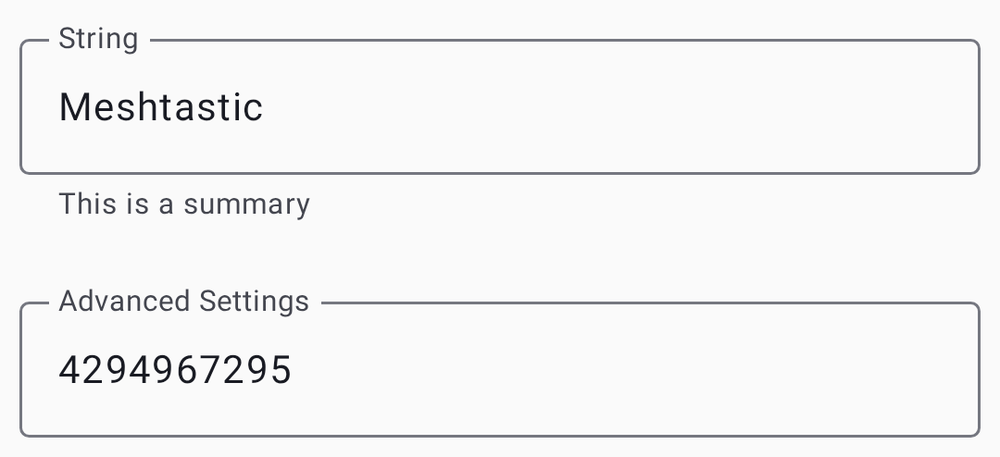

# Sätted - moodulid & admin

Konfi valikulisi funktsioonimooduleid ja teosta seadme haldamist. Moodulid laiendavad Meshtasticut spetsiaalsete võimalustega – igaüht saab eraldi lubada või keelata.

> 💡 **Vihje:** Pead lubama ainult need moodulid, mida sa tegelikult kasutad. Kasutamata moodulite keelamine vähendab eetriaega, säästab akut ja lihtsustab seadistamist.

Mooduli seaded kasutavad kaardipõhist paigutust koos lülitite, rippmenüüde, tekstiväljade ja liuguritega:

## Mooduli konf

### MQTT moodul

Sildab võrgusõnumeid MQTT vahendajasse ja sealt internetiühenduse loomiseks. This is how you extend your mesh beyond radio range or integrate with home automation systems.

| Sätted          | Kirjeldus                                                                |
| --------------- | ------------------------------------------------------------------------ |
| Lubatud         | Lükka MQTT sild sisse                                                    |
| Server          | MQTT vahendaja aadress                                                   |
| Kasutajatunnus  | Authentication username                                                  |
| Parool          | Authentication password                                                  |
| Encryption      | Krüpteeri MQTT kasutus                                                   |
| ~~JSON Output~~ | ⚠️ **Vananenud** — JSON tugi püsivarast eemaldatud; välja ignoreeritakse |
| TLS             | Use secure connection                                                    |
| Root Topic      | Baas MQTT teema teekond                                                  |
| Map Report      | Publish position for public map                                          |

Vaata [MQTT](mqtt) üksikasjalikumat kasutusjuhendit, mis sisaldab teavet krüpteerimise, privaatsuse ja vahendaja seadistamise kohta,.

### Jadapordi moodul

Võimaldab jadapordi sidet väliste seadmete integreerimiseks (GPS-moodulid, andurid või kohandatud riistvara). Kui lubatud, saab sõlme jadaühendus saata ja vastu võtta protobuf- või tekstiandmeid, võimaldades välistel mikrokontrolleritel või arvutitel võrguga suhelda.

| Sätted          | Kirjeldus                      |
| --------------- | ------------------------------ |
| Lubatud         | Aktiveeri jadapordi ühendus    |
| Echo            | Kaja sai jadaandmed tagasi     |
| Mode            | Text, Protobuf, or NMEA output |
| RX/TX kontaktid | GPIO sisend jagaühenduseks     |
| Baud Rate       | Jadaühenduse kiirus            |

### Välise teavitusmoodul

Juhib raadio riistvara summeri-, LED- või vibratsioonihoiatusi. Useful for devices that need to physically signal when a message arrives — particularly helpful for unattended or outdoor installations.

| Sätted                            | Kirjeldus                     |
| --------------------------------- | ----------------------------- |
| Lubatud                           | Aktiveeri märguanded          |
| Alert Message                     | Notify on incoming messages   |
| Alert Message Buzzer              | Use buzzer for messages       |
| Alert Message Vibra               | Use vibration for messages    |
| Hoiatuskell                       | Teavita hoiatuskella märgist  |
| Väljund (GPIO) | Sisend teavitusväljundi jaoks |
| Active                            | High or Low active            |
| Duration (ms)  | Notification length           |
| Use I2S as Buzzer                 | Use I2S audio output          |

### Salvesta & edasta moodul

Buffers messages for nodes that were temporarily offline, then replays them when those nodes reconnect. Essential for meshes where nodes go in and out of range regularly — ensures messages aren't lost during brief disconnections.

| Sätted                                     | Kirjeldus                                                                                                                                        |
| ------------------------------------------ | ------------------------------------------------------------------------------------------------------------------------------------------------ |
| Lubatud                                    | Activate store and forward                                                                                                                       |
| Südamelöögid                               | Periodically announce this node's store-and-forward capability                                                                                   |
| Records                                    | Maximum stored messages                                                                                                                          |
| History Return (max)    | Max messages to replay                                                                                                                           |
| History Return (window) | Time window for replay                                                                                                                           |
| Server                                     | Act as a store-and-forward server for the mesh (requires ample memory, e.g. ESP32 with PSRAM) |

> 💡 **Vihje:** Salvesta ja edasta töötab kõige paremini rohke mäluga sõlmedes (ESP32 koos PSRAM-iga). Router nodes are ideal candidates since they're typically always-on.

### Kaugustesti moodul

Automated range testing tool for evaluating link quality between nodes. Kui lubatud, edastab sõlm perioodiliselt testsõnumeid kasvavate loenduritega. A receiver node logs these messages, allowing you to walk or drive away and later analyze at what distance messages stopped arriving.

| Sätted                                 | Kirjeldus                         |
| -------------------------------------- | --------------------------------- |
| Lubatud                                | Activate range testing            |
| Sender Interval (s) | Time between test transmissions   |
| Salvesta CSV                           | Log received test data to SD card |

### Telemeetria moodul

Controls what telemetry data your node shares with the mesh. Telemeetria sisaldab seadme tervist (aku, tööaeg) ja keskkonnaandurite andmeid (temperatuur, niiskus, rõhk).

| Sätted                       | Kirjeldus                               |
| ---------------------------- | --------------------------------------- |
| Device Metrics Interval      | How often to report device metrics      |
| Environment Metrics Interval | How often to report environment sensors |
| Air Quality Enabled          | Report particulate sensor data          |
| Power Metrics Enabled        | Report power usage                      |

Vaata [Telemeetria & Sensorid](telemetry-and-sensors) toetatud andurite ja sätete soovituste kohta.

### Eelsalvestatud sõnumi moodul

Seadme füüsiliste nuppude kaudu ligipääsetavad eelseadistatud sõnumid (pöördnuppude, klaviatuuride või sarnase sisendriistvaraga raadiote puhul). Define a list of quick-send messages that can be transmitted without a phone connected — ideal for field use.

| Sätted                  | Kirjeldus                                                          |
| ----------------------- | ------------------------------------------------------------------ |
| ~~Lubatud~~             | ⚠️ **Vananenud** — praegune püsivara võib seda lülitit ignoreerida |
| Sõnumid                 | Newline-separated list of messages                                 |
| Saada kelluke           | Esita saatmisel kellukese heli                                     |
| Rotary Encoder          | Enable rotary encoder input                                        |
| Üles/alla/vajuta sisend | GPIO sisendi kontaktide määramine                                  |

### Audio moodul

Codec2 audio support for low-bandwidth voice communication over the mesh. This is an **experimental** feature that encodes voice into very small data packets using the Codec2 codec.

| Sätted          | Kirjeldus                        |
| --------------- | -------------------------------- |
| Lubatud         | Aktiveeri audio moodul           |
| Codec2 Rate     | Audio quality/bandwidth tradeoff |
| I2S Word Select | GPIO sisend I2S WS jaoks         |
| I2S Data In     | GPIO sisend I2S DIN jaoks        |
| I2S Data Out    | GPIO sisend I2S DOUT jaoks       |

> ⚠️ **Märkus:** Heli jaoks on vaja spetsiaalset riistvara (I2S mikrofon ja kõlar). Voice quality is very low-bandwidth — think "understandable radio voice," not phone-call quality.

### Kaugriistvara moodul

GPIO juhtimine kärgvõrgu kaudu. Võimaldab kaugsõlmel lugeda või kirjutada GPIO sisendkontakte teisel sõlmel – kasulik releede aktiveerimiseks, lülitite lugemiseks või välise riistvara kaugjuhtimiseks.

| Sätted                     | Kirjeldus                                                               |
| -------------------------- | ----------------------------------------------------------------------- |
| Lubatud                    | Aktiveeri kaugjuurdepääs GPIO-le                                        |
| Luba määratlemata sisendid | Luba juurdepääs mis tahes GPIO sisendile (turvarisk) |
| Available Pins             | Kuni 4 GPIO sisendit, mida see sõlm kauglugemiseks/-kirjutamiseks avab  |

> ⚠️ **Hoiatus:** Funktsiooni „Luba määratlemata sisendkontaktid” lubamine annab kaugsõlmedele juurdepääsu kõigile GPIO sisendile, mis võib häirida raadio enda riistvara. Luba ainult spetsiaalsetel GPIO sõlmedel.

### Naabriinfo moodul

Levitab teavet otse kuuldud naabrite kohta, võimaldades kärgvõrgu topoloogia kaardistamist. Iga lubatud sõlm jagab perioodiliselt nimekirja teistest sõlmedest, mida ta kuuleb ja nende signaali kvaliteedist.

| Sätted                                     | Kirjeldus                                                                                                                                   |
| ------------------------------------------ | ------------------------------------------------------------------------------------------------------------------------------------------- |
| Lubatud                                    | Aktiveeri naabrite leviring                                                                                                                 |
| Värskendusintervall(id) | Kui tihti naabrite nimekirja levitada                                                                                                       |
| Transmit Over LoRa                         | Edasta naabriinfot ka LoRa kaudu, mitte ainult MQTT/telefoni kaudu. Vaikimisi võtit ja nime kasutavat kanalit pole saadaval |

Vaata [Avasta](Discovery) kuidas kasutada naabri-andmeid kärgvõrgu topoloogia uurimiseks.

### Ambientvalguse moodul

Juhib toetatud riistvaral NeoPixeli või muid adresseeritavaid RGB LEDe. Can be used for visual status indicators, notification lights, or decorative effects.

| Sätted             | Kirjeldus                                                          |
| ------------------ | ------------------------------------------------------------------ |
| LED olek           | Turn the LED on or off                                             |
| Pinge              | LED current limit (0–31)                        |
| Red / Green / Blue | Individuaalsete värvikanalite väärtused (0–255) |

### Tuvastusanduri moodul

Turns your node into a motion or door sensor alert system. Kui GPIO sisend tuvastab oleku muutuse (liikumine tuvastatud, uks avatud), levitab sõlm kärgvõrgu kaudu hoiatusteate.

| Sätted                                     | Kirjeldus                                                                                                                               |
| ------------------------------------------ | --------------------------------------------------------------------------------------------------------------------------------------- |
| Lubatud                                    | Aktiveeri tuvastusandur                                                                                                                 |
| Ekraani sisend                             | GPIO sisend on anduriga ühendatud                                                                                                       |
| Detection Trigger Type                     | How the pin's state maps to a detection event (e.g. active high/low, edge-triggered) |
| Use Input Pullup Mode                      | Enable the pin's internal pull-up resistor                                                                                              |
| Minimaalne leviring(id) | Minimaalne aeg hoiatusteadete levitamisel                                                                                               |
| Riiklik ringhääling(ud) | Perioodilise oleku levitamise intervall                                                                                                 |
| Saada hoiatuskell                          | Lisa märguannetesse hoiatuskella sümbol                                                                                                 |
| Friendly Name                              | Custom name for this sensor                                                                                                             |

### Paxloenduri moodul

Inimeste loendur WiFi ja BLE päringute abil. Counts nearby devices by passively listening for probe requests that phones and laptops emit when scanning for networks. Available only on ESP32 devices.

| Sätted                                     | Kirjeldus                  |
| ------------------------------------------ | -------------------------- |
| Lubatud                                    | Activate people counting   |
| Värskendusintervall(id) | How often to report counts |

> 💡 **Vihje:** Paxloendur on kasulik jalakäijate liikluse hindamiseks matkaradade alguses, ürituste toimumiskohtades või muudes kohtades. Counts are approximate — one person may carry multiple devices.

### TAK moodul

Meeskonna teadlikkuse komplekti integratsioon ATAKi ja WinTAKi koostalitlusvõime tagamiseks. Vaata [TAK Integration](tak) täpsema seadistamise ja kasutamise kohta.

## Haldus

### Kaughaldus

Administraatori võtit jagavate sõlmede kaugkonfigureerimine:

1. Select the target node in the node list.
2. Mine selle sõlme **Seadetesse**.
3. Muuda seadistust.
4. Puuduta **Salvesta** – muudatused saadetakse kärgvõrgu kaudu.

> ⚠️ **Nõutud:** Administraatori võtit, mis on seadistatud nii sinu kui ka sihtsõlmes.

### Tühjenda sõlmede andmebaas

Removes stale nodes from your local database that haven't been heard in a configurable time window.

### Factory Reset

Resets all settings to factory defaults. **Seda ei saa tagasi võtta.**

### Taaskäivita

Ühendatud või hallatava sõlme kaugkäivitamine.

### Arendaja paneel

Opens the **Packets** and **App logs** tabs for viewing, filtering, and exporting diagnostic output. See [Debug Logs](debug-logs) for the full walkthrough.

### Kaug-admin tõrkeotsing

- **"Sihtsõlmelt ei ole vastust"** — sihtsõlm võib olla leviulatusest väljas, võrguühenduseta või sellel võib olla sobimatu administraatori võti. Verify the admin key matches on both nodes.
- **Changes not applying** — some settings require a reboot to take effect. Try the Reboot action after saving.
- **Ei näe kaugseadeid** — veendu, et sõlmel oleks sihtsõlme administraatori võti ja et administraatori kanal oleks turbekonfiguratsioonis lubatud. Administraatori kanal seadistatakse automaatselt, kui administraatori võti on määratud.

## Related Topics

- [Settings — Radio & User](settings-radio-user) — core radio and user profile settings
- [Mooduli konfiguratsiooni viide](https://meshtastic.org/docs/configuration/module) — üksikasjalik mooduli dokumentatsioon aadressil meshtastic.org
- [KKK](https://meshtastic.org/docs/about/faq) — meshtastic.org levinud küsimused

---

