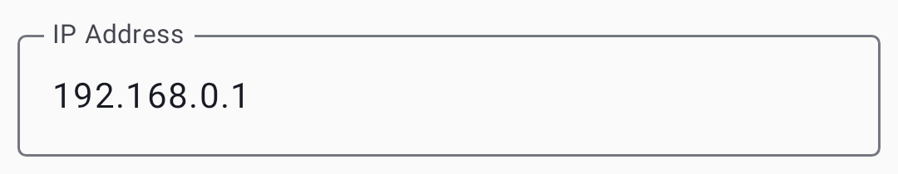
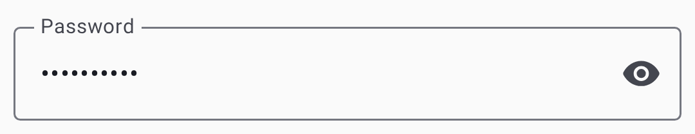
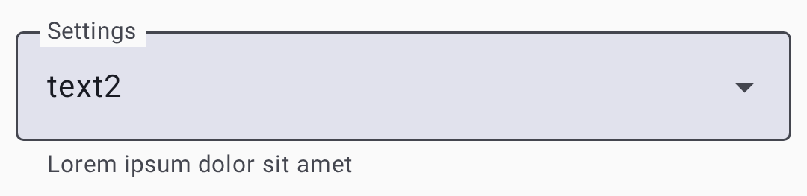
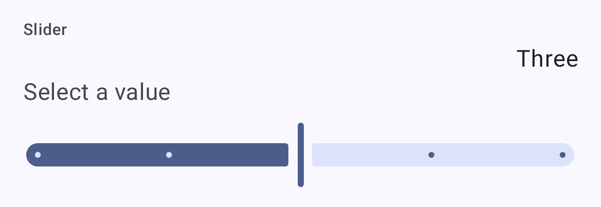

# Seaded — raadio ja kasutaja

Configure your radio hardware and user identity parameters.

## Kasutaja seaded

### User Profile

| Setting           | Kirjeldus                                                                             |
| ----------------- | ------------------------------------------------------------------------------------- |
| Täis nimi         | Your display name (up to 39 characters)                            |
| Lühi nimi         | 4-character abbreviated name                                                          |
| Licensed Operator | Enable if you hold an amateur radio license (enables higher power) |

### Applying Changes

Pärast sätete muutmist puuduta nuppu **Salvesta**, et konfiguratsioon raadiosse salvestada. Muudatuste rakendamiseks võib seade taaskäivituda.

## Sätted

### Seadme sätted

| Setting                                       | Kirjeldus                                                               | Vaikimisi |
| --------------------------------------------- | ----------------------------------------------------------------------- | --------- |
| Roll                                          | Node behavior (Client, Router, etc.) | Klient    |
| Kordusülekannete režiim                       | How the node retransmits messages                                       | Kõik      |
| Sõlme(de) teabe levitamine | Sõlme teabe levitamise intervall                                        | 10800     |
| Topeltpuudutusnupp                            | Toiming topeltpuudutuse nupu korral                                     | Keelatud  |

### LoRa sätted

| Setting          | Kirjeldus                                                               | Vaikimisi                                       |
| ---------------- | ----------------------------------------------------------------------- | ----------------------------------------------- |
| Regioon          | Sagedusribade reguleerimispiirkond                                      | Määramata (tuleb seadistada) |
| Modemi vaikesäte | Speed/range tradeoff                                                    | LongFast                                        |
| Hüppete limiit   | Maks uuesti saadetud hüpet                                              | 3                                               |
| TX võimsus       | Transmission power (dBm); 0 = max allowed for region | 0 (region max)               |
| Sagedusnihe      | Sageduse peenhäälestamine (MHz)                      | 0                                               |
| Kanali ribalaius | Bandwidth setting                                                       | Default for preset                              |

> ⚠️ **Tähtis:** Enne edastamist **peate** oma piirkonna määrama. Operating without the correct region may violate local radio regulations. Lisateabe saamiseks vaadake [regiooni seadistamise juhendit](https://meshtastic.org/docs/getting-started/initial-config) aadressil meshtastic.org.

### Modem Presets

> 💡 **Vihje:** **SNR-i piirväärtused** on meelega negatiivsed. LoRa can decode signals _below_ the noise floor, so a more-negative limit means the preset tolerates a weaker, noisier signal (more range). See [How the Signal Meter Works](signal-meter) for the full explanation.

| Preset             | Range                   | Kiirus                   | SNR Limit | Best For                                                                                          |
| ------------------ | ----------------------- | ------------------------ | --------- | ------------------------------------------------------------------------------------------------- |
| Short Turbo        | ~1 km   | 21,9 kbps                | −7,5 dB   | Dense urban with line-of-sight; data-heavy applications                                           |
| Short Fast         | ~3 km   | 10,9 kbps                | −7,5 dB   | Linnaosad; hooned mõne kvartali raadiuses                                                         |
| Short Slow         | ~5 km   | 5.5 kbps | −10 dB    | Äärelinna lühimaa; mõõdukas hoonestustihedus                                                      |
| Medium Fast        | ~5 km   | 5.5 kbps | −12,5 dB  | Suburban areas; moderate building density                                                         |
| Medium Slow        | ~8 km   | 1,1 kbps                 | −15 dB    | Suburban/rural; moderate range with slower speed                                                  |
| Long Turbo         | ~10 km  | 4,4 kbps                 | −12,5 dB  | Sarnane ulatus kui Pikk Kauge, aga 500 kHz ribalaiusega; kiirem läbilaskevõime                    |
| Long Fast          | ~10 km  | 1,1 kbps                 | −17,5 dB  | **General use (default)** — balanced range and speed                           |
| Long Moderate      | ~20 km  | 0,34 kbps                | −17,5 dB  | Maapiirkond, mõningase maastikuga; aeg-ajalt kasutatav                                            |
| Lite Fast          | ~5 km   | 5,5 kbps                 | −12,5 dB  | EL 866 MHz SRD sagedusala (125 kHz ribalaius); võrreldav Medium Fast           |
| Lite Slow          | ~10 km  | 1,1 kbps                 | −15 dB    | EL 866 MHz SRD sagedusala (125 kHz ribalaius); võrreldav Long Fast             |
| Narrow Fast        | ~5 km   | 2,7 kbps                 | −10 dB    | EL 868 MHz sagedusala (62,5 kHz sagedusriba); väldib häireid teiste seadmetega |
| Narrow Slow        | ~10 km  | 1,1 kbps                 | −12,5 dB  | EL 868 MHz sagedusala (62,5 kHz ribalaius); võrreldav Long Fast                |
| ~~Long Slow~~      | ~30 km  | 0,18 kbps                | −20 dB    | ⚠️ **Vananenud** — endiselt valitav, kuid võidakse tulevases püsivara versioonis eemaldada        |
| ~~Very Long Slow~~ | ~40+ km | 0,09 kbps                | −20 dB    | ⚠️ **Vananenud** — endiselt valitav, kuid võidakse tulevases püsivara versioonis eemaldada        |

> ℹ️ **Märkus:** Selles tabelis kasutatakse üldlevinud lühinimesid. Rakenduse eelseadistatud rippmenüüs on need järgmised: **Short Range - Fast**, **Long Range - Fast**, **Lite - Fast**, **Narrow - Fast**, jne.

#### Choosing a Modem Preset

The modem preset controls the fundamental tradeoff between **range** and **data rate**:

- **Slower presets** use more spreading, making signals decodable at weaker signal levels (lower SNR limit). See tähendab pikemat ulatust, aga vähem baite sekundis.
- **Faster presets** pack more data per transmission but require a stronger signal to decode.

**Practical guidance:**

- **Linnavõrk (palju sõlmi, lühikesed vahemaad):** Kasutage valikut **Long Fast** (vaikimisi) või **Short Fast**. Suurem kiirus tähendab väiksemat eetriaega, kui kanalit jagavad paljud sõlmed.
- **Rural/sparse mesh (few nodes, long distances):** Use **Long Moderate**. Range matters more than speed when nodes are far apart.
- **EU 866/868 MHz regulatory compliance:** Use **Lite Fast**, **Lite Slow**, **Narrow Fast**, or **Narrow Slow** — these are optimized for the EU SRD/868 MHz bands with narrower bandwidths.
- **Fikseeritud taristuühendused:** Kasutage **Short Turbo** või **Long Turbo** spetsiaalsete punkt-punkti ühenduste jaoks, millel on head antennid ja otsenähtavus.
- **Mixed environments:** Stick with **Long Fast** — it's the community default and ensures compatibility with others in your area.

> ⚠️ **Tähtis:** Kõik samal kanalil olevad sõlmed **peavad** kasutama sama modemi eelseadistust. Erinevate eelseadetega sõlmed ei saa suhelda isegi siis, kui neil on sama sagedus ja krüpteerimisvõti.

> 💡 **Vihje:** ulatuse hinnangud eeldavad tasast maastikku ja mõõdukaid antenne. Elevation advantage (hilltop, rooftop) dramatically increases effective range. A well-placed Router with Long Fast can often outperform a ground-level node with Long Slow.

### Ekraani sätted

| Setting             | Kirjeldus                                                                        |
| ------------------- | -------------------------------------------------------------------------------- |
| Screen Timeout      | Time before display sleeps                                                       |
| Display Units       | Meetriline või Imperial                                                          |
| OLED Type           | Auto, SSD1306, SH1106, SH1107                                                    |
| Compass Orientation | Rotation offset for compass display (0°, 90°, 180°, 270°)     |
| ~~Compass North~~   | ⚠️ **Vananenud** — asendatud kompassi suunaga; nähtav endiselt vanemas püsivaras |

### Asukoha sätted

| Setting                                   | Kirjeldus                          |
| ----------------------------------------- | ---------------------------------- |
| GPS lubatud                               | GPS lubamine/keelamine             |
| GPS värskendamise intervall               | Kui tihti GPS asukohta leida       |
| Asukoha(de) levitamine | How often to share position        |
| Nutikas asukoht                           | Liikumispõhise levitamise lubamine |
| Määratud asukoht                          | Use a manually set position        |

### Toite sätted

| Setting                                 | Kirjeldus                               |
| --------------------------------------- | --------------------------------------- |
| Power Saving                            | Enable low-power sleep mode             |
| Shutdown After (s)   | Auto-shutdown idle timer                |
| ADC Multiplier                          | Aku pinge kalibreerimistegur            |
| Oota sinihammast(id) | Time to wait for BLE connection at boot |
| Mesh SDS Timeout (s) | Ülisügava une ajalõpp                   |

### Võrgu sätted

| Setting       | Kirjeldus                                  |
| ------------- | ------------------------------------------ |
| WiFi lubatud  | Luba WiFi (ESP32 seade) |
| WiFi SSID     | Network name to connect to                 |
| WiFi PSK      | Network password                           |
| NTP server    | Time synchronization server                |
| Syslog Server | Kauglogimise server                        |

### Sinihamba sätted

| Setting            | Kirjeldus                                                           |
| ------------------ | ------------------------------------------------------------------- |
| Sinihammas lubatud | Enable/disable BLE radio                                            |
| Sidumisreziim      | Määratud PIN kood, juhuslik PIN kood või PIN koodi pole             |
| Fikseeritud PIN    | Sidumise PIN (vaikimisi: 123456) |

### Turva sätted

| Setting                 | Kirjeldus                                                                                                                                                                                                                              |
| ----------------------- | -------------------------------------------------------------------------------------------------------------------------------------------------------------------------------------------------------------------------------------- |
| Avalik võti             | Sinu sõlme avalik võti (kirjutuskaitstud)                                                                                                                                                                           |
| Administraatori võti    | Kaughalduse võti                                                                                                                                                                                                                       |
| Salajane võti           | Sinu sõlme privaatvõti (käsitsege turvaliselt)                                                                                                                                                                      |
| ~~Admin kanal lubatud~~ | ⚠️ Eemaldatud — nüüd seadistatakse automaatselt, kui administraatori võti on määratud                                                                                                                                                  |
| Arendaja logi           | Edasta reaalajas arendajalogi jadapordi/sinihamba ​​kaudu                                                                                                                                                                              |
| Jadaühendus lubatud     | Luba jadapordi konsoolile juurdepääs (teisaldatud seadme konfist)                                                                                                                                                   |
| Hallatud režiim         | Piira mitte-administraatori kanali muudatusi                                                                                                                                                                                           |
| Taastevõtmed            | Salvesta sõlme võtmete krüpteeritud varukoopia sellesse seadmesse (ainult Android)                                                                                                                                  |
| Taasta võtmed           | Kirjuta varundatud võtmed tagasi sõlme (saadaval siis, kui varukoopia on olemas)                                                                                                                                    |
| Kustuta taastevõtmed    | Eemalda salvestatud võtme varukoopia sellest seadmest                                                                                                                                                                                  |
| Protection Level        | Pakettide autentsus – kuidas käsitletakse allkirjastamata või vahendatud pakette: **range**, **tasakaalustatud** või **ühilduv** (nõuab toetavat püsivara; range režiimi puhul küsitakse kinnitust) |

Seaded kasutavad standardseid eelistuste juhtelemente – rippmenüüsid, lülitid ja liugurid:

| Control  | Screenshot                                                   |
| -------- | ------------------------------------------------------------ |
| Dropdown |  |
| Toggle   |      |
| Slider   |       |

## Related Topics

- [Seaded — moodulid ja admin](settings-module-admin) — valikulised funktsioonimoodulid ja seadme haldamine
- [Signal Meter](signal-meter) — how modem presets affect signal quality thresholds
- [LoRa konfiguratsioon](https://meshtastic.org/docs/configuration/radio/lora) — üksikasjalik LoRa sätete juhend aadressil meshtastic.org
- [Esialgne konfiguratsioon](https://meshtastic.org/docs/getting-started/initial-config) — piirkonna seadistamise juhend meshtastic.org lehel

---

