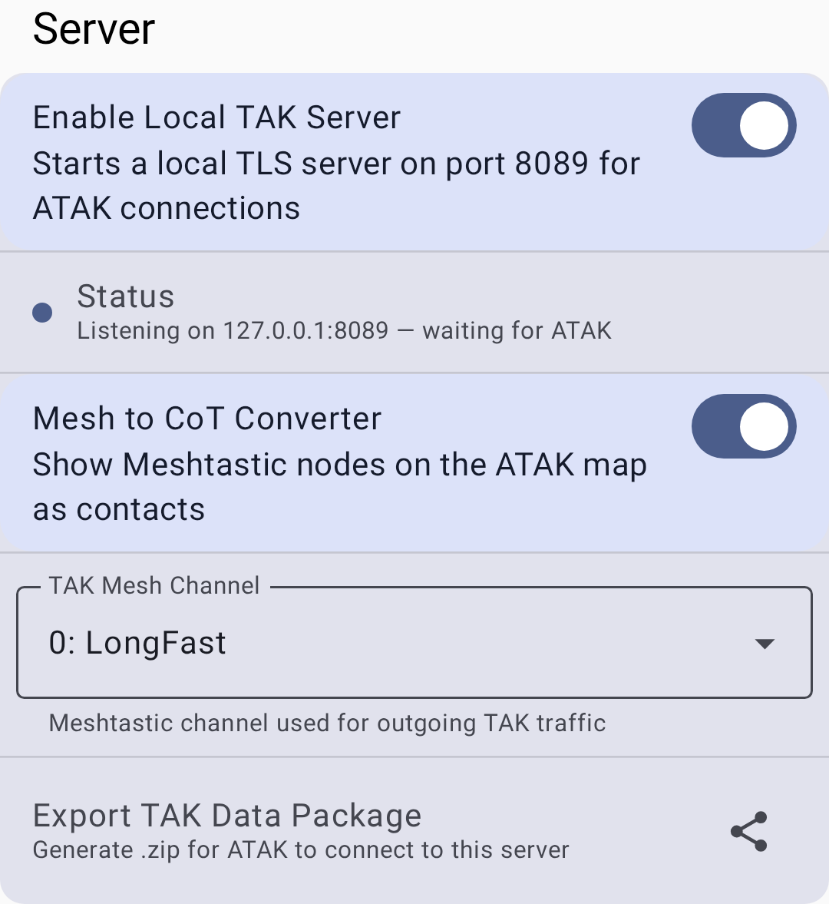

# TAK integratsioon

Meshtastic lõimub Team Awareness Kit (TAK) ökosüsteemiga, võimaldades Meshtastic kärgvõrgu seadmete ja TAK-rakenduste (nt ATAK ja WinTAK) koostalitlusvõimet.

## Overview

TAK moodul võimaldab Meshtastic sõlmedel:

- Jaga asukohaandmeid TAK ühilduvas CoT (Cursor on Target) vormingus
- Kuvatakse meeskonnaliikmetena TAK kaardil
- TAK PLI (asukohateabe) sõnumite vastuvõtmine

## Seadistamine

### Prerequisites

- ATAK (Android Team Awareness Kit) või WinTAK on paigaldatud
- Meshtastic ATAK plugin on paigaldatud
- TAK moodul on sinu Meshtastic raadios lubatud

### Sätted

1. Mine menüüsse **Seaded → Mooduli konfiguratsioon → TAK**.
2. Luba TAK moodul.
3. TAK meeskonna/grupi seadistamine:

| Sätted  | Kirjeldus                    |
| ------- | ---------------------------- |
| Lubatud | TAK-i interopi aktiveerimine |
| Mode    | TAK ühilduv väljundrežiim    |

### ATAK plugina sätted

1. Paigalda pluginate hoidlast Meshtastic ATAK plugin.
2. Ava ATAK ja luba Meshtastic plugin.
3. Plugin sildab sõnumeid ATAKi ja kärgvõrgu vahel.

### Lokaalne TAK server

Rakendus saab käitada ka **kohalikku TAK serverit**, nii et **samal seadmel** olevad ATAK/iTAK saavad otseühenduse luua ilma kaug-TAK serverita. The server binds to localhost only (`127.0.0.1:8089`) and uses TLS with mutual certificate authentication (mTLS), so it is not reachable from other devices on the network. Ava **Seaded → Mooduli konfiguratsioon → TAK → TAK Server**:

- **Luba kohalik TAK server** – käivitab pordil **8089** ainult tagasihelistamise eesmärgil toimiva mTLS-serveri sama seadme ATAK/iTAK-ühenduste jaoks.
- **Ekspordi TAK andmepakett** — genereerib `.zip`-andmepaketi, mille ATAK/iTAK saab selle serveriga ühenduse loomiseks importida.

## TAK rollid

TAKiga seotud rollidega seadistatud sõlmed käituvad tavalistest klientidest erinevalt:

| Roll                  | Kirjeldus                                                                                                                                                                                                                                                                                                |
| --------------------- | -------------------------------------------------------------------------------------------------------------------------------------------------------------------------------------------------------------------------------------------------------------------------------------------------------- |
| **TAK**               | Täielik TAK koostalitlusvõime – saadab ja võtab vastu CoT andmeid, vestlussõnumeid ja PLI-uuendusi. Toimib tavalise kliendi ja TAK sillana.                                                                                                                              |
| **TAK jälgimisseade** | Ainult asukohapõhine TAK väljund – levitab PLI automaatselt regulaarsete intervallidega ilma kasutaja sekkumiseta. Optimeeritud järelevalveta asukohamajakate (sõidukid, seadmed, teekonnapunktid) jaoks. Ei vahenda vestlussõnumeid. |

> 💡 **Vihje:** Kasuta **TAK jälgimisseadet** seadmete puhul, mis peavad edastama ainult asukohta (nt sõidukisse paigaldatud raadio). Kasutage **TAK** seadmete puhul, mille kasutajad osalevad aktiivselt TAK toimingutes.

### CoT (Cursor on Target) vorming

TAK- õnumid kasutavad kursori sihtmärgil XML-vormingut – see on sõjaline standard olukorrateadlikkuse andmete jagamiseks. Meshtastic teisendab oma sisemised protobuf-sõnumid TAK-süsteemidega ühendamisel CoT-vormingusse, seega pole käsitsi vormingu teisendamist vaja.

## TAK identiteet

TAK rollide kasutamisel levitab sinu sõlm identiteediteavet, mis kuvatakse TAK kaartidel:

| Sätted         | Kirjeldus                                                                                            |
| -------------- | ---------------------------------------------------------------------------------------------------- |
| Meeskonna värv | Sinu meeskonna värv TAK kaardil (nt sinine, punane, tsüaansinine, roheline)       |
| Liikme roll    | Sinu operatiivne roll (meeskonnaliige, meeskonnajuht, peakorter, meedik, RTO jne) |

Need sätted kuvatakse menüüs **Seaded → Mooduli konfiguratsioon → TAK**, kui TAK moodul on lubatud. Sinu TAK kutsung ei ole eraldi säte – see tuletatakse automaatselt sinu Meshtastic sõlme nimest.

> 💡 **Vihje:** Meeskonna/rolli värvid on TAK standardsed kuuluvusvärvid. Koordineeri oma TAK meeskonnaga järjepidevat meeskonnatöö jagamist.

## Sõnumivorming (V1 / V2)

Meshtastic toetab kahte TAK sõnumivormingut, mis valitakse ühendatud raadio püsivara põhjal automaatselt – käsitsi konfigureerimist pole vaja:

| Vorming                          | Compatibility                                           | Features                                                                                                                                                                                                                      |
| -------------------------------- | ------------------------------------------------------- | ----------------------------------------------------------------------------------------------------------------------------------------------------------------------------------------------------------------------------- |
| V1 (Legacy)   | Püsivara 2.7.x ja vanem | Bare protobuf encoding on port 72. Toetab ainult asukoha jagamist (PLI) ja vestlust (GeoChat) – kujundid, markerid, marsruudid ja muud tüüpi CoT-sündmused eemaldatakse |
| V2 (praegune) | Püsivara 2.8.0+         | Compact, zstd-compressed encoding on port 78. Lisab lisaks kõigele, mida V1 toetab, kujundeid, markereid, marsruute, õhusõidukeid, tsiviillennukeid, hädaolukordi ja ülesannete CoT tüüpe                     |

Sõlm edastab vanematelt sõlmedelt pärit V1 pakette isegi V2 kasutamise ajal, seega sega-püsivaraga võrgud töötavad edasi.

## Kasutamine koos ATAKiga

Kui on seadistatud:

- Meshtastic sõlmed ilmuvad ATAK kaardil markeritena koos kutsungi nimega
- Vestlussõnumid võivad ühendada võrgusilma ja TAK võrke
- Asukohavärskendused liiguvad Meshtasticu ja TAKi vahel kahesuunaliselt
- TAK jälgimisseadme sõlmed levitavad PLId automaatselt – nende asukohad kuvatakse ATAK kaartidel ilma ATAK poolse konfita

> ⚠️ **Märkus:** TAK-i integratsioon nõuab spetsiifilisi sõlmerolle ja mooduli seadistust. Standardsed kliendisõlmed ei osale automaatselt TAK operatsioonides.

## Troubleshooting

| Problem                                     | Cause                                                                                                                | Solution                                                                                                   |
| ------------------------------------------- | -------------------------------------------------------------------------------------------------------------------- | ---------------------------------------------------------------------------------------------------------- |
| Sõlme ei kuvata ATAK kaardile               | TAK moodul on keelatud või vale roll                                                                                 | Veendu, et TAK moodul on lubatud ja sõlme roll on TAK või TAK jälgimisseade                                |
| Asukohavärskendused on aegunud              | GPS asukoht kadunud või intervall liiga pikk                                                                         | Kontrolli GPSi olekut; vähenda asukoha konfis asukoha levitamise intervalli                                |
| ATAK plugin kuvab teadet „ühendus katkenud” | BLE connection lost or plugin crashed                                                                                | Ühenda Meshtastic rakenduses sinihammas uuesti ja seejärel taaskäivita ATAK plugin                         |
| Shapes, markers, or routes not bridging     | Saatja sõlm kasutab pärandversiooni V1 (püsivara 2.7.x või vanem) | Värskenda saatva sõlme püsivara versioonile 2.8.0+ sõnumivormingu V2 jaoks |
| CoT andmed ei liigu                         | Kanali mittevastavus                                                                                                 | Kõik TAK-sõlmed peavad olema samal kanalil ja sama krüpteeringuga                                          |

## Security Considerations

- TAK andmed jagavad sinu asukohta ja kutsungit
- TAKi kasutamisel tundlikes keskkondades veendu, et kanali krüpteerimine on seadistatud
- TAK moodul arvestab sama kanali krüptimist nagu teised Meshtasticu sõnumid

## Related Topics

- [Seaded — moodulid ja admin](settings-module-admin) — TAK mooduli konf
- [Sõlmed](nodes) — TAK ja TAK jälgimisseade rollid sõlmede loendis
- [Kaart ja teekonnapunktid](map-and-waypoints) — sõlmede asukohad kaardil
- [ATAK plugina juhend](https://meshtastic.org/docs/software/integrations/integrations-atak-plugin/) — üksikasjalik ATAK seadistamine aadressil meshtastic.org

---

