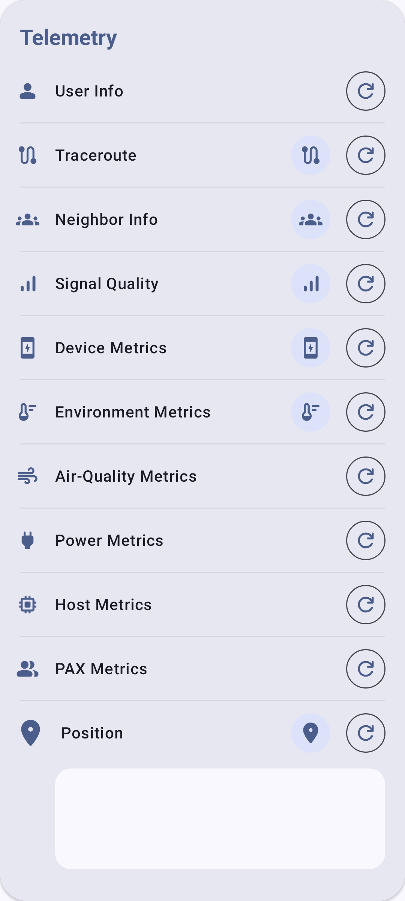

# Telemetria & sensorid

Meshtastic sõlmed saavad koguda ja jagada andurite andmeid kärgvõrgu kaudu.

## Ülevaade

Telemeetria võimaldab anduritega varustatud sõlmedel levitada keskkonna-, energiatarbimise ja seadme terviseteavet. This data is visible on the node detail screen and can be logged over time.

## Device Telemetry

Kõik Meshtastic sõlmed edastavad seadme põhitelemeetriat:

| Meetriline       | Kirjeldus                      | Tüüpiline ulatus                   |
| ---------------- | ------------------------------ | ---------------------------------- |
| Aku tase         | Charge percentage              | 0–100%                             |
| Vool             | Aku pinge                      | 3,0–4,2V (LiPo) |
| Kanali kasutus   | % of airtime used locally      | 0–100%                             |
| Eetri kasutus TX | % of airtime used by this node | 0–100%                             |
| Töötamise aeg    | Seconds since last boot        | Varies                             |

## Environment Sensors

Supported environmental sensors:

### Temperature & Humidity

| Andur   | Temperatuur | Niiskus | Õhurõhk | Sõnumid                 |
| ------- | ----------- | ------- | ------- | ----------------------- |
| BME280  | ✓           | ✓       | ✓       | Recommended all-in-one  |
| BME680  | ✓           | ✓       | ✓       | Adds gas resistance/IAQ |
| SHT31   | ✓           | ✓       | —       | High accuracy           |
| MCP9808 | ✓           | —       | —       | Precision temperature   |
| LPS22   | —           | —       | ✓       | Pressure only           |

### Air Quality

| Andur    | Meetriline                   | Sõnumid                    |
| -------- | ---------------------------- | -------------------------- |
| BME680   | Gas Resistance / IAQ         | Volatile organic compounds |
| PMSA003I | PM1,0, PM2,5, PM10           | Particulate matter         |
| SEN55    | PM, NOx, VOC, Temp, Humidity | Multi-sensor               |

### Valgus & UV

| Andur    | Meetriline                              |
| -------- | --------------------------------------- |
| OPT3001  | Ambient valgus (lux) |
| VEML7700 | Ambient valgus (lux) |
| LTR390   | UV indeks                               |

## Võimsusnäitajad

Nodes with INA-series power sensors can report:

| Meetriline  | Kirjeldus                                 |
| ----------- | ----------------------------------------- |
| Bus Voltage | Supply rail voltage                       |
| Pinge       | Power consumption (mA) |
| Toide       | Calculated power (mW)  |

Kasulik päikesepaneelide laadimise või aku seisundi jälgimiseks kaugsõlmedes.

## Configuring Telemetry

1. Mine menüüsse **Seaded → Mooduli konfiguratsioon → Telemeetria**.
2. Set reporting intervals:
   - **Seadme mõõdikute intervall** – kui tihti seadme mõõdikuid levitada
   - **Keskkonnamõõdikute intervall** – kui tihti anduriandmeid levitada
3. Enable specific sensor types as needed.

### Recommended Intervals

| Use Case                                   | Device (s) | Environment (s) |
| ------------------------------------------ | ----------------------------- | ---------------------------------- |
| Urban mesh (many nodes) | 3600                          | 3600                               |
| Rural mesh (few nodes)  | 900                           | 900                                |
| Weather station                            | 900                           | 300                                |
| Aku säilitus                               | 7200                          | 7200                               |

> ⚠️ **Märkus:** Lühemad intervallid suurendavad saate kasutusaega ja aku tühjenemist.

## Air Quality Metrics

Nodes with particulate matter or CO₂ sensors report air quality data:

| Meetriline            | Unit  | Kirjeldus                         |
| --------------------- | ----- | --------------------------------- |
| PM1.0 | µg/m³ | Ultrafine particulate matter      |
| PM2.5 | µg/m³ | Fine particulate matter           |
| PM10                  | µg/m³ | Coarse particulate matter         |
| CO₂                   | ppm   | Süsinikdioksiidi kontsentratsioon |

CO₂ sensors such as the SCD4x also report their own temperature and humidity, which appear alongside the readings above. From PM2.5 history the app additionally derives an **EPA NowCast AQI** value.

The CO₂ reading is color-coded by severity (Good → Stuffy → Poor → Unsafe → Evacuate). See [Node Metrics — Air Quality](node-metrics#air-quality-metrics) for the exact ppm bands, colors, and AQI detail.

Õhukvaliteedi andmeid saab vaadata infokaartidena sõlme detailvaates, aja jooksul graafikule lisada ja CSV-vormingusse salvestada.

## Viewing Telemetry

1. Mine **Seadmed** ja vali seade.
2. Telemetry sections show on the detail screen:
   - Device Metrics (always available)
   - Environment Metrics (if sensors present)
   - Power Metrics (if INA sensor present)
   - Air Quality Metrics (if PM/CO₂ sensor present)
3. Historical graphs show trends over time.

## Troubleshooting

- **Keskkonnaandmeid ei kuvata?** Kaugühenduse jaoks on vaja ühendada füüsiline andur (nt BME280 I2C-l). Seadme telemeetria (aku, tööaeg) on ​​alati saadaval, kuid keskkonnamõõdikute jaoks on vaja riistvara.
- **Vananenud näidud?** Kontrolli aruandlusintervalli – väga pikad intervallid (7200+ sekundit) tähendavad harva andmete uuendamist. Samuti veendu, et kaugsõlm on endiselt võrgus.
- **Sensor conflict on I2C bus?** Some sensors share I2C addresses. Kui samal siinil on mitu andurit, kontrolli raadio jadapordi arendajaväljundis aadresside kokkupõrkeid.

## Related Topics

- [Node Metrics](node-metrics) — view telemetry data on the node detail screen
- [Seaded — Moodulid ja administreerimine](settings-module-admin) — telemeetriamooduli konfiguratsioon
- [Ühikud ja lokaat](units-and-locale) — temperatuuri ja rõhu kuvamise ühikud

---

