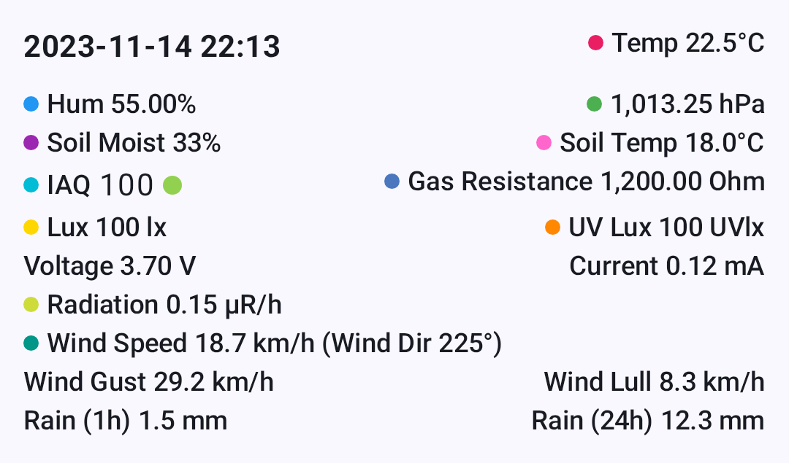

# Ühikud, mõõtühikud ja lokaat

Meshtastic rakendus kuvab automaatselt temperatuure, vahemaid, kiirusi ja aegu ühikutes, milleks sinu seade on seadistatud – rakenduses pole vaja sätteid muuta.

---

## How It Works

Meshtastic raadiod edastavad andmeid alati **meetrilistes ühikutes** (meetrites, °C, m/s, hPa jne). Kui rakendus need andmed vastu võtab, teisendab ja kuvab see väärtused seadme lokaadi määratud ühikutes.

On Android, your measurement preferences are determined by your system **Language & Region** settings. Töölaual (JVM) kasutab rakendus JVM-i vaikesätet „lokaat”.

> 💡 **Vihje:** Rakenduses pole kunagi vaja ühikuid vahetada. Muuda oma süsteemi mõõtmiste eelistusi ja kõik Meshtasticu ekraanid värskendatakse automaatselt – sõlmede üksikasjad, telemeetriadiagrammid, ilm, kõrgus ja palju muud.

---

## Temperatuur

Temperature values from environment sensors are transmitted as **°C** and displayed based on your device's temperature unit preference.

| Sinu sätted | Teadmiseks |
| ----------- | ---------- |
| Celsius     | 22°C       |
| Fahrenheit  | 72°F       |

This affects all temperature displays throughout the app: node environment telemetry, soil temperature, dew point, and telemetry chart axes.

## Distance & Altitude

Sõlmede vahelised kaugused ja GPS kõrgused edastatakse **meetrites** ning skaleeritakse ja teisendatakse automaatselt.

| Sinu sätted                      | Small Distance | Large Distance         | Kõrgus   |
| -------------------------------- | -------------- | ---------------------- | -------- |
| Meetriline                       | 350 m          | 2.5 km | 1,200 m  |
| Imperial (US) | 1,148 ft       | 1.6 mi | 3,937 ft |

Rakendus kasutab loomulikku skaleerimist – lühikesed vahemaad jäävad meetritesse või jalgadesse, pikemad vahemaad aga muutuvad automaatselt kilomeetriteks või miilideks.

### Where these appear

- **Node list** — distance and bearing to each node
- **Node detail** — altitude, distance from your position
- **Kaart** — teekonnapunktide vahemaad, traceroute'i hüppevahemaad
- **Compass** — distance to selected node

## Kiirus

GPSi maapealne kiirus kuvatakse lokaadi eelistatud kiiruseühikus.

| Sinu sätted                      | Teadmiseks |
| -------------------------------- | ---------- |
| Meetriline                       | 12 km/h    |
| Imperial (US) | 7 mph      |

## Tuul

Wind speed and gust data from environment sensors are transmitted as **m/s** and converted for display.

| Sinu sätted                      | Teadmiseks |
| -------------------------------- | ---------- |
| Meetriline                       | 5 m/s      |
| Imperial (US) | 11 mph     |

Wind readings appear in the **Node Detail** environment section and the **Environment Telemetry** charts.

## Rainfall

Rainfall measurements (1-hour and 24-hour totals) are transmitted as **mm** and converted for display.

| Sinu sätted                      | Teadmiseks |
| -------------------------------- | ---------- |
| Meetriline                       | 12 mm      |
| Imperial (US) | 0,5 in     |

## Units That Never Change

Mõned ühikud on rahvusvahelised standardid ja neid kuvatakse ühtemoodi olenemata lokaat:

| Measurement                 | Unit                           | Why                                   |
| --------------------------- | ------------------------------ | ------------------------------------- |
| Baromeetrii rõhk            | hPa                            | International meteorological standard |
| Heading / bearing           | ° (degrees) | Universal navigation convention       |
| Radiatsioon                 | μR/hr                          | Standard dosimetry unit               |
| GPS koordinaadid            | decimal degrees                | Universal geographic standard         |
| Niiskus, aku, mulla niiskus | %                              | Universal                             |

## Date & Time

All timestamps throughout the app — last heard, message times, telemetry logs, chart axes — follow your device's date and time preferences.

| Sätted               | What It Controls | Example                                          |
| -------------------- | ---------------- | ------------------------------------------------ |
| **24-Hour Time**     | Kella vorming    | 14:30 vs 2:30 PM |
| **Kuupäeva vorming** | Date ordering    | 09/05/2026 vs 05/09/2026                         |

The app also uses **relative time** where it makes sense — for example, "5 min ago" or "2 hours ago" in the node list — which is automatically localised into your device language.

## Changing Your Measurement System (Android)

On Android, your measurement system (metric vs imperial) is tied to your region setting:

1. Open **Android Settings → System → Language & Region**
2. Change your **Region** or **Measurement units** preference
3. Tagasi Meshtastic juurde — väärtused värskendatakse kohe

> 💡 **Vihje:** Kogu mõõtühikute vormindamine toimub tsentraalselt ja arvestab platvormi lokaaduga, seega püsivad ühikud kogu rakenduses ühtsed.

## Related Topics

- [Node Metrics](node-metrics) — where temperature, distance, and sensor values are displayed
- [Telemeetia & Sensorid](telemetry-and-sensors) — andurid, mis neid mõõtmisi teevad
- [Measurement & Formatting](../developer/measurement) — developer reference for the formatting utilities
- [Settings — Radio & User](settings-radio-user) — region setting that drives unit selection

---

