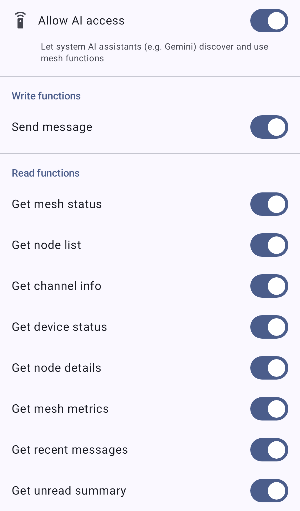

# Sovellustoiminnot

Sovellustoiminnot tuovat Meshtastic-ominaisuudet Android-järjestelmälle ja laitteessa toimiville tekoälyavustajille (kuten Gemini) Android App Functions -rajapinnan kautta. Kun ne ovat käytössä, avustaja voi löytää ja käynnistää mesh-toimintoja puolestasi — esimerkiksi lähettää viestin tai tarkistaa mesh-tilan — ilman että avaat sovellusta. Sovellustoiminnot ovat käytettävissä vain **Google-version Android-julkaisuissa**.

> ℹ️ **Huomautus:** Tämä on eri asia kuin sovelluksen sisäinen **Chirpy**-avustaja. Sovellustoiminnot mahdollistavat sen, että _järjestelmän_ tekoälyavustaja voi toimia mesh-verkon kautta; Chirpy on Meshtastic-sovelluksen sisäinen keskusteluavustaja.

## Sovellustoimintojen käyttöönotto

Hallitse sovellustoimintoja kohdasta **Asetukset → Järjestelmätekoäly**. Näyttö sisältää:

- **Pääkytkin**, nimeltään **"Salli tekoälyn käyttö"**, ja alaotsikko _"Salli järjestelmän tekoälyavustajien (esim. Gemini) löytää ja käyttää mesh-toimintoja"_. Kun pois käytöstä, toimintoja ei jaeta järjestelmälle.
- Yksittäinen kytkin jokaiselle toiminnolle, jotta voit paljastaa vain haluamasi ominaisuudet.

> ⚠️ **Important:** App Functions ship switched on. On a Google-flavor build the master toggle and every individual function, **Send message** included, start enabled — so an assistant can read your mesh data and send messages to your mesh until you turn **Allow AI access** off.

Toiminnot on jaettu **Kirjoita**-osioon (toiminnot, jotka muuttavat jotakin tai lähettävät dataa mesh-verkkoon) ja **Lue**-osioon (toiminnot, jotka palauttavat vain tietoa).

The screenshot has **Send message** and **Get recent messages** switched off to illustrate per-function control; a fresh install shows every switch on.

### Kirjoitustoiminnot

| Toiminto         | Mitä se tekee                                                                                                                                                                                                 |
| ---------------- | ------------------------------------------------------------------------------------------------------------------------------------------------------------------------------------------------------------- |
| **Send message** | Sends a text message to a contact (direct message) or to a channel. The mesh carries at most 233 bytes of text, so keep assistant-composed messages short. |

### Lukutoiminnot

| Toiminto                | Mitä se palauttaa                                                                    |
| ----------------------- | ------------------------------------------------------------------------------------ |
| **Get mesh status**     | Onko yhteys radioon muodostettu ja kuinka monta radiota on verkossa. |
| **Get node list**       | Mesh-verkon radiolista.                                              |
| **Get channel info**    | Tietoa kanavistasi.                                                  |
| **Get device status**   | Yhdistetyn radion tila.                                              |
| **Get node details**    | Yksityiskohtaiset tiedot tietystä radiosta.                          |
| **Get mesh metrics**    | Mesh-verkon telemetria ja metriikat.                                 |
| **Get recent messages** | Viimeisimmät viestisi keskusteluista.                                |
| **Get unread summary**  | Yhteenveto lukemattomista viesteistä.                                |

## Yksityisyys

> 🔒 **Privacy:** The **Send message** function lets an assistant send messages to your mesh on your behalf, and the read functions expose node, message, and metric data to it. Because all of them start enabled, the choice you make here is what to turn off rather than what to turn on. Each function has its own toggle, and **Allow AI access** turns all of them off at once.

## Aiheeseen liittyvät aiheet

- [Viestit ja kanavat](messages-and-channels) — viestien lähettäminen suoraan sovelluksessa
- [Radiot](nodes) — radiolista, josta lukutoiminnot hakevat tiedot
- [Node Metrics](node-metrics) — the telemetry behind Get mesh metrics
