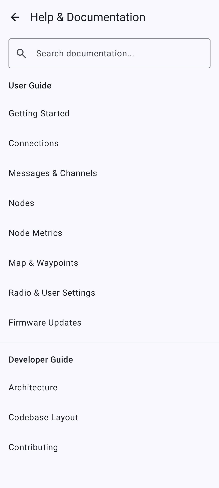
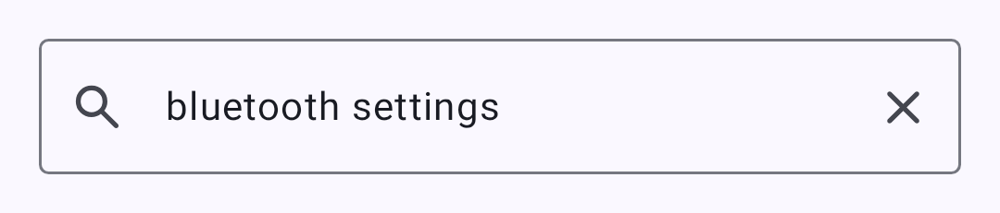
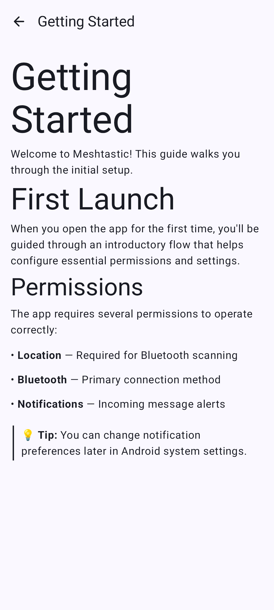

# Työpöytäsovellus

Meshtastic-työpöytäsovellus jakaa ydinkoodipohjan Android-version kanssa Kotlin Multiplatformin kautta. Useimmat ominaisuudet toimivat identtisesti Linuxilla, macOS:llä ja Windowsilla.

## Asennus

### Linux

- Lataa `.deb`- tai `.AppImage`-paketti julkaisusivulta
- Tai rakenna lähdekoodista komennolla `./gradlew :desktopApp:run`

### macOS

- Lataa `.dmg`-paketti julkaisusivulta
- Tai rakenna lähdekoodista

### Windows

- Lataa `.msi`-asennuspaketti julkaisusivulta
- Tai rakenna lähdekoodista

## Radioon yhdistäminen

### USB-sarjaportti (ensisijainen)

Luotettavin yhteystapa työpöydällä:

1. Yhdistä Meshtastic-radio USB-kaapelilla.
2. Sovelluksen pitäisi tunnistaa sarjaportti automaattisesti.
3. Jos laitetta ei tunnisteta, valitse oikea sarjaportti Yhdistä-valikosta.

### TCP/IP

Verkkoyhteydellä oleville radioille:

1. Syötä radion IP-osoite ja portti (oletus: 4403).
2. Paina **Yhdistä**.

### Bluetooth (BLE)

Bluetooth Low Energy on tuettu työpöydällä [Kable](https://github.com/JuulLabs/kable)-kirjaston kautta:

1. Varmista, että järjestelmässäsi on Bluetooth-adapteri.
2. Sovellus etsii lähellä olevia Meshtastic-radioita automaattisesti.
3. Valitse laitteesi Yhdistä-näkymästä.

## Ominaisuuksien yhtenevyys

| Ominaisuus                                                  | Android | Työpöytä | Viestit                                                                                                                        |
| ----------------------------------------------------------- | ------- | -------- | ------------------------------------------------------------------------------------------------------------------------------ |
| Viestit                                                     | ✓       | ✓        | Täysi yhtenevyys                                                                                                               |
| Radiolista                                                  | ✓       | ✓        | Täysi yhtenevyys                                                                                                               |
| Kartta                                                      | ✓       | ◐        | Kartta-välilehti on käytettävissä myös Desktop-versiossa, mutta interaktiivinen karttanäkymä on käytettävissä vain Androidissa |
| Asetukset                                                   | ✓       | ✓        | Täysi yhtenevyys                                                                                                               |
| Bluetooth (BLE)                          | ✓       | ✓        | Työpöydällä Kable-kirjaston kautta                                                                                             |
| Laiteohjelmiston päivitys                                   | ✓       | ✓        | Sovelluksen USB-, BLE- ja Wi-Fi-päivitykset (ESP32) toimivat samalla tavalla kuin Androidissa               |
| Ilmoitukset                                                 | ✓       | ✓        | Käyttöjärjestelmän natiivit ilmoitukset                                                                                        |
| Widgetit                                                    | ✓       | ✗        | Vain Android                                                                                                                   |
| Vain Android                                                | ✓       | ✗        | Vain Android — ei saatavilla työpöydällä tai iOS:llä                                                           |
| Tekoälyavustaja (Chirpy)                 | ✓\*     | ✗        | Vain Google-version Android-laitteissa                                                                                         |
| Sovellustoiminnot (järjestelmän tekoäly) | ✓†      | ✗        | Vain Google-version Android-laitteissa                                                                                         |

\*Chirpy AI vaatii Android 14+ -version Google-version Android-laitteissa, joissa on tuettu laitteisto.

†Sovellustoiminnot tuo sovellustoiminnot Android-järjestelmän tekoälylle Google-version Android-laitteissa. Katso [Sovellustoiminnot](app-functions).

## Käyttöliittymäerot

Työpöytäsovellus käyttää samaa Compose Multiplatform -käyttöliittymää, mutta se on mukautettu suuremmille näytöille ja työpöytäkäyttöön.

### Pikanäppäimet

Shortcuts use **⌘** (Command) on macOS and **Ctrl** on Windows and Linux. (The Super / Windows key is not bound.)

| Pikanäppäin  | Toiminto                    |
| ------------ | --------------------------- |
| **⌘/Ctrl+Q** | Sulje sovellus              |
| **⌘/Ctrl+,** | Avaa asetukset              |
| **⌘/Ctrl+1** | Vaihda Viestit-välilehdelle |
| **⌘/Ctrl+2** | Vaihda Radiot-välilehdelle  |
| **⌘/Ctrl+3** | Vaihda Kartta-välilehdelle  |
| **⌘/Ctrl+4** | Vaihda Yhdistä-välilehdelle |
| **⌘/Ctrl+/** | Avaa tietoja                |

### Ikkuna ja järjestelmätarjotin

- **Ikkunan koon muuttaminen** — responsiivinen asettelu mukautuu ikkunan kokoon
- **Järjestelmätarjotin** — pienennä järjestelmätarjottimeen taustalla tapahtuvaa mesh-toimintaa varten
- **Valikko** — napsauta järjestelmätarjottimen kuvaketta hiiren oikealla näyttääksesi ikkunan tai sulkeaksesi sovelluksen
- **Hiiritoiminnot** — hover-tilat ja tavallinen työpöydän navigointi

### Ilmoitusasetukset

Työpöytäsovellus tarjoaa sisäiset kytkimet ilmoitusten hallintaan — viestit, uudet radiot ja alhaisen akun varoitukset. Avaa nämä kohdasta **Asetukset → Ilmoitukset** sovelluksessa.

## Sisäänrakennettu dokumentaatioselain

Työpöytäsovellus sisältää sisäänrakennetun dokumentaatioselaimen, jonka avulla ohjeisiin pääsee nopeasti poistumatta sovelluksesta.



Selain tukee koko dokumentaation laajuista kokotekstihakua:



Yksittäiset dokumenttisivut renderöidään täydellä muotoilulla:



## Rakentaminen lähdekoodista

```bash
git clone https://github.com/meshtastic/Meshtastic-Android.git
cd Meshtastic-Android
./gradlew :desktopApp:run
```

Vaatimukset:

- JDK 21
- Android SDK:ta ei tarvita pelkkien työpöytäversioiden rakentamiseen

## Tunnetut rajoitukset

- Interaktiivinen karttanäkymä on käytettävissä vain Androidissa — Kartta-välilehti on työpöytä-versiossa näkyvissä, mutta karttaa ei näytetä
- Jotkin Android-kohtaiset ominaisuudet (widgetit, tietyt ilmoituskanavat) eivät ole käytettävissä
- Suorituskyky voi vaihdella heikkotehoisella laitteistolla ajettaessa Compose Desktopia
- BLE-paritus ei vielä tallenna laiteparia työpöydällä (paritus toimii ilman tallennusta)

## Aiheeseen liittyvät aiheet

- [Yhteydet](connections) — yhteystapojen yleiskatsaus
- [Laiteohjelmistopäivitykset](firmware) — USB-, BLE- ja Wi-Fi-päivitykset toimivat samalla tavalla kuin Androidissa

---

