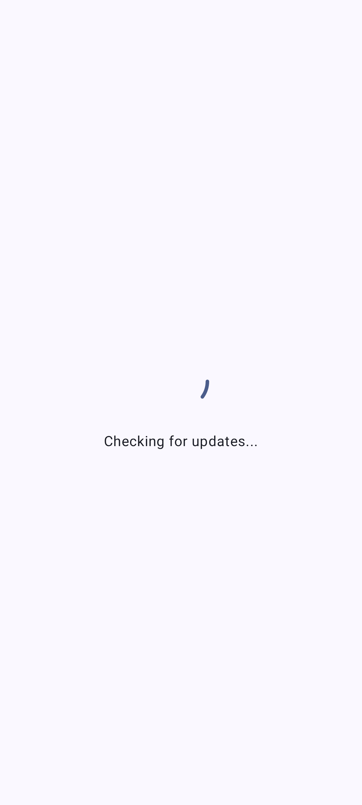
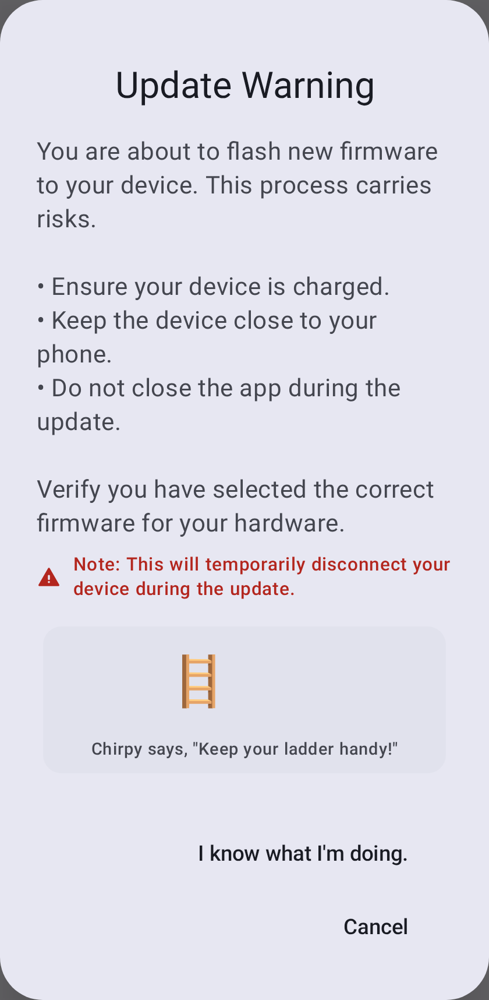
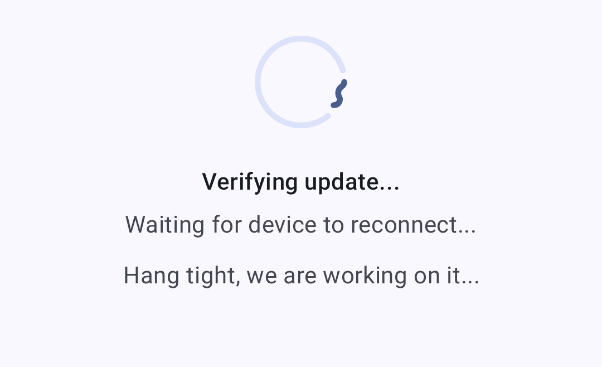
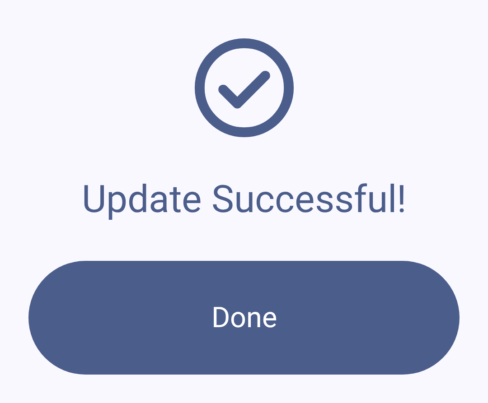
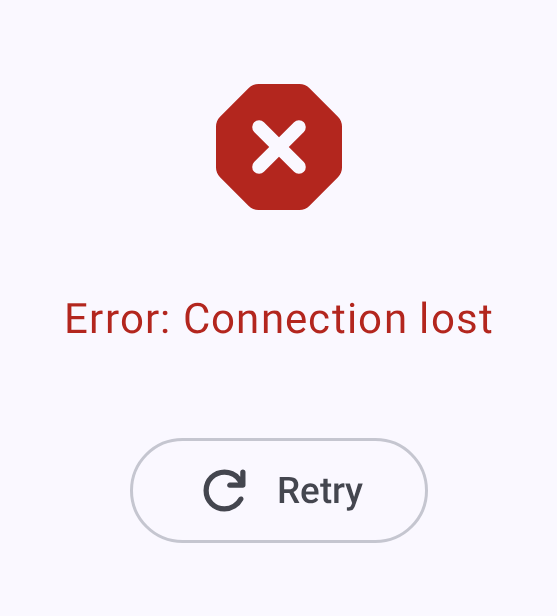

# Laiteohjelmiston päivitykset

Pidä Meshtastic-radiosi ajan tasalla uusimmalla firmwarella, jossa on uusia ominaisuuksia, virhekorjauksia ja tietoturvaparannuksia.

## Päivitysten tarkistaminen

1. Avaa yhdistetyn radion asetukset ja valitse **Lisäasetukset → Laiteohjelmiston päivitys**. Tämä vaihtoehto näkyy vain laitteilla, jotka tukevat OTA-päivityksiä.
2. Sovellus tarkistaa saatavilla olevat firmware-versiot.
3. Saatavilla olevat päivitykset näyttävät versionumeron ja muutoslokin yhteenvedon.

## Päivitysmenetelmät

### OTA (Over-The-Air) Bluetooth-yhteyden kautta

Yleisin päivitystapa Android-käyttäjille:

1. Varmista, että radiosi on yhdistetty Bluetoothilla.
2. Siirry Firmware-päivitys -näkymään.
3. Valitse haluamasi firmware-versio.
4. Napauta **Päivitä** aloittaaksesi OTA-päivityksen.
5. Odota, että päivitys valmistuu — älä katkaise yhteyttä päivityksen aikana.

> ⚠️ Varoitus: firmware-päivityksen keskeyttäminen voi rikkoa laitteen. Varmista, että radiossa on riittävästi akkua (>50 % suositus) ja pidä Bluetooth-yhteys lähellä koko prosessin ajan.

### USB-päivitys sovelluksesta

Kun radio on yhdistetty **USB:n tai sarjayhteyden** kautta (bluetoothin sijaan), **laiteohjelmiston päivitys** -näkymässä on käytettävissä **USB-tiedostonsiirto**. Sovellus käynnistää laitteen uudelleen DFU-tilaan ja pyytää sitten tallentamaan `.uf2`-tiedoston laitteen DFU-asemaan järjestelmän tiedostonvalitsimen avulla. Tämä vaihtoehto näkyy vain USB tai sarjayhteydellä — sitä ei voi käyttää bluetoothin kautta.

> ℹ️ **nRF bootloader note:** A vendor bootloader supplied as a `.zip` (e.g. RAK WisBlock RAK4631) has to be flashed with a serial DFU tool such as `adafruit-nrfutil` — copying that `.zip` to the drive won't work. A bootloader supplied as an `update-....uf2` **can** be installed by copying it to the drive; that is how the app's own bootloader upgrade works. The app surfaces a hint when the serial-only route applies.

### Factory Erase and Bootloader Upgrade

On a **USB/serial** connection, nRF52 and RP2040 devices also offer **Erase and reinstall** and, where an upgraded bootloader is published for the board, **Upgrade bootloader**.

Erasing wipes everything on the device — channels, keys and all settings — and there is no backup, so the app asks for confirmation first. Both operations write two files in turn, so you will be asked to select the device's update drive twice: once for the erase or bootloader image, then again for the firmware.

The app reads `INFO_UF2.TXT` from the drive you select to confirm it really is the device's update drive and to identify the board before writing anything. If it can't confirm which Bluetooth stack your device uses it refuses to erase and points you at the [Web Flasher](https://flasher.meshtastic.org) instead — picking wrong there can leave the device needing a hardware programmer to recover.

### Muut päivitysvaihtoehdot

Käytä näitä palautukseen tai silloin, kun OTA- tai sovelluksen USB-päivitys ei ole käytettävissä:

- Käytä [Meshtastic Web Flasheriä](https://flasher.meshtastic.org)
- Tai [Meshtastic CLI -työkalua](https://meshtastic.org/docs/getting-started/flashing-firmware) työpöytäympäristössä

## Versiokanavat

| Kanava               | Kuvaus                                                                   |
| -------------------- | ------------------------------------------------------------------------ |
| Vakaa                | Suositeltu useimmille käyttäjille: testatut julkaisut    |
| Alpha                | Esijulkaisut voivat sisältää virheitä                                    |
| Paikallinen tiedosto | Asenna itse valitsemasi laiteohjelmistotiedosto ladatun julkaisun sijaan |

## Päivitystä edeltävä tarkistuslista

Ennen päivityksen aloitamista:

- [ ] Akku > 50 %
- [ ] Vakaa Bluetooth-yhteys
- [ ] Kirjaa ylös nykyiset asetuksesi (ne voivat nollautua suurissa versiomuutoksissa)
- [ ] Tarkista julkaisumuistiinpanot mahdollista yhteensopivuutta rikkovien muutosten varalta

## Päivityksen jälkeen

Kun laiteohjelmisto on kirjoitettu, sovellus varmistaa päivityksen ja odottaa laitteen palaavan takaisin verkkoon:

Kun päivitys onnistuu:

- Radio käynnistyy uudelleen automaattisesti
- Bluetooth-yhteys muodostuu uudelleen
- Varmista, että asetuksesi ovat säilyneet
- Vahvista uusi versio **Asennettu tällä hetkellä** -kohdasta **Laiteohjelmiston päivitys** -näkymässä — sama tieto näkyy myös radion tiedoissa ja **Yhteydet**-näkymässä

## Vianetsintä

### Päivitys jumissa

Jos päivitys näyttää jumiutuneen:

- Odota vähintään 5 minuuttia ennen toimenpiteitä
- Jos laite on edelleen jumissa, käynnistä radio uudelleen virrankatkaisulla
- Yritä päivitystä uudelleen

### Laite ei käynnisty päivityksen jälkeen

Jos laite ei käynnisty:

1. Kokeile yhdistää USB:llä tietokoneeseen
2. Käytä web-flasheria palautus tai DFU-tilassa
3. Asenna tunnetusti toimiva firmware-versio
4. Tarkista Meshtastic Discordista laitekohtaiset palautusohjeet

### Yhteensopivuutta koskevat varoitukset

Sovellus voi näyttää varoituksia, kun:

- Yhdistetyn radion laiteohjelmisto on alle tuetun vähimmäisversion
- Sovelluksen ja laiteohjelmiston version välillä on ristiriita
- Vanhentuneet ominaisuudet vaativat siirtymistä uuteen versioon

> ⚠️ **Tärkeää:** Päivitä Meshtastic-sovellus aina ennen firmware-päivitystä tai sen yhteydessä varmistaaksesi yhteensopivuuden.

## Aiheeseen liittyvät aiheet

- [Yhteydet](connections) — yhdistetään uudelleen laiteohjelmiston päivityksen jälkeen
- [Laiteohjelmiston päivitysopas](https://meshtastic.org/docs/getting-started/flashing-firmware) — täydellinen firmware-päivityksen ohjeistus meshtastic.org -sivustolla
- [Tuetut laitteet](https://meshtastic.org/docs/hardware/devices) — tarkista firmware-yhteensopivuus laitekohtaisesti
- [UKK](https://meshtastic.org/docs/faq/) – usein kysytyt kysymykset meshtastic.org -sivustolla

---

